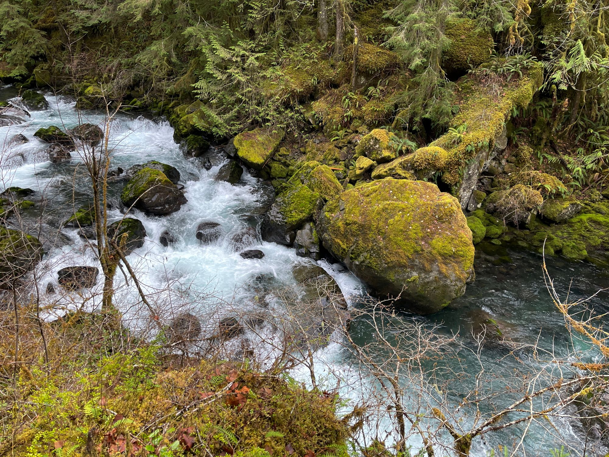

> Saturday, February 19th, 2022 - Olympic National Forest - Falls View Campground

### Chasing Waterfalls

I found this hike on the [WTA Website](https://wta.org) Hike Finder Map by [searching for waterfalls](https://www.wta.org/go-outside/map?features%3Alist=Waterfalls) as a feature. I'm not entirely sure why I wanted to find a waterfall, it just sounded like a fun feature to find.

This was a beautiful day for a late-Winter hike and this spot was lovely. Located just about 4 miles south of Quilcene on 101 across from Mt. Walker on the Olympic peninsula, it was easily reached by car by parking just outside the Falls View Campground.

Lou, Izzy, and myself were clearly not the only people who wanted to get out on some trails for the day. This was unsurprising given the 50+ degree weather and sun breaks throughout the afternoon.

Olympic National Forest Campground Falls View Sign along 101

While the campground is closed from early-Winter until late-Spring you can simply bypass the gate. There are no obvious signs from the entrance to direct you to the trailhead and there are three possible directions, straight, right, and left. We went straight at first finding a downed tree and a family coming back from the loop asking if we knew where the trailhead was located. The path that led to the right seemed less promising, we headed to the left and it was a win.

So to reach the trailhead from the campground entrance you want to go toward the left camping loop and walk around either direction an old sign indicating the trailheads for both trails.

There were variously staged spots with gravel piles both near the entrance and at the trailhead sign. I assumed they were being staged for some future project, perhaps regrading the road and parking pads at the camp sites, but it's one of those things I would love to know.

As the sign indicates, the trail to the right leads is the shorter of the two. It will take you to a fenced overlook of the canyon with a great view of the unnamed falls as they spill into the Big Quilcene River below where the roaring rapids are more audible than visible from above. This is an extraordinarily short loop that seems like it would be well suited for a quick stop when driving along the 101. It's only about 10 minutes worth of walking.

We took that path. Amusingly, I got some okay footage of the falls, but actually did not manage a photo. Whoops.

Overlooking River Valley looking toward the Olympics to the South

The entire right path is about a tenth of a mile and takes only a few minute to walk. There are a few nice vistas into the canyon and up to the southern ridge of Green Mountain to facing west.  
After completing the smaller trail we took the left hand trail. This trail has you immediately descending several hundred feet along a variety of steep switchbacks with occasional railroad ties that do feel a touch treacherous as you make your way down to the edge of the Big Quilcene River. There are occasional rails and the path is wide enough to feel you can stop for a moment without impeding your fellow hikers.

Descending the Canyon

After reaching the bottom the trail cuts across a small wooden bridge over a small creek to the left, but we first headed to the right and found an area near the water at the base of the canyon. It was a little muddy, and the moss covered rock there seemed a little slippery, but the view of the water with the little rapids before you and the falls to your right is gorgeous while the sounds of the rapids and the falls is soothing.

Big Quilcene River at the Canyon Base

After crossing the little wooden bridge there's another small path off the trail toward the water through some trees. Again it's quite muddy but it allows for another beautiful view of the same area from a slightly different angle.

A little creek spilling into the Big Quilcene

After continuing along the trail we were treated to beautiful moss and mushroom covered trees and logs the land rising to the left and falling to the right. The trail generally rises as it follows along the Big Quilcene River. After something like 2/3 of a mile we found the bench mentioned repeatedly in the WTA description which provides a nice overlook of a section of the river below. It was as lovely as described and it was nice to take a quick break before and after the final loop.

From the bench you continue a little further along the trail and then meet the final loop. We chose to head to the left following a little ways behind another group navigating the trail. In a few spots in the the final loop we were forced to pass other travelers in a way that was a little precarious given the narrowness of the trail and a few steep edges. The trail being only about 2 feet wide and the edges will spill you down to the beginning of the loop below.

As we neared the end of that final loop, which seemed to be another 2/3 of a mile, meets back up with the Big Quilcene River and provides great views of more rapids below.

Another aspect of this spot being a little busy with only one main trail was having to wait on a couple of occasions for the folks in front of us to move along while they took photos or a small break without a lot of room to pass. As is generally the case, everyone was pleasant enough and nearly everyone we encountered exchanged a cordial wave and a "hello", and we didn't mind waiting since we were there with the whole family on a more leisurely hike. If we were trying to hit this trail for a run it would have probably been a bit more frustrating.

After  completing that final loop with its various climbs and drops the bench seems a lot more appealing as you pass it again. Then you follow the same trail back, only now the roar of the river can be heard to your left.

> Not pictured: The Bench

The hardest part of this entire trail is climbing back up the switchbacks to the trailhead. The going is steep and definitely gets your heart pumping as you wend your way back and forth back along the switchbacks up the canyon.

You definitely feel it, and I'd recommend a good stretch before and after.

Overall this was a fantastic late-Winter hike on the Olympic Peninsula. Though there's not a lot of trail here at this location, it's across from Mt. Walker and there are plenty of other trails nearby if you need to fill up your day.

Wink-y Kiss Painted Rock

It's worth your time not missing this little gem hidden behind an Olympic National Forest Campground.
