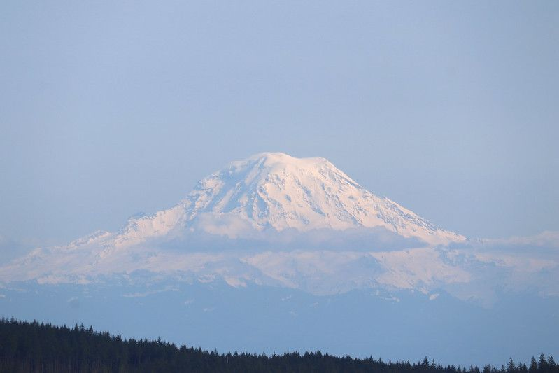

Having recently [commit](https://ephandleigh.com/committing-to-something-scary/) to a goal that feels very aggressive, I decided that I needed to prove to myself that I was within range of a target I would need to hit very soon.

To that end I attacked Wildcat Trail at Green Mountain State Forest with, perhaps out-sized, enthusiasm.

Wildcat Trail's trail head is only a few miles from my beloved [Newberry Hill Heritage Park](https://www.wta.org/go-hiking/hikes/newberry-hill-heritage-park). As a matter of fact, there's been talk of [connecting the two trail systems](https://www.kitsapsun.com/story/news/2020/10/22/connector-trail-could-link-newberry-hill-heritage-park-green-mountain/3724279001/) through the trail less NHHP park land that extends to the south. I think it sounds like a fantastic idea, though I do not share the enthusiasm the newspaper showed toward attracting more users. While I do sincerely wish for everyone to be able to enjoy and experience these places, I also cherish the relative solitude one _can_ find on the NHHP trails today that _might_ be diminished by expansion of the system.

But I digress. For now.

This post is most assuredly not about the wealth of connection options this region's parks have available to them.

This post is about my experience hiking the Wildcat Trail on Green Mountain on Saturday, April 23rd, 2022. Good and bad. Brutally honestly.

First, let me say that it was absolutely an exhausting hike, but I'd also like to make clear that while I was feeling a great deal of fatigue, by the time I got back to the parking lot I was certain I could have gone at least another couple miles. I was not done in, not completely.

Secondly, let me say that I am working toward being able to find a sustainable pace to travel across terrain with weight on my back without being done in. I am 100% certain that I could have hiked several miles miles on Sunday.

If I'd had to.

But I was _super_ glad I didn't have to.

F'real.

### Details

According to Gaia GPS my track was 9.95 mi. with only 1,668 ft. of ascent. According to Apple Fitness (and some estimation due to having my workout paused for a bit) this was a bit more than 10 miles and a bit over 2100 feet elevation gain. I generally would assume more accuracy to the observer utilizing an active altimeter, such as the readings from my watch and phone, but perhaps I am naive and optimistic. Or maybe I'm just hoping that this hike that sort of kicked my ass a bit was closer to the target toward which I'd aiming of 2,500 feet of elevation gain.

I'm still pleased with my results, at least broadly. It was a humbling experience, no doubt about that, to have felt so drained scrabbling up and back down the Wildcat Trail. But given the roughly 6 miles and 500 feet of elevation gain I'd done the day before, and the previous trip a couple days before that, I was generally pleased that I was able to complete my journey and not be completely wiped out.

I believe in myself, I can do this trip.

But I definitely need to train.

## From the Trail Head

I began this trail feeling rather confident and chipper. I arrived at the trail head parking lot listening (_in retrospect singing too enthusiastically)_ to Nirvana's Rape Me, maybe a bit louder than was appropriate. After slowly negotiating the sizable lip near the entrance that would easily do damage to a vehicle driven by someone not paying attention and progressing at even a normal parking lot's speed, I backed into the only open space among the two-dozen-odd vehicles that were there at around noon on this sunny Saturday afternoon.

I prepped my bag stuffed with items of varying levels of necessity. And snacks. All tolled it was around 22.5 lbs on my back, though that measurement was attained using a bathroom scale and I'll admit it was pretty nonscientific when compared to the use of a far more appropriate hanging scale, which I do not have.

I recognized the parking lot was busy but decided I wouldn't let it concern me.

I got myself ready, dialed in my pack and trekking poles, and was off!

### Pacing

I regret having set a too aggressive pace early on. I think I would have ultimately done better if I would have started with a more sustainable pace. Instead, feeling gung-ho, I tried to push myself a little harder than was appropriate.

The terrain didn't make it any easier. With all the rock and gravel, too, I felt that I was having some trouble getting good footing and at times it seemed I wasn’t getting the most of my trekking poles either. This was definitely disappointing but represents an opportunity for me to improve.

### Zoning Out

Another thing that I regret was being a little too introspective as I hiked. I was thinking big thoughts about work, the implications of this big hike I'm trying to take, the other hikes I've been taking, and various things about a variety of interpersonal relationships.

I was much less present than I should have been.

I was trying to remind myself to breath, to engage my core, distribute power between my legs and the arms / trekking poles, but I was also thinking about a lot of various things.

Sometimes that really gets me.

I have this tendency to get trapped in my head. And when hiking I often find myself able to work through things that need worked, as it were.

I still manage to stop and smell the roses, don't get me wrong. I struggle with keeping a steady pace sometimes because I so often find such beautiful things to look at and photograph while I'm on the trail. However, this day I was extraordinarily introspective as I consider the scary challenge I had recently set for myself as well as my current career trajectory, and then some.

### Other Mistakes

I had forgotten from my previous visit to Green Mountain that these trails are very rocky, owing to the volume of both bikes and horses that utilize this trail. I wore lighter hiking socks resulting in my feet feeling a bit more sore than it would have if this was a softer trail.

I also, on my way up the trail, I slid out on a slick rock surface and nearly fell. This should have been a perfect warning for me to be more careful as I continued my journey but instead I actually found myself trying to jog down the steep trail on the way back down from the peak which resulted in my sliding out and taking a little physical damage.

The injuries I sustained were nothing too terrible, to be clear. I wound up with a pretty sizable scrape across my right leg around my calf and shin. I also sustained a little scrape on my right arm and a blood blister on my thumb where I jammed my thumb while bracing myself.

Additionally, I found that on the ascent, while zoning out, I manged to follow the wrong path just past the horse camp and wound up climbing about 3/4 of mile up before realizing my mistake and having to double back. Although I could have cut around on one of the logging roads, I really wanted to cover the entire Wildcat Trail, so back I went.

### Sharing the Trail

While I am never thrilled with all the horses and vehicles on these trails, I find that nearly everyone I passed along the trail was generally courteous and polite. I subscribe to the belief that folks on foot should yield to those on utilizing other means of conveyance. As I did this each time I found most folks friendly, often calling out how many other members of their party to expect, and/or offering their gratitude as they pass.

In addition to the bikers and equestrians I met along the trail, I also encountered a variety of other hikers, trail runners, and folks seemingly out for a stroll on a Saturday afternoon. All were either friendly or made clear in a non-rude way that they were not looking for human interaction. Everyone seemed to be in good spirits on the trails and it was nice to wish folks well as we passed each other along the way.

### Natural Beauty, Horrible Blights

There are myriad beautiful spots on Green Mountain. There are fantastic views all the way around of various landmarks like Seattle and Mount Rainier (as seen on the header of this post)

Gear on the Trail

I was extremely pleased with both the the landscape and macro shots I was able to take along the way.

Flowers

I despise, however, the open wounds of the logged areas. This place is, unfortunately, still actively being logged and there are many reminders of this sad fact. The regular logging road crossings and open cuts consistently lift back the veil to remind you that this is not a truly protected natural area.

### On the Trail to Work

The primary goal of my hikes are to improve my physical and mental well-being and this trip out was a great workout physically and mentally. As I mentioned, I may have been more in my head than I would have preferred, less present in the beauty of the trail, but this was still valuable as it allowed me to work through top-of-mind topics that were clearly important.

I didn't have to stop often, despite starting out more aggressively than was appropriate. I made good strides overall, and generally felt very confident the entire trip up, and even after I began to feel fatigued coming down the trail (before falling like a buffoon due to my own hubris), I was able to push myself to perform.

It felt great. While I was glad to stretch and cool down at the end, I really did feel that I could have put in a few more miles that day. I rather wanted to put in a few more miles just to prove to myself I could.

### Closing thoughts...

This was a big trip for me. I had already hiked over 10 miles for the week, including 5 miles just the day before, and I was able to make it to the top of a big (for me) climb all the same.

While I felt that I wasn't completely satisfied with my performance, I ultimately feel I accomplished my goal of proving to myself that I am not so far from being able to take this trip in September as to be impossible to meet my goal.

I feel good about this trajectory.

I can do this! 💪
