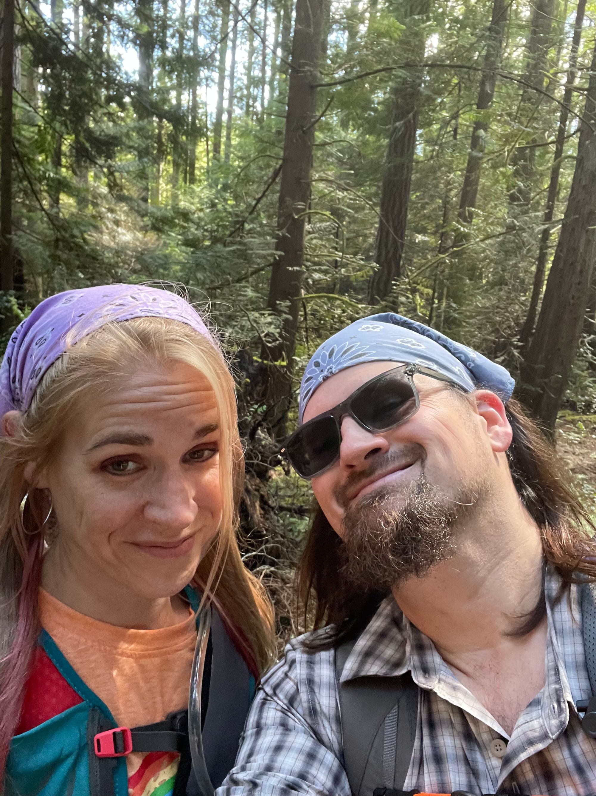

We are explorers, adventurers, wanderers, and hurtling around the sun on this rock same as you. We are creators and doers of things. We are neurodiverse. We are humans just trying to do our best. We are each others' humans.

We are Eph & Lou Baum and we reside in the beautiful Pacific Northwest and happy to call the PNW home. We arrived in Washington on the last day of July 2020 at the height of the COVID pandemic's first Summer. We arrived with the kids and spent our first couple months in AirBnB's in the Fircrest neighborhood of Tacoma while house-hunting throughout the region. Very quickly we settled down in Kitsap County, which had been a bit of a foregone conclusion anyway. We found a little place that felt just right in the "Union Hill Neighborhood" in Bremerton less than a mile from the Ferry Terminal and love it!

The journey to Washington and our experience over that last decade (getting close to 15 years) together has been extremely eventful. We've lived through a variety challenges, together, and have come out the other side better, stronger, humans for all our struggles.

A brief timeline of our lives together:

- 2008 - We both work for Office Depot in Maple Grove, MN - then both change stores
- 2009 - We both end up at Office Depot in Minnetonka, MN
- Early 2009 - We're two single parent divorcees dating
- Late 2009 - We're buying a house together because it's cheaper than renting - we've got big dreams
- Just after Halloween 2010 - We're Married!
- February 2011 - A Child is Born!
- ... just a whole lot of stuff- some of it great, some of it just awful
- July 2020 - Arrive in Washington, turning the page again...
