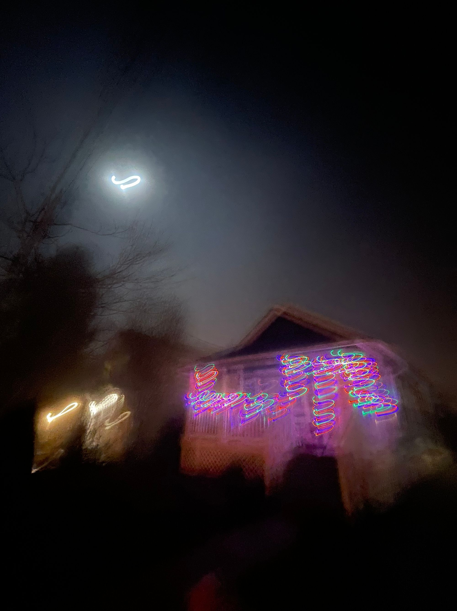

It has been seven days since 2023 began and I'm holding on tight to the idea that this will be our year.

So it will.

The collective trauma we've all suffered as humans over the last several years has been pretty severe, at least in my humble opinion. We've all been experiencing a lot of the same set-backs & challenges. We're all holding our collective breath about the economy and climate. Everyone is staring down the barrel of the same recession.

It's exhausting, and we're all tired.

For Lou and I, though, our journey has involved a move across the country, trying to rebuild our lives in the midst of a global pandemic and what feels, to me anyway, the most polarized our society has been in my lifetime.

Our year 2022 began with enormous challenge out the gate on our son's 15th birthday, Jan 4th, when our younger daughter was struck making a left hand turn through an intersection, which resulted in our nearly brand new 2021 Ford Bronco Sport, with less than 3,000 miles, to be totaled. That led to variety of insurance paperwork, doctor's visits, and a fight to get everything settled. Thankfully our kiddo was ultimately fine, though they were shaken up and still didn’t feel comfortable making left turns.

Then there was my burn-out and subsequent 6 weeks of FMLA time-off from work. I’m still recovering, I’m still challenged. The subsequent return to work and shift of roles from a people leader back to an individual contributor has been generally good for my mental and physical health. I have a lot of experience I need to spool off onto my “professional” blog related whenever I find some of that fabled free time.

Also excellent for my mental health has been a strong focus on Hiking + Meditation. The associated health improvements, including further weight loss down to the trim ~215 lbs I’m still in range of today (despite the winter layer of fat Birthmas-mageddon tends to create).

Of course all that hiking and working for my backpacking goal ultimately lead to back injury again:

> [
>
> View this post on Instagram
>
> ](https://www.instagram.com/p/CgU_H6pvvr4/?utm_source=ig_embed&utm_campaign=loading)
>
> [A post shared by Eph Baum (@eph_baum)](https://www.instagram.com/p/CgU_H6pvvr4/?utm_source=ig_embed&utm_campaign=loading)

On the bright side, though, I finally have had a low back MRI and gotten some more answers about my spine. They’re not great answers but knowing helps immensely and gives me something to focus on. (I intend to write about my chronic back issues eventually)

Lou’s 2022 was mostly focused on their fiber arts, building a business plan for around fiber arts, and volunteering (with fiber arts:)). They were very busy volunteering with some local kids, bringing fiber arts to the children of the local Rec Center.

> [
>
> View this post on Instagram
>
> ](https://www.instagram.com/p/CgUudhjJhXM/?utm_source=ig_embed&utm_campaign=loading)
>
> [A post shared by The Yellow Wagon (@yellowwagonfiberarts)](https://www.instagram.com/p/CgUudhjJhXM/?utm_source=ig_embed&utm_campaign=loading)

Lou continues to produce incredibly beautiful pieces of art while making progress on laying the groundwork for her business. All while managing the household,

Meanwhile, we took many wonderful trips all over our new home to place like [Quinault](/quinault/), Ocean City, Redmond, [Port Angeles & Olympic National Park](https://flic.kr/s/aHBqjAnsy6), Port Gamble, [Mount Rainier](https://flic.kr/s/aHBqjAntJ6),  and so many more

It's evident that there was a huge swing between highs and lows this last year. It's been exciting, if nothing else, but it has been so much more, for sure. 2022 was a year of growth and a year of healing.

I think that 2023, despite risks and warning signs (alarm bells have been ringing for literally years related to all sorts of possible doom and gloom), will ultimately be very good for us. It will be a year of growth, of building, of settling, and of solidifying. I'm very excited for this next year for a variety of reasons and I hope you'll come along for the journey with us.

In reflection: it’s been a hell of a year (or 12) and I really look forward to more
