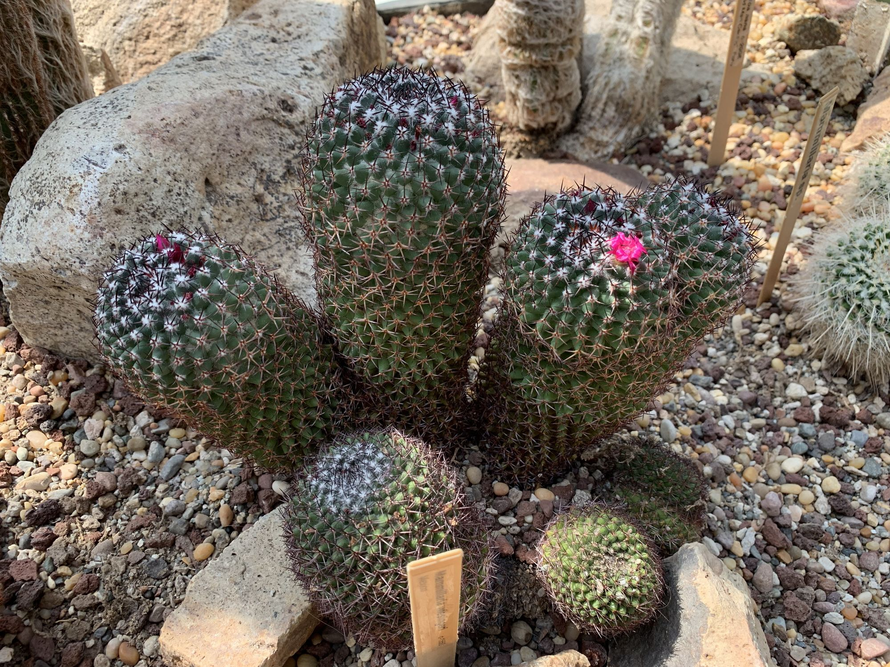

This has been a hell of a week where we’ve largely spent our time planning an semi-impromptu trip to Phoenix, Arizona to bring home a new member of our family.

This is a significant undertaking for us and given the somewhat hurried circumstance, if feels a little chaotic despite simultaneously being something we’ve been planning to do for a long time

The week saw Lou focusing on planning and booking our trip, as well as working on a variety of fiber arts projects and keeping the household running. I'm always in awe of their ability to juggle all the things. They seem to really enjoy juggling the chaos, however, and I do what I can to help wherever and however I'm able.

I’ve been feeling overwhelmed, however. Wednesday I even raised my voice to Oz in frustration after they'd been disrespectful. Again. There's been a lot of big emotions though, a lot stemming from excitement over things like the impending trip, the puppy, and the general hustle and bustle of life and it has definitely been testing the household.

My Thursday hike was Friday because Thursday I realized I had made a mistake and ended up working late to fix it. It was a good Thursday hike. However, I put in another 5 1/2 miles at Newbury and tackled Salal Ridge. I was able to practice mindfulness and hiking meditation, and it was valuable as always, physically, mentally and emotionally.

Today we needed to grab our luggage from the shed and in so doing also did a little spring cleaning to boot. It wasn't a full spring cleaning, we're trying to do this in little bites, like eating an elephant, especially because our belongings are spread across multiple storage locations.

One of the drawbacks of moving across the country in a U-Haul only to dump most of your possessions in storage only to then be unable to be properly able to lay it out to sort through it. The primary issue is a lack of space in this house for all the stuff we brought with us from the Midwest as well as the stuff we've been accumulating since we arrived here.

But we're working through it, and doing our best, and it's going to be fine. We'll ultimately get our meager possessions organized. We've already made a lot of progress on that front today for sure, and we'll keep working through it all.

As I went through a tote filled with electronics and desk items from my recent past, an old Apple TV, a keyboard with switches that felt great but were just too dang loud, and some random networking gear for example. There were some old conference badges as well, which is always a nostalgic walk through the past. I'm sure there's something in the zodiac or the seasons or the astrological charts to account for this rearward gazing, but regardless, the past as been more on my mind lately and I'm having to work a little hard to maintain my connection to the present and be mindful.

Also in the box was an old journal that had been separated from the rest, which definitely did nothing to reduce my thoughts of our history.

It begins on my birthday, as many of my journals do, in February of 2016 almost exactly seven years ago and speaks of the things that were going on in our lives then. Thinking about how to characterize 2016 is difficult. I want to call it challenging, but really, it was like all the other years of our lives. The journey that we've taken has been a long and arduous uphill slog and looking down at from up here makes me grateful for where we've arrived given where we come from. We had faced and would continue to face a great many challenges personally and professionally, and it can be a lot easier to dwell on the struggles and challenges than the good times.

Meanwhile, today, looking forward, we're about to embark on an adventure to the American Southwest and I'm absolutely stoked about it. It feels kind of nice to be in a position that I can take an extra week off. I'm grateful to my company for providing an extra week of paid time off based on my tenure with the organization that's not tied to my normal PTO accrual, just an extra week to take off and "refuel". I'm excited to take another family adventure.

Among other things, I'm excited to see cacti in person again. It's been a while. There have been a few here and there over the years - I remember really enjoying a few on display at [Volunteer Park Conservatory](https://www.volunteerparkconservatory.org/) in Seattle when we visited in 2019, hope of moving here soon was strong. That was a wonderful family trip. We stayed in Kenmore and adventured all around, including Poulsbo as we checked out our future home county again. That was a hell of a trip. (I'm pretty sure I wrote about the trip, it's definitely in my journal, and but [it](https://www.instagram.com/p/B0qi1XNnFDI/) was [captured](https://www.instagram.com/p/B0kdxgTHoI6/) on my "deadname" insta - (searching through that feed is yet another a trip down memory lane of the last decade, or so, speedrunning through some of the positive highlights I shared through one social media platform))

I keep titling these posts as WIP though I'm not sure who I'm trying to fool - I will hopefully come back to these at, at least in some cases. There's a lot more I would love to write about based on the last few days, but for now I'm already beyond my timebox for this post, so I'm walking away for the evening.

Fare thee well
