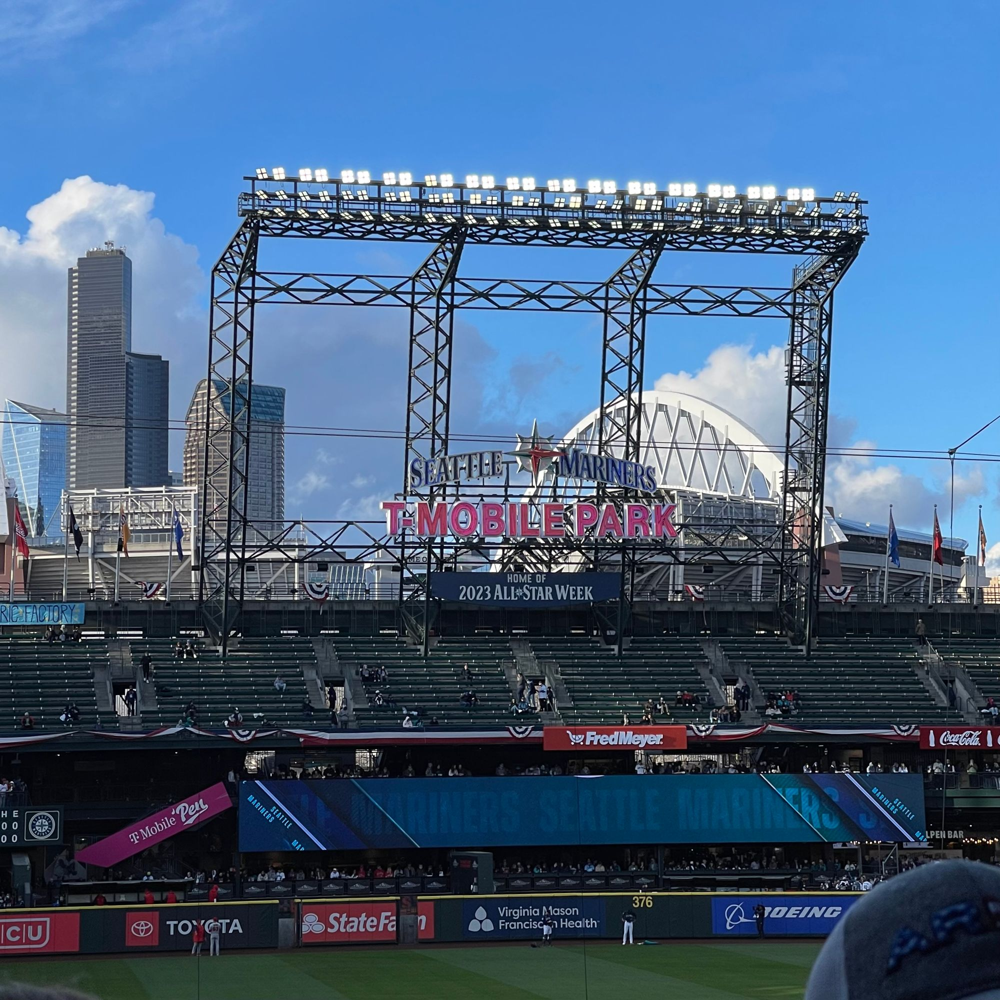

It has definitely been another week for sure - Lou and I had **two** nights out this week, a major milestone as Oz is finally showing enough maturity to be left alone (if you don't count the adult sibling that's generally around just in case things go wrong).

The title of this post, a reference to a great [Calvin and Hobbes collection](https://www.goodreads.com/book/show/24818.The_Days_Are_Just_Packed) they covered Bill Watterson’s first sabbatical from the strip and is the first volume to feature the unbreakable Sunday format, means to suggest that there are a lot of things going on. A number of events have been occurring. It’s all, or mostly anyway, good, but I have felt a touch overwhelmed of late so... (insert relevant emoji here)

I often forget to take pictures in the moment and realized as I’m typing this that I forgot to take a photo, as I usually do, of the movie poster outside the theater of the movie we watched today. I did so, I think, because I’d _generally_ forgotten, but also because I had snapped a photo of it the week before when we'd walked by and thought it looked interesting. It would have been better to have taken a selfie with myself and Lou together with the movie poster. Hindsight is, of course, 20-20.

The movie was saw tonight was [Linoleum](https://www.imdb.com/title/tt13483866/) and we did so at the historic [Roxy Theater](https://roxybremerton.org/), which is a beautiful old theater in downtown Bremerton. It was our first date night in Bremerton. It was nice to actually get out "on the town" in our own city.

We began our date [Remedy Speakeasy](https://www.remedyspeakeasy.com/), a little bar on 4th Street we've walked by many times but not really noticed much given that Lou and I no longer drink much. It looked interesting, and sure enough, it was pretty great. It felt maybe a little quiet for a Saturday, but I am putting that to the fact that today was sandwiched between Good Friday and Easter and there were a lot of cars in various church lots as we drove by them.

The food was tasty, the service was pleasant, and the whole place had a really good vibe that recalled previous neighborhood bars we've visited in the past. The menu has a few more items we would both like to check out, so it seems we might be forced to come back again at least a few more times to try to get the full experience.

Before the movie we decided to walk around a bit and stopped in at Ballast Books, grabbing an interesting looking book: [Rooted: Life at the Crossroads of Science, Nature, and Spirit](https://www.goodreads.com/book/show/55277028-rooted). We also stopped into the new Bremerton Mercantile on the corner of 4th and Pacific Ave. that continues to grow.

The movie was beautiful. There's not a ton I can say without feeling like I might spoil things. The casting was fantastic, the cinematography, story, acting, writing were all excellent. I've come to really feel Jim Gaffigan is a treasure, despite the position I once held when debating with a former friend. I was moved emotionally on a multiple levels. I would definitely recommend it.

Today Lou was out learning more about our community and meeting other folks trying to effect change. Today she and Victoria met with folks [Resilient Ecosystems](https://www.reseco.org/) for a workshop.

Oz and I went out and about to run some errands and have a little Papa / Oz bonding time. We stopped at REI, got sushi at Hokado in Silverdale.

The rest of the week was, as suggested above, so I'll try to briefly summarize as I suspect this post is already too long and uninteresting to most readers.

#### Sunday

Sunday was a little gloomy, and knowing that we were facing a long week, we mostly stuck around the house. I worked a bit on a new project involving ChatGPT and a strong desire to gain a little more practical experience using Elixir & Pheonix Framework. I talk about it a bit more [here](https://ephbaum.dev/2023-04-02-project-blog-elxrbb-innaugural-entry/).

My friend Bald Mike arrived in Seattle via Amtrak for a one day "layover" before continuing on the LA. The train was not only shockingly on-time but actually about an hour early! This surprise would have been a great opportunity to meet up, but alas the lack of Sunday fast ferries for Kitsap Transit and one boat service on WSF meant that it would have been a challenge.

Lou left in briefly in the afternoon and returned with a small filing cabinet.

I made a list of things of goals, so that's something.

#### Monday

Monday the word overwhelmed appeared in my journal, but it was a huge day, so it makes sense, I think.

Monday afternoon Lou and I shot across to Seattle and spend the rest of the day with my pal and colleague Bald Mike and his partner Mia. It was a fantastic time, we walked around Pike Place for a bit, went over the to the International District, and then ultimately we went to T-Mobile Park to see the Mariners play the Angels.

The whole experience was fantastic, it was a wonderful and one of a few rare social experiences we've had since COVID began three long years ago.

It was the first time for us to experience T-Mobile park, and we'd managed to get those tickets right next to Mike and Mia on the lower level first base line, so it was a great first experience. We were struck, Lou and I, by how similar this stadium felt to Target Field in Minneapolis while Bald Mike kept suggesting it was like White Sox Stadium. It seems baseball stadium design has largely normalized.

It was a good time with only a few complaints such as how there's only one purveyor of coffee per level and the lines are quite long.

It was ultimately an incredibly fun time and I hope we get to spend time with them again as soon as possible.

#### Tuesday

Tuesday was a little quieter. Lou stated her intention is to "grab the community by the balls", which is a little vulgar and funny but ultimately makes sense. She's very excited about the work she's beginning to learn about with [Kitsap Strong](https://www.kitsapstrong.org/). She's very excited and I'm excited for her.

Oz had their second acting class and still seems to be really enjoying them.

I managed to make a little more progress on my new side project, though not nearly as much as I would like.

#### Wednesday

The word overwhelmed again appears in my journal.

We treated ourselves to Gyro Star for dinner and was only mildly disappointed by this delicious but overly busy eatery's minor mistakes on our order.

We took Ollie to the vet for a few more shots. The vet was kind enough to remind us that Ollie is at an incredibly impressionable age and now the time he's most likely to have his whole like changed by even a brief traumatizing event.

So that's cool.

On our evening walk we met a man wearing a hat from which two feathers protruded who, upon seeing Ollie, told us of his former pet: a feral black cat found in the woods named Salem who lived for 21 years. He spoke of Barbara and at one point, in making the point that it's important to carpe diem, mentioned that he'd killed a lot of people. It was an interesting interaction.

#### Thursday

In keeping with the theme, the word overwhelmed again appears. Spoiler: you'll be _unsurprised_ by the way the first line for next day's section reads 😅

Thursday morning Tris came across from Seattle for a visit and we had a lovely time, she hung out for dinner and spent some of her time with her siblings.

There was meant to be a cleanup in downtown Bremerton but it was cancelled due to the weather.

In the evening with had Ollie's Puppy Socialization Classes at Alder Trail Animal hospital. It was a wonderful time. Ollie started the evening out being very withdrawn and protective but by the end he was frolicking and butt sniffing.

#### Friday

Still feeling overwhelmed. At this point, perhaps I should accept this as my default mode. 😅

Lou had some meetings, Oz spend the day with a friend visiting.

Ollie is stubborn.

#### Saturday

I already talked about this day, though it did have a bit of a rough start, it turned out to be pretty fantastic overall.

### Conclusion

I feel like there's a lot more I could convey about our week, but this has already probably been too verbose.

There's a lot going on and a lot more to come, and it's all fine. I'm feeling a little challenged and really wondering how to proceed when it feels I need to give more time to self-care than is available.

Still, we're moving forward, we're progressing.

I mentioned the [project](https://github.com/ephbaum/elxrBB-tutorial) I've been working on and while I've only put in a couple of hours of time on it, you can see what my progress has been like from this [commit](https://github.com/ephbaum/elxrBB-tutorial/commit/50edab8f630cb427f04be4d99140a25eacee2b64). ChatGPT lies, but I am confident that this is a project I can accomplish. I'm only left wondering whether or not I should. Maybe I should wait for GPT-5 🤣
