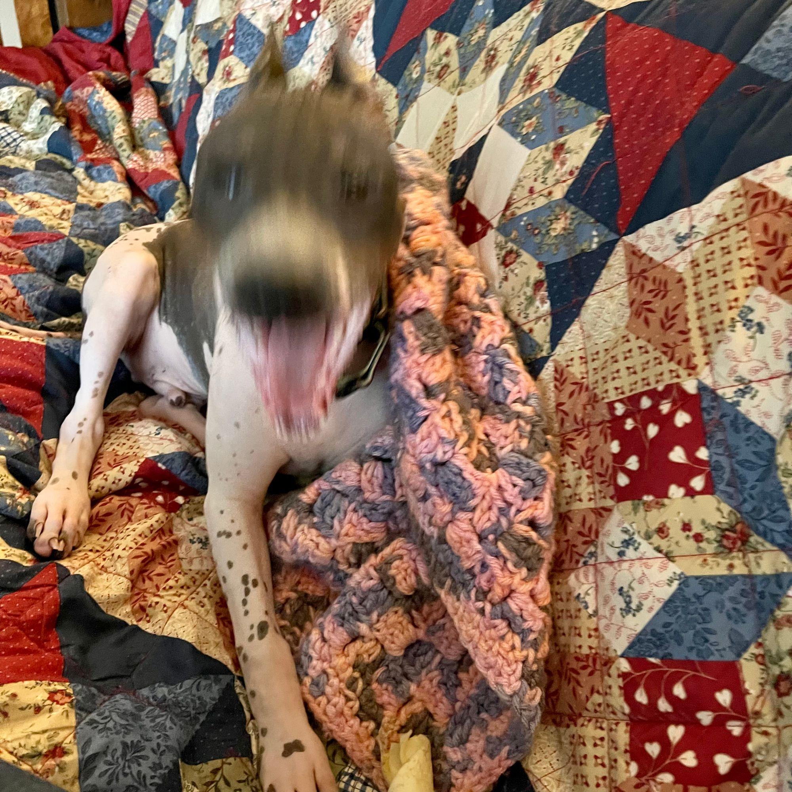

The end of this week has reminded me that I'm still burnt out.

It's okay, of course.

I just have to give myself some grace.

Today has been the busy kind of busy when you have a puppy and kids and a house, and so-on & so-forth. I've tried to fit in some training with the puppy, and Papa/Ozzy time watching [Puss in Boots: The Last Wish](https://www.imdb.com/title/tt3915174/), among other things.

## Puss in Boots: The Last Wish

This movie is gorgeous. I really did not expect to love this movie as much as I have done, but it's absolutely lovely.

I was worried when I saw the trailer, after having seen The Bad Guys, that this would suffer from the same fate of looking great but having little substance but I was absolutely wrong. I have never had all that much love for the Shrek franchise, but I have certainly not _not_ appreciated it. 😅 Maybe I'm jaded after all these movies.

But this film is not just gorgeous, but also brilliantly written with lovely dark undertones. It's incredible, the character development is sublime, the whole thing is deftly assembled.

I absolutely loved it!

It's been incredible to see the advancement of animation over the last several decades. It's hard to watch old Don Bluth movies now, much like it's hard to watching the first Monster's Inc. from a technical perspective, even if they're still wonderful movies.

The last few years have given us some amazing examples like Into the Spider-Verse.

I wonder what we'll think of them in years to come as these things continue to advance and improve.

## Meanwhile... this week

Week 15 began with Easter.

### Easter Sunday: kind of productive, kind of not

We didn't really do much in the way of celebrating, but there was candy 😋

Oz demanded candy for the holiday.

#### Feelin' a kind of way...

There's something about Easter, or as I've historically called it: Zombie Jesus Day. I think I may just find the crux of the the Christian faith's core story somewhat "triggering", perhaps is the best way to describe it.

But that's perhaps a topic for another time.

My mother texted me and I texted back, so that's how that's going.

Lou spent a good chunk of the day trying to check off some TODOs, I tried to do the same. We both checked off a big one from our list, I spent some time working on the little project that's been interesting me, as if I need another project.

Ultimately we filed our name change paperwork with the county. For the reason why I said that my given name was too long and makes me sad. That seems like a succinct enough reason. I have definitely have [reasons](https://github.com/ephbaum/ephbaum#why-eph-baum). There are more beyond, as well, but I'm hopeful I've given reason enough.

### Monday

I've long held that the day after Easter should be a holiday 😅

It would be keen if it was a holiday because I would have really loved to have had the day off despite not really having done much to observe the holiday.

However, somehow I managed to attend to my work and we had a pretty normal day.

We learned that our name change hearing will be held Monday, April 17th. This is extremely exciting news. It's thrilling!

Excited broke out just as we were preparing to retire for the evening it was [made clear](https://hachyderm.io/@ephbaum/110178346477709383) that our main bath's shower handle's cartridge was in need of replacing as we suddenly couldn't turn the water off. That was an unpleasant but solvable situation, though I didn't love my second trip out after bed time o'clock because it turned out I _didn't_ the 7/64” hex-key as I'd thought. 😓Thankfully, the [process](https://www.moen.com/customer-support/installation-help/1200-1225-cartridge-replacement-tutorial) wasn't too difficult, although the cartridge was pretty stubborn and its extradition took a bit of elbow grease.

### Tuesday happened

Apart from a recollection of taking Oz to their acting class, however, I don't have a lot of recall from that day.

Let's move on.

### Wednesday was rather exciting

Excitement was had by all on Wednesday when Lou spent much of the day in Seattle at a Poverty Prevention Workshop that sounded like an extremely positive event in service of a terrible issue in our society. It's astounding to me that we can try to pretend there's such a thing as American exceptionalism when such a significant portion of our people live in abject poverty.

We managed, Oz, Ollie, and I, to survive the day without Lou, though it was touch and go at times.

In the evening I was supposed to play Infinity RPG with some work chums again, the group from which one member has been absent for that last two sessions due to the birth of their second child, and we're doing our best to forge ahead despite his player character having vanished in wormhole.

I say we were supposed to play because we had some attendance challenges and ultimately chose, those that remained, to hold off on this session until we can meeting together again, in another two weeks I'm sure.

### Thursday: Hiking & Puppy Class!!!

For me, Thursday was a lovely because I took Ollie on his first _real_ PNW hike! We only put in a couple miles, not the committed 5 miles I maintain as a #ThursdayHike goal. I think we could have gone longer but, alas, it rained (with just a little hail) and Ollie was not pleased and wanted desperately to return to the car.

Lou, on the other hand, was on another hike on the other side of town.

We took Ollie to his puppy class where practically everyone commented on his incredible improvement. I really was night and day. When they played, Ollie played too. They all sniffed each other, even the new Golden Retriever puppy that had not attended the first class, Ollie took them and they played like they were ol' puppy pals. 😍They were so darn cute! Puppy class is wonderful.

### Friday, A Day Like Any Other

Friday was another day. Work this week, and in particular on Friday, has been exhausting. With all the best intentions toward completing sprint work and each day I'm presented with new and interesting challenges that _must_ take priority due to things like failing deployments.

It's worth noting that it's my good friend Jim's birthday, which had me reflective over the last nearly 20 years of our friendship. I owe a great

In the evening, after dinner, Lou and I took our little Ollie pup for a walk and wound up downtown where we visited Gastropup and Vulkas market for tasty treats for ourselves and our pup.

### Saturday, that weekend vibe

As I mentioned, Oz and I watched Puss in Boots: The Last Wish, wonderful as I'd mentioned above.

We did this while Lou was largely out for the day at another local community event.

We, Oz and I, also participated in the tail end of the event and helped a little with the clean up, we met some lovely folks.

It sounds like the event had a good turn out with positive community impact!

Now I'm exhausted but I did this stupid post.

I meant to cover some ground in this post about my recent reflections, the fact that I'm feeling a strong desire to make some kind of a difference.

It's going to be a big week this week. Monday will be a big day for sure!

Namaste
