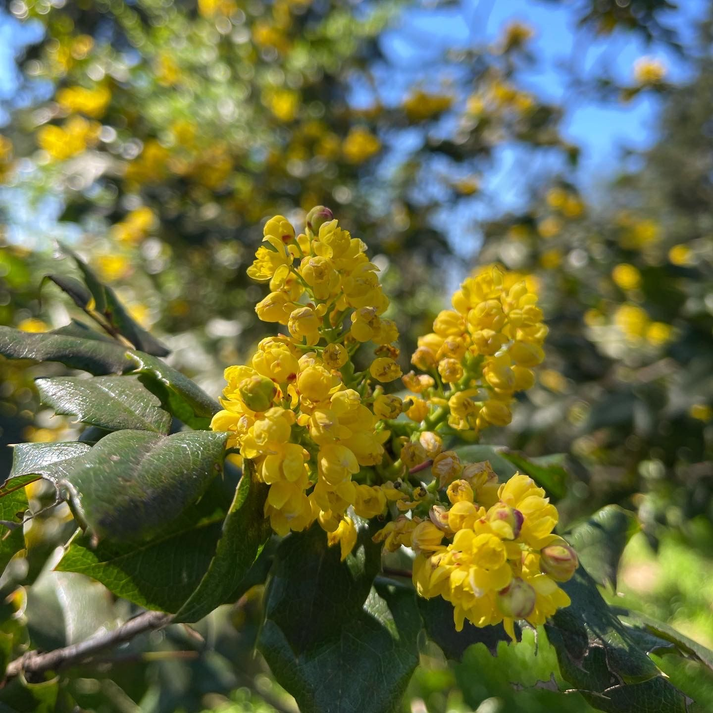

## Into the future

It was another action packed weeks!

It’s so late on a Saturday and I’m hardly remembering all that occurred!

So, this may be a placeholder post as I’m falling asleep trying to type this into Joplin

Events this week, in no particular order

- Ozz Acting Class
- Ozz State Testing in Silverdale
- Ozz birthday party 50 minutes away
- Ozz meets school friend at the local park
- Lou checking on a friend's house/cats nearly every day
- Lou working on projects
- Eph got new teeth installed
- Ollie training
- Eph & Lou picnic of the extraordinarily delicious Sugar Bones Tacos at Steilacoom park
- Eph & Lou checked off some todos like updating our names, filing paperwork, registering a new LLC
- Another of our kiddos is getting their first apartment
- And more I’m totally forgetting because I need sleep

Maybe I’ll come back 😅

---

Update, I'm back, and I'm going to try to fill in some of this because it was YAEW (Yet Another Eventful Week)

Since the "by day" format seems to work reasonably well, I'll just stick with that.

## Sunday

Sunday was a day of rest, as Sundays generally should be, but also we ticked off a few little todos around the house.

There's not much more to say about Sunday except that it was a pleasant day even if it was largely overcast all day.

## Monday

Monday was a bit more eventful for me as it was a day where I finally reached the end of my Tooth Implant Journey! When I set out months ago on a quest to get replacement molars for the one I lost and the one I was losing on the back bottom of my jaw, I didn't really know what to expect.

The entire experience was less than stellar, to be honest, and I would recommend that you do all in your power to keep your teeth if possible.

With that said, the final stage of the process was reasonably painless and easy enough. It's never pleasant to have someone digging around in your mouth, and the process of having the healing caps unscrewed and the crowns installed, sanded, and finally torqued down was certainly not one I would seek out without a real need. But it's done now and I have molars for crunching again!

Monday we also managed to spend some time at Evergreen Rotary Park and it was a lovely afternoon for it.

## Tuesday

Apart from Ozz's acting class, there wasn't much to speak of about Tuesday of this week.

The clouds laying across the Olympics were super dramatic.

I had a lot of reflection, in my journal I suggested a new memoir:

> Start of Many Projects, Maintainer of Several, Finisher of Few  
> The Eph Baum Story  
> A Tragedy

This, mostly, due to feel inundated by all the projects I really want to work on but don't due to one excuse or another.

I am working toward eliminating the excuses and owning my time.

For some reason on Tuesday I kept feeling somewhat homesick for Anoka, MN. I kept thinking about eating at Sparky's and shopping Main St.

Meanwhile, we've been increasing the number of walks we're taking with Ollie as the weather has continued to improve and Ollie continues to be more and more comfortable on the leash. We had another lovely walk up to the Kiwani's Park and really enjoyed the sunset over the Olympics.

## Wednesday

Wednesday was a heck of a day as I had to drive Ozz up to the Oxford Suites in Silverdale for WAVA's administration of standardized testing. This meant I was working from Out of Office, which can be either really fun and productive, or it can be extremely distracting and unproductive.

For me on Wednesday it was more the latter than the former, but I did still manage to get some things done even if they weren't the things I had really set out to do in the morning.

Ozz requested that we get McDonald's on the way to their testing since we so rarely get fast food these days and almost never McDonalds. It was fine but I still don't understand why people love their fries so much, they're only okay.

Meanwhile I managed to get together with most of my Infinity RPG group. We basically spent the entire session at a safe house working through the shopping mini game where your "cashflow" is essentially your wallet's "armor". It was a great time and my character now as a fancy folding marksman rifle!

## Thursday

Another afternoon of testing for Ozz. This time we stopped for Taco Bell on the way and I definitely prefer a bean burrito, due to some good ol' nostalgia, to the Fish Fillet sandwich.

My work from out of office worked out a bit better this day, I feel like I managed to get more done overall than I did the day before.

Meanwhile, another of our kiddos is moving out! They're getting their first apartment and it's kind of a big deal! 🥰

Meanwhile I managed to get in a another #ThursdayHike with Ollie at Illahee preserve! We met several other people and dogs who were all quite pleasant and while we still aren't hitting a full 5 miles, per my previous commitment, we're still doing pretty well and Ollie is becoming a bit more comfortable.

But only a bit, he keeps his head on a swivel.

## Friday

This was a day where I mused in my journal:

> It's normal to feel dread when looking at all you vacuum from your air cleaner's pre-filter

Friday was another milestone day for Lou and I as we managed to get our IDs updated! It was stupidly easy with the appointment system at the Washington Department of Licensing! I was shocked! We walked in a few minutes before our appointment in the afternoon and walked out less than 30 minutes later!

Another check box in the massive todo list that comes with changing your names.

We're making progress at becoming who we are! 😅

Ozz also met with a new friend at a park, we met the parents. It was a nice time chatting with them while the kids hung out on the playground. There's generally something to be enjoyable about spending time at a public park, it's often very relaxing and comforting. Seeing other people walking, playing, flying kites, tossing a ball around, whatever it is people are doing feels good. Reminds you that other folks exist and they live complex and interesting lives of their own.

I'm just pleased that they've found a school friend that lives less than an hour away, which is one of the challenges of a statewide online school like WAVA.

## Saturday

I started Saturday by registering a new business now that my name is finally official - which is all I've really been waiting for at this point. I'm super excited about it and can't wait to share more - but that's for the future.

Saturday's adventures took us to Steilacoom where Ozz had been invited to a birthday party for another school chum!

This meant meeting another set of parents and chatting a bit!

I'm always surprised by how much social interaction can take out of me. 😅

We'd previously been the Fort Steilacoom Park when we were living (for 6 weeks) in Tacoma. We had not yet made it to the city that bears the Steilacoom name. It is a lovely little town just south of Tacoma along the southern shore of Puget Sound with incredible views of the same Olympics we look at everyday here in Kitsap County.

We considered exploring the town itself on foot, but we were hungry and had Ollie with us so we opted to grab food from Sugar Bones Tacos in Lakewood and to go hang out at Fort Steilacoom Park for the afternoon until it was time to pick up Ozz after their movie in Lakewood.

It was an absolutely gorgeous day to be at the park! We spent some time lounging in the shade of big beautiful trees, Lou and I, talking about our plans for the future and how we can possible get there. Then we took Ollie to the giant off leash park and he got to meet some more dogs and puppies.

Being only 5 months old we kept him on his leash the whole time. He did pretty well, all things considered, except for the little chihuahua that got a little snarly that Ollie wound up striking back at. The owner admitted their little pup was a bit of a scaredy cat bully.

It was an lovely time!

## Conclusion

It was another busy week of existing for Lou and I filled with living, laughing, and loving! We're up for another busy week ahead!
