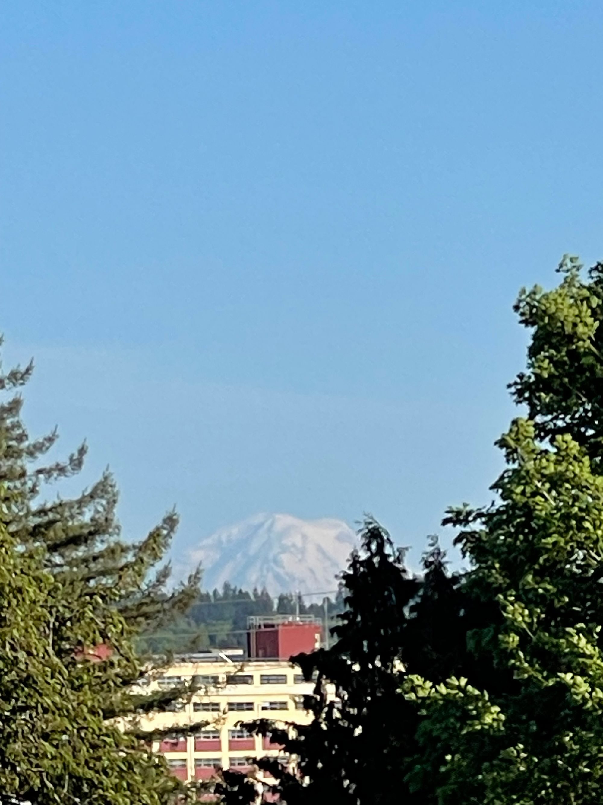
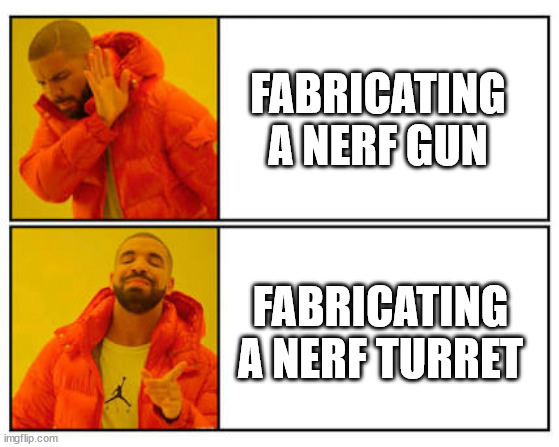

Another week has come and gone for the \*Baum family and I remain grateful for living in this little corner of the beautiful Pacific Northwest

Personally I’ve found myself challenged on a variety of fronts.

And Ozz needs to do a project.

## A Project?

They initially wanted to try to build an upscale Nerf blaster for their collection

Look, I've memed

Lou suggest not making a gun. I suggested making a turret using Ajrduino, optical sensors, motors, flywheels, etc.!

It's **not** a gun 🤷�

We’ve since [found a project](https://www.instructables.com/Arduino-NERF-Ball-Wireless-FPV-Sentry-Turret/) on Instructables that looks like it might be a good jumping off point at least. We’ll need a make a project proposal, and a charter, which should be easy enough to do and maybe I’ll try working with the kiddos to draft that this afternoon so we can get that under source control.

I'm tapping this post out from our front porch on our fairly busy street in sunny Bremerton, WA on a beautiful PNW afternoon as we approach record hot temps for the date for the region

This week has seen me struggling for focus - perhaps you've noticed my meandering writing?

All around me there is change and movement. All around me there are people struggling, and people who are simply not okay. All around me is growth, and life, and danger. All around me is family, a community, organizations, and folks and I feel like I have so little bandwidth to help.

I want to make a difference

I want to help

I don't know where to start

Meanwhile I am sitting here on my porch and everything is fine for me, except for all the in-flight projects  in need of my attention. 😅

The project I'm mostly thinking about, though, is this Nerf Turret-

but now Ozz has found me out here-

oh, and Lou as well

—-

Well, I don't quite remember where I was, and scrolling up seems like a lot of work, and I'm here now, so I'll just continue from here.

I've managed to check a few items off my TODO lists today and it has been quite the afternoon with puppy walks, dinner, and other various comings and goings on top of various tasks 💪

Meanwhile, I _think_ I meant earlier to talk about the excellent improvement in my well-being the act of sitting in a rocker on my front porch produces. That serotonin hit, being outside is literally good for your sense of well-being.

If I can sit outside and get work done I get that additional dopamine hit, which is half of the four chemicals and while I probably won't be triggering any oxytocin out here (lol), I'm betting a few jumping jacks might hit me with some endorphins as well but that smacks of effort, so I'll just take the two and run with them😂

Anyway, I think a lot about trying to figure out how to keep my brain chemicals balanced given my neurodiversity.

Investing in rocking chairs seemed like a no-brainer from a brain-happy chemical perspective. I consider them an investment

## Meanwhile, back at the lodge...

The Hurricane Ridge Lodge in OLYM [burned down](https://www.nps.gov/olym/learn/news/hurricane-ridge-day-lodge-fire-2023-05-07.htm) this week while closed and undergoing maintenance. I'm so glad that we'd had the chance to visit and I'm blown away, yet again, by just how many fires seem to take structures in this region. I'm so very happy to have had the opportunity to visit before it was lost. It was a truly lovely structure. 😭�

[This article](https://www.columbian.com/news/2023/may/12/cause-of-fire-that-burned-hurricane-ridge-day-lodge-sought/) in an Oregon paper covering Clark County reports that the reason for the fire is being sought.

## ... you should go and change it

I found myself reflecting on just how much I've found myself trying to change my life (and myself) for the better.

I've been iterating on my life to continually improve it.

My company played this song at a town hall once and it clicked for me, the words "if you don't like your life then you should go and change it" have been echoing ever since. It feels like the lyrics, to which I was no stranger, suddenly made more real the way that I've been trying to live my life as authentically myself as possible.

I've now reached a point in my life that I actually do like it, largely, but there are a variety of things about my life I'd like to make better.

One of those things is definitely the notion of _working for my living_

I'm angling more and more toward just living

The TODO list never seems to get any shorter, but there are ways to put TODOs on the list you enjoy doing, or that perhaps lead to TODOs you'll enjoy.

Anyway, here's to iterative progress across many the many demands in our lives 😅

## Enough of that Thinking

You're right H2!

This week gave me plenty of opportunity to check off TODO items, including a few that I wanted to check off.

There's really not a lot to report about our family's comings and going this week. Ozz continues to enjoy their acting class.

My #ThursdayHike with Ollie this was even better than the last. He continues to improve on the trail and he's starting to get his excitement under control as we meet new people and dogs.

Ollie had even more opportunity as we walked around at Manette Park on Friday while a small fair was held for Catalyst School, which is just down the street. Folks were pleasant, there were a lot of exciting tables and booths. Many people commented on Ollie and generally want to love on Ollie. It's hard as he's still so little and has some particularly negative feelings about being touched sometimes. Still, he gets so excited to meet new people despite _knowing_ they're going to try to touch him.

Socialization is good for Ollie

Good for me, as well.

And Lou, and Ozzie too

I got some compliments on my death metal mycelium, a great choice on Lou's part finding a shirt that "is nerdy 4 levels deep" iirc 😂

Most of the attention was on Ollie, however. It was a fun community event and it was filled with a sort of community warmth that's hard to articulate

## Mother's Day is for Mothers

This weekend it was suggested that I do the cooking and so far I've managed to order two out of the three traditional meals with a plan to order at least one more tomorrow 😓

Perhaps I'll think of something more I can do for my darling Lou (besides jewelry and yummy takeout 😅)

## A Moment in Time

Today I was struck by seeing a little abandoned sedan that I've walked past regularly for some time, it's abandoned, it seems, perhaps non-running, perhaps its owner, and it is covered in moss and there's debris built-up around its tires. And beyond, through the trees, past an overhead transformer, beyond the town, stands Rainier against the slightly hazy blue skyline

## What else?

Honestly, it was life - we're all just doing what we can - but right now I'm more interested in working on another project besides blogging at the

I'm taking the time to recognize the little beauties in life despite all the ugliness that exists

I recognize that as privilege and for I am deeply grateful

Enough meandering for tonight... byeeee
