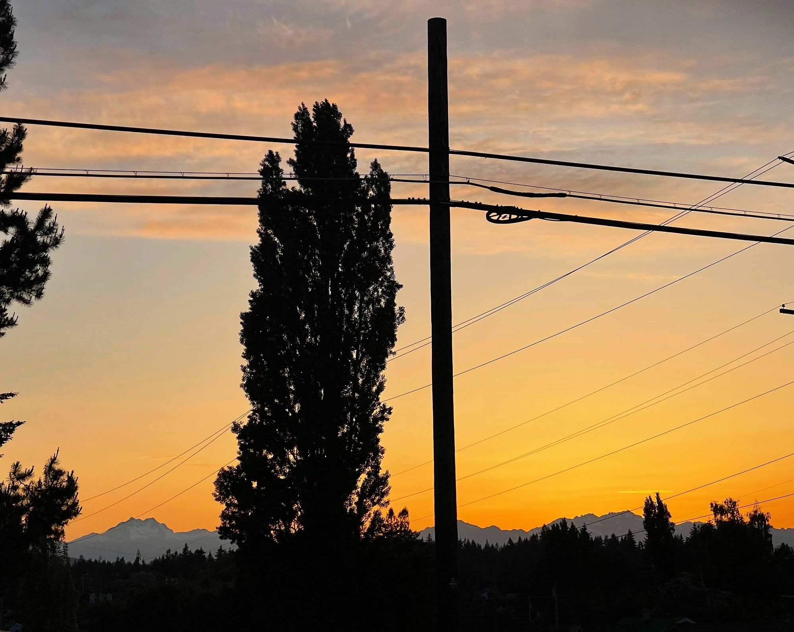

I feel like I'm emerging, and shaking of the rust from some S.A.D., though not Seasonal Affective Disorder. I'm thinking of something like Surviving Another Depression as opposed to Stomp About Dumbly. I wasn't sure about that, meaning, however, so I asked ChatGPT for alternatives. ChatGPT suggested the following:

- Struggling Against Despair: Representing an individual's resilience in the face of overwhelming despair.
- Solitude, Anxiety, Desolation: Reflecting a person's inner emotional turmoil.
- Seeking Alternative Directions: Signifying someone trying to find new ways to manage their feelings.
- Sustain, Adapt, Develop: Representing a strategy for overcoming obstacles.
- Sympathy, Assistance, Dedication: Highlighting the need for support systems in mental health.
- Strength Amidst Difficulty: Showcasing the inner strength that emerges during challenging times.

🤔

I overheard someone yesterday mention that they don't like this city and they wouldn't be here if they had not been stationed here and I can't help but wonder about that completely opposite feeling from my own having worked so hard to get here. On the other side of the token, though, there are stations in San Diego and Hawai'i that I probably wouldn't fight as places to live 😅

Today, while driving up to take a hike on the Wildcat Trail on Green Mountain, as I approached the roundabout that leads to Holly Road on Seabeck Highway a juvenile bobcat, bobbed tail and all, ran across the highway before me. It was super cool and I choose to believe that it was at worst a cool experience and at best a good omen portending future success.

Anyway, this has been another long week. I'm still not sure a winning recipe is to keep recounting each week one day at a time, so I'm going try something a little different.

Right now it's a beautiful afternoon and Lou and I are watching the show [From](https://www.imdb.com/title/tt9813792/), which has a real Lost vibe. It's super interesting so far, though we're only about half way through S1E2.

## Sunday

Sunday was a gloomy day, but we still took Ozz to the Lion's Park to hang out with some friends for a few hours to try to play the game Calico. It was a find enough day to spend a few hours in the park.

In the evening we had a friend's kiddo come to say with us in our newly created guest room until Thursday while her mom is out of town for a conference.

It was a reasonably productive day, all things considered, but not very eventful.

For myself, however, it seemed to be the end of Ozz's illness, which followed Lou's experience with the illness, which came from somewhere, but here on Sunday my throat started to hurt and by bedtime I was feeling pretty awful.

I barely got any sleep and my face kept leaking from most of its holes, which, simply put: sucked.

## Monday

Much of Sunday was, for me, lost to the head code. I took the day off from work and spent most of the day on the couch resting.

Lou turned on the movie [Finding 'Ohana](https://www.imdb.com/title/tt10332588/), which was cute and had a sort of Goonies vibe.

Then we watching some more of The Kominsky Method, which is fun, and finally Lou turned on [This is the End](https://www.imdb.com/title/tt1245492/). It was a little surprising to me that I hadn't actually seen this one, but was expectedly mediocre with a few amusing aspects and was plenty meta.

In the evening Moira came over for traditional Bob's Burger / Dinner / Laundry night. We watched this season finale of Bob's Burgers: S13E22. It was lovely as always but now we have to wait until September to enjoy Season 14 Episode 1.

Lou got more Hobbi yarn and was super excited :)

## Tuesday

Tuesday was a relatively quiet day all-in-all. Lou and Ozz spent the evening at our guest's home so that they could check on the cats and feel a little less homesick.

I watched [Missing](https://www.imdb.com/title/tt10855768/) on Netflix and it didn't fully suck. There were some cool aspects and the story was only sort of predictable.

I had a nice quiet night to myself with Ollie.

## Wednesday

Wednesday was a bit challenging being home alone with the Ollie puppy and trying to take care of work and the house.

Ultimately, however, it worked out fine enough.

After work I picked up Lou and the kids. It was a gorgeous afternoon and I found myself a little sad that we were unable to enjoy it more fully out of doors.

In the evening I played Infinity with the fellas. It was a good game ultimately and we made some interesting progress in our campaign and I was pleased to employ a bit of PsyWar. The Infinity has a game system for everything and it's pretty fun to play.

## Thursday

Thursday saw me bringing Ozz down to the Pierce College Fort Steilacoom [Science Dome](https://www.pierce.ctc.edu/science-dome) for a little fieldtrip to their Planetarium.

It was our first time there and we had an enjoyable time. I was a little surprised by how small it was. I'm not sure why I expected it to be so much better than it was, to be honest.

I may have modeled some terrible behavior by drag racing through Tacoma, however, so I am feeling rather embarrassed by that.

Ozz, however, was excited to see one of their classmates.

It was hot AF.

Since Ozz and I didn't get back until after 5 we decided to order some sushi for dinner and after dinner we played some games. First we played Taco vs. Burrito and had a great time, and then Lou and the kids played a couple games of Labyrinth. This was a fun way to spend an evening until our guest was picked up in the late evening having been a lovely guest.

## Friday

Friday was even hotter than Thursday.

There's really not much for me to share about the day, to be honest.

I did take stock and realized that I need to put some time into my self-care, most especially because I missed my Thursdday hike.

## Saturday

That brings me to today and my hike this morning.

Lou is attending an event this evening so it will be just me, Ozz, and Ollie tonight - which means I could probably figure out our plan for dinner and such now that I think about it.

Perhaps I'll circle back later, but for now I'm just going to move on -- keep on keepin' on y'all

I've managed to keep up this practice, I'm proud of myself
