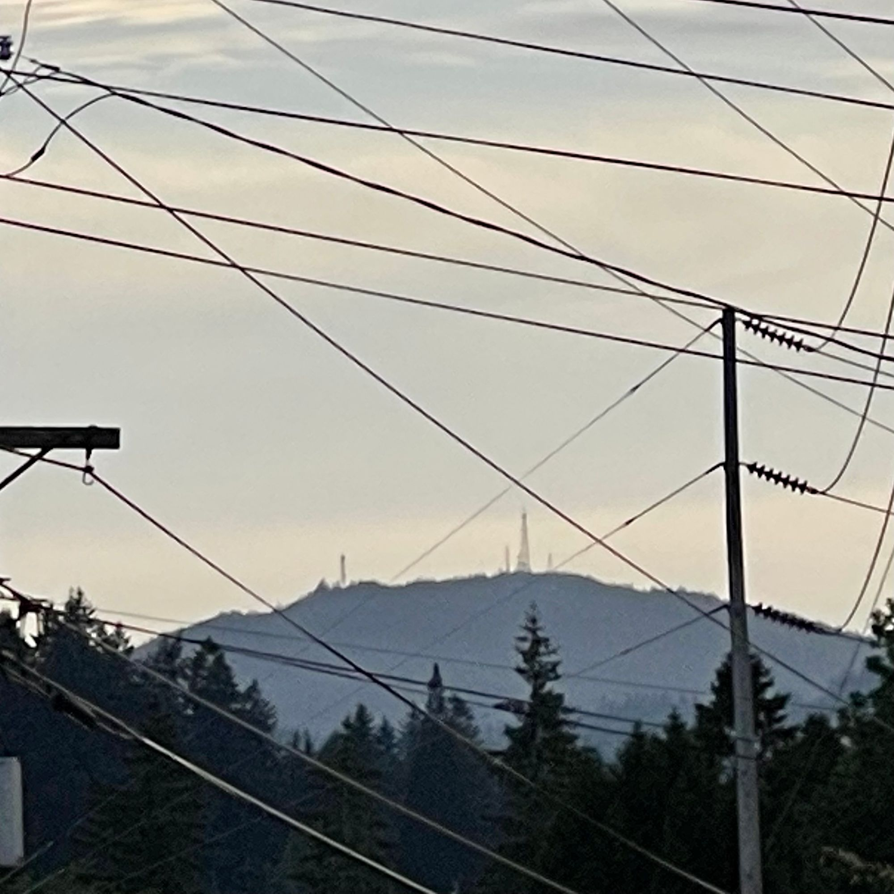

This will, by necessity, be a short post. It's also, by necessity, not posted on the correct day.

Once again, I have let myself down, and now I'm feeling a little disappointed in myself.

It has been a busy week, and this weekend has been quite a whirlwind!

First, let me comment on the weather: lovely! The air has been clean, the temperatures mild, the sun frequent. We finally got a little rain late in the week that was, I think, much needed, but it's been generally just lovely. We did a little work in the yard and I was able to put up a hammock and spend a little time out in the back yard enjoying the outside, getting that little serotonin boost my brain needs so often.

Yesterday, Michael came home! It's hard to believe that Mikey is already 16; it's even harder to believe that he has successfully completed his sophomore year of high school and will now be a junior.

Time flies, doesn't it? It feels like just the other day this kid was only two years old!

Yesterday we picked up Mikey from the airport, and as a result, we had a whirlwind of a day.

The whirlwind day was a busy ending to a busy week, with another busy week ahead!

Lou has been out of the house every day this week for some training, leaving Ozz and me to hold down the fort with Ollie. I must say, we were generally successful in this endeavor. We even managed to find a little time during lunch to watch some YouTube videos together, specifically the first two videos of [Night Mind's reporting](https://youtu.be/24XGxSdZmyI) on [10 Tapes](https://www.10tapes.com) ARG, which has been quite interesting. Lately, I've been contemplating ARGs in general and how fascinating they are.

Some normal things happened this week as well. Tris came for a visit, I went hiking on Thursday, and I checked off various items from my to-do lists, although it never felt like enough.

I also spent some time this week checking in on some friends. Broadly speaking, most folks are doing well enough, but I can sense that they're carrying their own burdens, you know?

I find myself frustrated by my inability to do more to help the many people I care about.

Friday was an old friend's birthday, and despite our estrangement for the past five years, which is a significant portion of our thirty-year acquaintance, I thought about them, as I often do. I wished them a happy birthday, as I do every year, and genuinely wished them well. Although I miss our relationship greatly, I suspect it's probably for the best.

As a sneak peek for next Saturday's post:

Today, we went to see [Spider-Man: Across the Spider-Verse](https://www.imdb.com/title/tt9362722/) and found it absolutely spectacular. It's an absolute masterpiece, a theatrical love letter to comic books and comic book movies. I loved nearly every frame, and within the first twenty minutes, I was instantly hooked and ready to watch it again. It's an incredible film and easily ranks among the best ever made.

The rest of this week will be quite busy for us. We are planning another adventure to Seattle to catch a Mariners game at T-Mobile Park. We have also discussed having a family game night, and there are various events in the area that we hope to attend!

For now, however, I think it's prudent to end this post here.

My apologies, all my faithful readers, for not providing you with more to read this week. I'm sure you'll all be disappointed.
