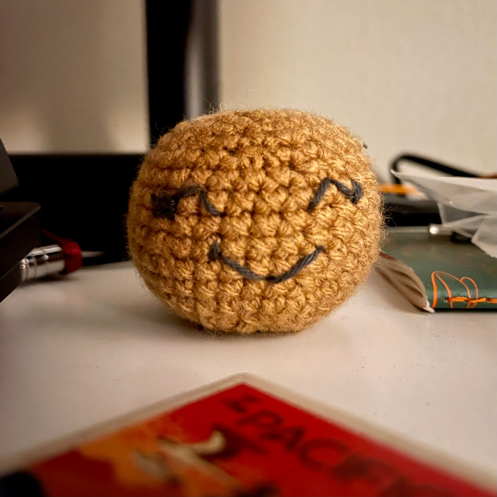

Here it is again, Saturday, and I'm still holding out that I can definitely maintain my commitment to myself by writing a blog post about the previous week as it relates to Lou and me (and mostly me, I still wonder if Lou will ever post here 🤔). She had plenty of goings on she could report on, like crocheting a bunch of Positive Potatoes, Worry Worm fidgets, and Mobius Strip fidgets. 🤩

That has been another fairly busy week. I'm glad that I journal or else I would be doomed to forget everything that's happened in my life.

That gets to a topic related to my feeble memory, for this week, its insistence on trawling through my past.

## Father's Day

Father's Day, and a fine Father's Day it was for me. All of my lovely children wished me well and I was treated to a fantastic day.

Father's Day, however,

As I mentioned, my brain has been pushing me toward recall and much of that is around my Father and related Adverse Childhood Experiences. That's honestly been a theme this week.

Transparently, I've been through a great deal of trauma in my life on top of that which I've inherited generationally. Father's day and my relationship with my own father is pretty viscerally challenging.

Due to having missed my Thursday Hike the previous week I was sent up to Illahee to have a few minutes outside. It was a lovely way to spend a little time "touching grass" and rather helpful. It was a valuable time that allowed me to try to work through _some_ of the overflow of thoughts and emotions that Father's Day tends to bring.

I had a beautiful experience as I was driving down Perry Ave. looking toward Sinclair Inlet when the [Walla Walla](https://en.wikipedia.org/wiki/MV_Walla_Walla) glided through the perfectly framed view of the water near the tip there near Point Herron. It was beautiful moment in which I had been feeling a sense of pride in reaching such a beautiful place such that I cant spend time in a beautiful nature preserve so near my home, etc.

It was a fine day. We played some games, I saw all the kids (except Tris who had a table at an art walk 😊). We ordered Pad Thai for dinner and watched some Black Mirror season 6.

It was lovely day all-in-all

## Monday through Wednesday

Across these days were several adventures and experience. I took the kids to the pool one day. We built my new desktop computer, which was the far and the easiest build I'd ever done despite having trouble fitting two different AIO's. Ultimately I managed to get it all together and working. I am planning to do a write up about that process on my [devblog](https://ephbaum.dev) (if I ever get around to it -- ideally I'd link it here if/when it's done, too)

There was a lot of things going on, and things happened, and in the end I had a working computer that runs super fast and makes me very happy. 😊

## Thursday

Hiking Day! I love hiking day! It's always so good to get out into the woods and get those wonderful brain chemicals squirting!

This particular hike, again at Illahee, was well needed as I'd missed out on my hike the week before

I can say with confidence that my minimum hikes per week is 1, and no less, to maintain my mental health. The more hikes (or equivalent outdoor experience, walking meditation, hammock hanging ) I have, the better.

It's really astounding to me how reliant I am on being outside at least part of the time to maintain my mental health.

## Friday

Friday was a busy day for me, and challenging. Due to an ongoing issue at work I spent a fair amount of my day on Zoom calls and by early afternoon I had found my social-meter had pretty much run dry.

This was unfortunate because in the evening I joined Lou at a "BBQ for Dudes", as I understand it, that sought to bring some local folks together from the local community.

I felt a little extra introverted and my gregarious was turned down a couple notches

I still attended and even wore my "Dude. Be kind." shirt that Lou found for me 😊

It was a fine event. I met a few folks, chatted a bit, and enjoyed some food from The Island Hut. It was unfortunate that there was no vegetarian option, but my body can definitely (reluctantly) process chicken and this chicken was absolutely delicious!

## Today!

That brings me to today!

Lou and I did some of that boring adult stuff: grocery shopping. It's a necessary evil, I suppose, but I definitely don't love it as I did when I was a kid. 😆

Today is the [Bremerton Bridge Blast](https://www.bremertonbridgeblast.com/) and so this afternoon we spent some time in Downtown Bremerton and we went over to check out the marina and intend to checkout the action down at the Evergreen Rotary Park later -- the fireworks start at 10:15 and despite still living practically on central time and being (much too young to feel this damn) old, I'm hopeful I can stay awake that late.

## Conclusion

I don't have much to conclude this week, but perhaps I'll think of a snappier ending _later_
