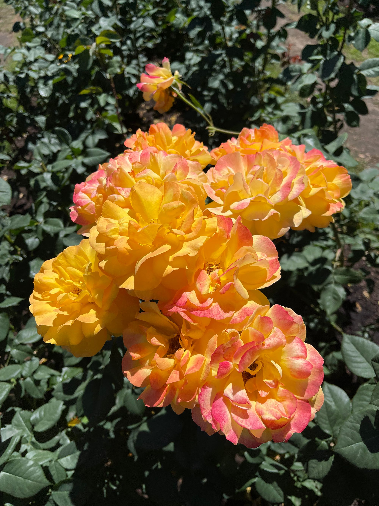

Here we are, the actual halfway point of the year. I find that time continues to feel like it's progressing faster and faster.

The post is coming to you from Portland, Oregon where we're vacationing! Having lived in the Pacific Northwest for three years it seemed high time to make a trip down here.

So, this won't be a very long post, just enough to feel like I've appropriately met my commitment (to myself).

This is has been a relatively uneventful week for me personally. It has been absolutely gorgeous weather here even as the rest of the country is suffering under a broken weather system with a heat dome in the south and smoke from Canadian wild fires blanketing the Midwest and Eastern states.

The US Supreme Court issued a variety of [decisions](https://www.supremecourt.gov/opinions/slipopinion/22) this week, some were good and some were not so great. You're welcome to draw your own conclusions. My initial thoughts are that I'm unsurprised that they ruled that "free speech" trumps discrimination, that they made the right decision on the well-intentioned Affirmative Action, and I find the student loan decision is baffling as the majority said that Congress needs to very clearly state what the government can do. The HEROES act, however, did very clearly say that the government can "waive or modify debts" but apparently Biden administration wanted to stretch it too far by actually waiving debts.

The first half of this week was a bit of a struggle as I looked forward to this trip to Portland.

I haven't actually spend time in Portland since I was a kid visiting my paternal grandparents before they passed.

This is a lovely city.

I was given so many warnings about just how bad the houseless issues have gotten here. You'd think we were about to journey to an urban hellscape from which we'd be unlikely to survive.

The truth is that things here aren't that bad. As a matter of fact, I would say that so far as I've seen, Downtown Seattle is a hell of a lot dirtier and rougher than Downtown Portland by a pretty wide margin.

It is hard to bear witness to the human misery.

It's difficult to see people openly using hard drugs on the street.

I wish that I had more power to help people in need.

I love exploring cities and this city has been wonderful to explore.

We went to Forest Park and hiked down to the "Witches Castle" yesterday and spent some time walking around the The International Rose Test Garden and Hoyt Arboretum at Washington Park.

The had lunch at Whole Bowl

It's been a lovely trip! But here it is Saturday morning and we're ready to head out after our breakfast for another day of adventure, so I'll wrap this up for now.

I know a lot of folks out there who are not doing well, they are struggling, they're anxious and depressed. To them I say: Go outside! Get mindful! Make some time for self care.

You're going to be okay!

We all will!

See you next week (or maybe sooner but I harbor no illusions I'll make time to post any more, but perhaps a recap of this trip will _actually_ happen)
