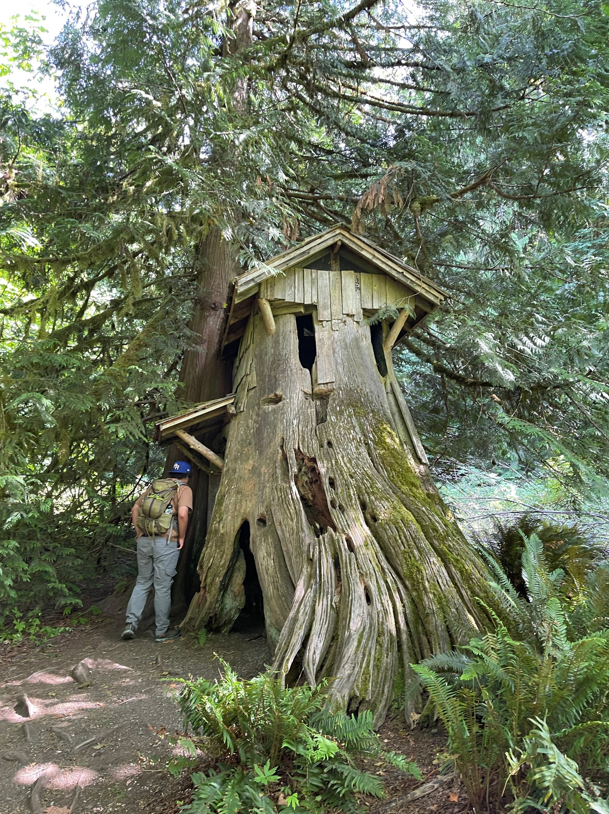

Today, for us, is Leave Minnesota Forever Day. It's now the third anniversary of the day that Lou and I pulled out of our driveway north of Brainerd, MN and began our move to the Pacific Northwest. It is the 4th Leave Minnesota Forever Day that we've marked. That day, all those years ago, we reached the border of North Dakota just a couple hours later and left our state behind us.

It certainly seems disingenuous to include the word "Forever" because it's obvious to me that we'll likely return at some point. As a matter of fact, I had actually been considering a return this year for the "Great Minnesota Get Together". It is worth noting, however, that we (Lou and I), still have not returned to Minnesota and neither of us feel a strong pull to do so any time soon. Perhaps next year will be the year. Perhaps some other circumstances, like a death in the family, will bring us back sooner rather than later.

I've been reflecting on the what I miss about Minnesota and the list is not all that long. I still love the state, the natural features, the road trips we'd take all over the place. I love passing through so many of the little towns that grew so familiar over the years. I miss the real Autumn change that Minnesota experiences that is so muted here where we seem to experience a constant series of Spring like seasons, a reasonably pointed Summer, and then more Springs with a short Winter punch or two. I definitely miss Anoka's Halloween festivities. I absolutely miss the chance to spend time with friends, a feeling which actually predates COVID by several years as we had moved more than two hours away from the Twin Cities metro area back in 2018.

It's not a long list, really, and the lists of things that I do not miss and of things that I remain pleased to have left behind are, practically speaking, infinitely longer. I'm sure I'll get back to Minnesota eventually as I have many friends and some family that remain there who I would like to see, but I am not in any hurry.

## Catching Up

I mentioned in my [abbreviated post last week](/2023-week-29/) that I would write a post.

Here I am writing a post, though not technically for last week, of course.

This has been an extremely busy Summer, as always.

Let me briefly touch on the events of our 29th week of 2023:

### Sunday

Sunday morning Lou went out to breakfast at the Oak Table for her friend in the morning and then I was left alone with Ollie while she took the kids up for additional birthday celebrations at the always beautiful [Foulweather Bluff Preserve](https://www.nature.org/en-us/get-involved/how-to-help/places-we-protect/foulweather-bluff/) in Hansville, WA. Foulweather Bluff is an absolutely lovely place with multiple 'biomes' all connected together with about a mile of forest trail that is stunningly beautiful, a brackish marsh, and a beach on a bluff battered by years of wind and water.

Unfortunately the site does not allow for dogs so I was not invited to attend by default as someone needed to watch Ollie, whose codependence is a bit of a nuisance at 8 months.

Ollie and I, however, managed to have a productive morning and were able to get a hike in as well and see some beautiful water at Illahee State Park anyway. It was a lovely afternoon for the two of us. We spent some time in nature and I was able to practice some mindfulness.

Additionally, I spent some time playing [Dave the Diver](https://mintrocketgames.com/en/DaveTheDiver), which is an amazing game in my humble opinion.

### Monday & Tuesday

Monday and Tuesday were reasonably uneventful days as we prepared for our trip.

### Wednesday - Off to the Beach

Wednesday morning Lou and I packed Mikey and Oz in the car and left Bremerton to drive to Ocean Shores for a little beach trip!

First, it's amazing how the drive through Belfair, Shelton, McCleary, Aberdeen, and Hoquiam are beginning to feel normal to me after having made the trip a few times. It's fun to start to feel more comfortable here. It is also semi-surrealistic to begin to truly feel like we're home after so many years of trying to get here and wondering what it would be like.

Second, it's amazing how the temperature changes as you progress west skirting the Olympics to the north until you reach the Ocean. By the time we'd left Bremerton it was already approaching 80 degrees, but reaching Aberdeen the temp began to drop into the mid-to-low-70's and finally as we reach the coast we found ourselves in a cool mist and temps in the mid-60's.

Our AirBnB was very nice, we had few complaints. I will say, however, that I do not want to multilevel townhome type house, a ranch still feels very much apropos for us, getting to the third level, and the room in which Lou and I would keep our stuff, was 28 steps. The house was near the main entrance to town and the Dollar General, which made accessing the area pretty easy.

We explored, spent time on the beach, ate tasty food, and spent time together as a family.

### Thursday & Friday

We enjoyed our time in Ocean Shores immensely on Thursday and Friday. We took more time to enjoy the beach, did a little shopping, ate tasty food, explored all around the spit and even did hikes on the beach at Oyhut Wildlife Recreation area and out to Damon Point as well.

I could write a lot about our experiences and how much we enjoyed the entire trip, but I'll keep it short by saying that it was a great experience and the cool and mild weather was extremely restorative.

We had delicious food from Hot Mama's and Los IV Hermanos (among others). We spent time on the beach, the kids got to enjoy the frigid waters of the Pacific Ocean, and I even got a kite in the air for a little while.

Ollie loves to dig on the beach and did so with incredible enthusiasm and natural skill!

I'm excited for our next trip to the coast!

### Saturday: The Return

Perhaps the highlight of the entire trip for me was the drive home.

We finally completed a journey that I'd been intending for a while, we've now completely circumnavigated the Olympics!

Additionally: we've now driven all of highway 101 through both Washington and Oregon. That leaves, of course, the rest of California down to Mexico. I hope to complete the entire thing in the next year or two so long as we can make it work logistically. That trip will require a fair amount of time, however, and some planning, to make it work.

Meanwhile, our journey took us up through the Quinault area again (gorgeous, peaceful, and high on my list of favorite places in the area) and then beyond up through Forks where we stopped for a bit. We stopped first at the visitor center / museum coming into town. Mikey and I took Ollie on a little hiking trail there that was as stunningly beautiful as it was short. We got food just up the road from Sully's, a tasty and reasonably priced little burger joint offering their own "veggie patty" that Lou and I found quite tasty and for dessert we stopped at Where's the Frybread for some delicious Frybread and Jam.

Forks is gorgeous and I'm pretty excited for when we get to spend time there again. I'm expecting we'll be staying there or La Push in the next year or so. We need to also visit the Hoh Rainforest and Sol Duc Hot Springs.

Of course we also need to get out to Neah Bay as well to enjoy the northwest coast, and numerous other locations around the Olympic Peninsula.

From Forks we took 101 up through Port Angeles and then cruised through Sequim marveling at all the traffic coming at us from the east as folks streamed in for the Lavender Festival.

Upon our arrival home in the afternoon / early evening, and though exhausted from our travel, we unloaded the car of our luggage and piled in some things we'd been holding onto for Lou's sister, Michelle and her daughter Ava. We visited their new apartment and chatted about their journey.

It was a lovely afternoon and a fine capstone to an eventful week!

## Back to Week 30

That catches the narrative of our life up with the current week!

This week has been somewhat less eventful than the last.

Sunday was again Waffle Day, despite breaking the streak the week before. Some stuff happened.

We watched Cocaine Bear in the evening. It's a wonderfully terrible movie.

Monday was a spectacularly rainy day, and the first day we had seen rain in a while. This kicked off a gloriously mild PNW weather week here where we haven't seen highs breach 80 degrees. It's been absolutely gorgeous! Tris came, and Momo did laundry and hung out as well, and it was pleasant, as always, to have all the kids in the house together. Tris made us delicious black bean and mushroom burgers. :)

Tuesday was relatively uneventful for the family. Michael and Oz had a little sibling date down at the movie theater to see the latest installment of the Insidious franchise: Insidious: The Red Door. Lou took Oz and Ava a couple parks in the evening.

On Wednesday Lou took Mikey and Ozzy to Point No Point in the morning. I worked at home, it's been a busy work week. During the day was an entertaining [hearing about UAPs](https://www.youtube.com/live/KQ7Dw-739VY?feature=share) held by The Subcommittee on National Security, the Border, and Foreign Affairs. The truth is out there, y'all

Meanwhile, after work on Thursday, Michael and I did our Thursday Hike at [Guillemot Cove Nature Preserve](https://www.kitsapgov.com/parks/Pages/GuillemotCove.aspx), which is a challenging little hike where you descend to a brackish marsh and a beach on the Hood Canal fjord facing the Olympics to the west. There's a trail that leads to a structure called "The Stump House". There's the Ridge Trail, a short but brutal climb up that overlooks the beach and Hood Canal fjord, and another called Big Maple Trail that leads to a couple of smaller loops along Boyce Creek. It was beautiful afternoon, and we were pleased to managed to do almost 5 miles of backpacking covering literally all the available trails in the park, which might not sound like much but that includes some significant elevation gains on the Ridge Trail and leading up to the Plateau Loop Trail. It's most unfortunate that dogs are not allowed here as I think Ollie would absolutely love hiking this one. This park is an absolute gem nestled back in Seabeck just a little bit off the beaten path. It's fairly quiet and peaceful with gorgeous vistas and plenty of flora and fauna to enjoy. On this trip Michael and I saw a Barred Owl as well as snakes, frogs, and even a salamander shot across the trail in front of me.

Friday saw Lou and I enjoying a date night together for the first time in a while as Oz had a sleepover with some friends and Mikey offered to watch Ollie for us. We went to [Anthony's](https://www.anthonys.com/) at the Sinclair Inlet and paid more than I would have liked for some delicious seafood on their patio. It was a lovely meal with my person in nearly perfect weather. After our meal we went over to Bachmann Park, a tiny little greenspace with an incredible view of the inlet where birds of all sorts stream by before you while you enjoy the soothing crash of waves against the retaining wall. From there we went and enjoyed the view of the water at golden hour at Illahee State Park for a bit before finally heading home for the evening. It was a wonderful and relaxing evening and I'm so pleased to have spent it with my lovely Lou.

And that's pretty much it.

Today, as you can tell, I'm catching up on posting today, and we don't have any firm plans for the rest of this weekend (although I have been thinking about taking a little drive over to Lake Cushman to finally see it).

The comings weeks will be busy for us. We have family coming into town to visit (Lou's other sister and mother will be here now that Michelle has arrived), I'm travelling to Chicago for work, Mikey will be heading back to start the school year in Iowa, and Lou has a volunteer trip coming up for SCAN. And that's just a sample of the many things going on in our lives as Summer comes to a close and the school year begins!

I'm sure I'll be writing about it right here on this very blog!
