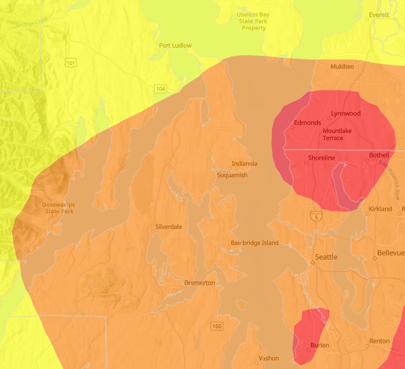

It's been yet another week in Kitsap County, Washington. Poor air quality came to Kitsap for the first time this season this week starting early on Sunday (late Saturday, really). We've had a few hazy days with AQI's approaching, or even in the firmly in, the low 100's a few times this summer, but it's been generally clear for the most part even while the rest of the country has been blanket in extreme heat and choking smoke. Sunday, however, air quality was up in the 180's around here. There was a [complaint](https://www.reddit.com/r/Bremerton/comments/15wrbfc/thanks_i_hate_it_here/) on Reddit as though it wasn't the first time the air quality here had spike so badly this season, or like we were dealing with the 200+ AQI's folks have been seeing on the other side of the Cascades on the other side of the state.

A screen shot for airnow.gov for last Saturday showing poor air quality over the Puget Sound region

It certainly was nothing like the air quality we were experienced down in Tacoma in August of 2020 with AQI's approaching 300. It was incredible, the air was thick with smoke, the sky a blazing orange. You could move your hand through the air and see the fluidity of the smoke move around and between your fingers.

Thankfully the air quality here has not been too bad since last weekend. Today the numbers are still in the "moderate" range, and it's definitely a bit hazy out there, but it's still relatively clear all things considered. I would love to get a hike in today, but it's probably not worth the stinging eyes and lungs.

In other weather news it's also been hot and dry. It's been much drier this much than usual, though August is a relatively dry month all the same, we're still running quite a bit behind on the rain meter for sure.

Perhaps that's enough about the weather however. I'm going to talk about our week.

## Sunday - Back to School Shopping

Sunday began, as they usually do, with waffles because Sunday is Waffle Day! Lou made banana waffles! They were delicious, as always. She was pretty critical thinking that the recipe she chose, with less flour, result in them being a bit more chewy than usual. I've found that banana waffles tend to have a bit more chewiness to them anyway, and found them to be no chewier than I would otherwise expect.

Despite the poor air quality we ventured out of the house, Oz and I, to do a little back to school shopping. We went to Silverdale to enjoy the local retail core. We hit up the Kitsap Mall in the hopes of finding some shoes and a few t-shirts for the kiddo to start off the new school year.

They continue to grow. It's maddening.

We got lunch from [The Rock: Wood Fired Pizza](https://www.therockwfp.com/) as Oz will respond the same way to every query about their desired food: pizza, burger, pasta and this was, in fact, a pizza place in the mall. Since we hadn't tried it, it seemed like maybe worth a shot. The pizza took an extraordinary long time to arrive. This was due, I was told, to them still trying to fire up the wood fire oven. I noted, however, that other folks were eating pizzas and I was pretty sure I'd seen some order around the same time as ours. An hour felt like a long time for a couple of 9" pizzas. The pizzas were delicious, however, even if they were perhaps a bit basic considering the pricing.

After lunch we shopped around. Found some shoes at Famous Footwear. Grabbed some shirts from Spencer's and Hot Topic to Oz's great joy. Shopped around.

We also tried to stop at [Ted Brown Music](https://www.tedbrownmusic.com/) because Oz has been very focused lately on a desire to try playing the bass guitar. They've been practicing with the guitars I got for Lou and the family for Christmas and really want to try their hand at bass guitar as well. Unfortunately it turns out they are closed on Sundays.

Overall it was a nice little day out with the kiddo. 😄

## The Rest

There's not a lot else of action to talk about this week, really.

Lou has been spending more and more of her time training, shadowing, and learning about the American Red Cross. This week she was even able to help with some of the volunteer screenings.

She mentioned that the volunteer queue for this region is rather large, particularly after the fires in Maui, and they've been trying hard to work through the influx of recent volunteers. Of course these folks wouldn't be going to on an all expenses paid trip to Maui on the back of that tragedy, they'd have to go through some training and such, first, but we know for sure future tragedies will occur and there will always be folks in need of help.

I'm proud of her work with the Red Cross. It's good to see her finding purpose and meaning in the work, and it's nice to see her building experience. She wants to translate this volunteer experience into something tangible for a future employers. She has a burning desire to re-enter the workforce and catch-up on her career. However, since she's been "only a stay-at-home mom" for the last few years she feels that most doors remain closed to her as a result.

The more I am exposed to the Red Cross the more it feels like the sort of organization I'd like to work with.

There are so few entities out there that actually seem to want to the serve the greater good without conditions or an agenda. The Salvation Army, for example, seems to only be willing to offer their help to those who willing to also accept their religion as well, which feels _evil_ to me, that you would only be willing to help someone when they need it the most _if_ they're willing to denounce their own religious / spiritual / personal beliefs first.

But I digress

Personally, in addition to my day job at CARS, I've been working (perhaps noodling is a better word) on a couple of [Astro](https://astro.build/) sites. I'm toying with a few ideas of redo this and my [dev blog](https://ephbaum.dev) into a static sites - or incorporating Astro with [Ghost](https://ghost.org/) (which is the current platform we're using). I'm also considering using Astro for a marketing page for the business I registered earlier this year.

These are normally things I would have done in an afternoon, but I find myself struggling a bit with things like focus and distraction.

I am making progress, however, even if I feel like I'm drowning a bit in a pile of TODOs.

## Reflection and Contemplation

I've been thinking lately about how I feel. Given the tumultuous nature of the last several weeks, I've been trying hard to look inward to get a read on how I'm doing.

This is, of course, easier said than done.

I've been reflecting on myself, on how I am, on how I got here, and, perhaps most importantly, on where I'm going.

I've been thinking a lot lately about how things can be viewed from different perspectives, with different lenses. I've been considering my own father's role in my life, how he's more or less been a villain to me and that has had me thinking a lot about my own role in other people's stories as a villain myself.

I've thought a great deal about my own growth.

What does my growth matter, however, to the people that I've hurt in the past?

What does my self-awareness do for those who still feel pain from my actions before I began to realize and gain some control over my own neurodiversity?

Of course it's a good thing! It's good to be aware, to be better, to recognize my mindset, my emotions. It's good to have a tighter control over myself and my actions.

It's good to feel remorse, to feel sorry for my actions, for the pain I've caused.

And to anyone that may still need to hear it: I'm sorry

I'm trying to be a better person now and into the future.

For what that's worth

To me it's worth everything.

Because viewed through a certain lens I have managed to overcome a great deal of adversity to _literally pull myself up by my own bootstraps_ to accomplish quite a bit in my life.

## Paranormality

This week Oz has been watching a lot of [Nuke's Top 5](https://www.youtube.com/@NukesTop5) and I'll admit to enjoying it a bit with them. Pretty much everything on there is an obvious fake or has a reasonable answer. It's much more fun to watch these scenes presented in a _top n_ format than it is to try to watch multi-hour "investigations", especially when they're often so boring (and stupid 😅).

I'll admit that I have always had a fascination with the paranormal and things that cannot be explained.

Do you believe in ghosts? Ghouls? Do you believe demons? What about angels? Djinn? Skinwalkers?

Here, again, is another chance to talk about the differing lenses through which anything can be viewed.

In most cases the paranormal can be explained away.

But there have been a great deal of reported experiences that can't be easily explained away going back for generations upon generations of people.

Are they are all lies?

Are they all untrue?

What if even 1% of these stories are true? What if even 1% of paranormal events "caught on tape" are real?

What can explain these things?

Is it ghosts? Residual energies? Left over trauma?

I don't know, but it's interesting to consider the answers to these questions.

I _am_ a skeptic. I have also seen some _shit_ in my time. I have had experiences I cannot explain away, experiences that don't make sense, and I wonder about them sometimes.

Oz wants to do "paranormal investigations" for fun. This kid always wants to do these TikTok challenges that supposed summon spirits and invite them into your body.

I wonder if it's worth the risk? Is it worth the risk to invite something you don't even understand into your body? Is it worth the risk that some negative energy might attach itself to you?

If I could say with 100% certainty that there was no risk, that these things aren't real, that there's nothing to worry about: then sure!

I wonder, though, is it worth it? Is it worth the risk?

There are some supposedly haunted locations around here, is it worth exploring? Just to see what happens?

Maybe

## Meanwhile

Meanwhile, Saturday is still happening and I'm just standing here typing about the last week. I'm going to let this go.

I wasn't feeling well yesterday and took the afternoon to rest and in so doing I finally got around to watching [Joker](https://www.imdb.com/title/tt7286456/). It's a terrible and beautiful film. I absolutely understand the criticism that it drew, but it is an amazing film and worth the watch. Joaquin Phoenix is astounding and it's a really well done film.

While Lou and I have been pretty busy lately we took a little time to start watching [Hijack](https://www.imdb.com/title/tt19854762/) and [Silo](https://www.imdb.com/title/tt14688458/) on Apple TV+ this week. We've only seen the first episode of each, but both have a lot of promise and we're going to try to catch more as we can. Hijack has kind of a 24 vibe while Silo gives Lost.

That's about it, I think. I'm sure there's a lot more I _could_ share. Paging back through my journal there's a lot of notes about how I'm feeling right now, but I'm not sure there's much cause to share my particular sense of lonely and overwhelmedness or how I'm feeling content but not happy. I'm working hard lately at reframing these things and it's hard work. Between that and the other necessary selfcare, I'm also fighting a sense of selfishness.

The mind is a strange thing, thoughts are scary, that we're just a bunch of feedback loops driving meat suits is kind of wild, isn't it?

I hope you all have a wonderful week and I'll see you next Saturday (unless I decide to put out one of these many many many drafts I have 🤔)

👋
