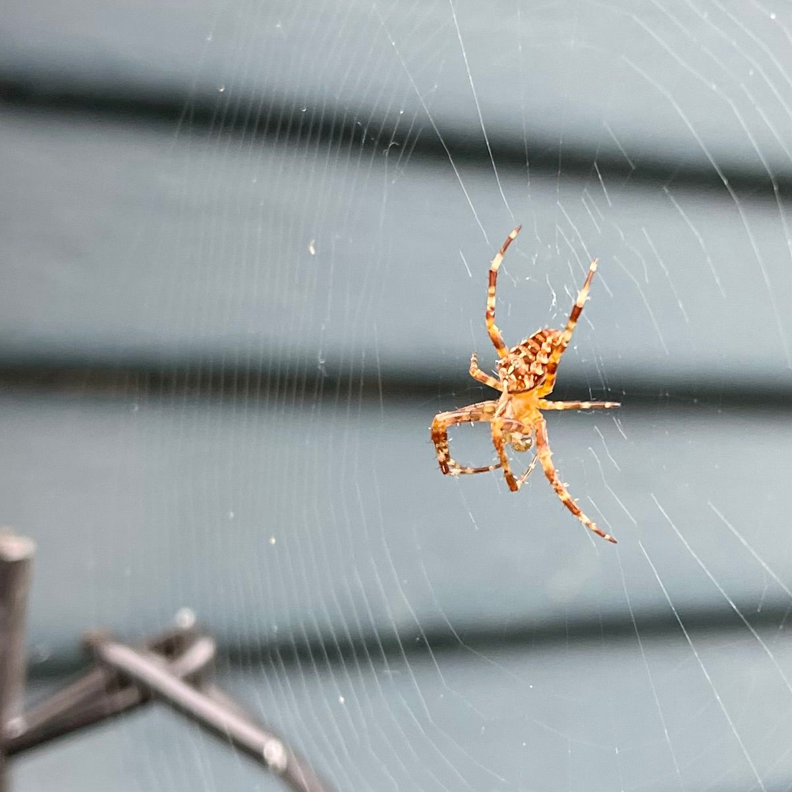

Another big week for the Baum family. It's been such a big week that I've been uncertain about how I would post today about it. I've been very transparent, but I'm always wondering if I'm being too transparent, if I'm opening myself up to unnecessarily risk.

Then I realize that the damage is done, and figure I'm in for a penny, in for a pound. I've already shared too much of my life on the Internet and I've already been a the victim of identity shenanigans multiple times over. I'm just going to put myself out there and hope that things will just generally work out fine enough in the end.

So in the interest of transparency about the life that we're living over, I'll share that the beginning of this week, or more accurately the end of last week, featured a very big conversation with our youngest child. She was very clear with us about her belief that she is a girl, and she said that she's as certain now as she ever was that she is, in fact, a girl.

We're embracing Liz! She continues to tell us who she is (while she continues to learn more and more about herself. We're doing our best to listen and support her in on this journey.

I'm proud of her courage in telling us. I know that this has been a struggle for her. She first told me she was a girl when she was very young. Of course she's also told us that she's a reincarnated spirit, and alien, a demon, and some kind of horse spirit (or something like that, she was very little and it's been a while) from another realm called Ipaña.

This conversation covered a lot of ground and was mixed with a conversation about her having recently changed her mind about wanting to attend a brick & mortar school instead going. This is not keeping with our original plan to make that change next year and, and while already challenging, meant that her first day of school would be moved up to this week instead of the next.

I think we had a really healthy dialog and Liz was very clear about her decision. I'm proud of her for being open with us and trying to be super mature. It was good for her to share. We're working on establishing additional care for her.

Overall this week was likely biggest for Liz as started at a brick and mortar school for the first time since kindergarten, but I think she's handling it rather well. She's had a few challenges to overcome but she's doing her best, and reporting no regrets about her decision as of Friday.

In more mundane news, this last week has seen somewhat milder temperatures across the region. It's been a pleasant transition from Summer to first Fall, or whatever this season will turn out to be. I imagine a few more higher temp days, Summer's last gasp, before we see more fall like weather begin to give way to winter.

Sunday of this week I took Liz to see [Indiana Jones and the Dial of Destiny](https://www.imdb.com/title/tt1462764/) and while it was pretty formulaic in its Indiana Jones implementation with the typical plots holes through which might be driven medium-sized trucks, at a minimum. That said the move was extremely entertaining. I believe Liz is willing to see the origin films despite being old, which seems like high praise coming from a 12 year old.

We went on Sunday primarily due to the low priced tickets for $4 in honor of [National Cinema Day](https://en.wikipedia.org/wiki/National_Association_of_Theatre_Owners#National_Cinema_Day), a "holiday" invented by [NATO](https://en.wikipedia.org/wiki/National_Association_of_Theatre_Owners) (not that other [NATO](https://en.wikipedia.org/wiki/NATO)) in 2022 where tickets went for only $3. It was a rather busy day at SEEfilm and we did miss the beginning of the movie but that's fine since I really didn't need any more incentive to re-watch this movie (and its previous installments)

Lou and I were able to sneak out to Illahee a couple times this week and really had a couple of lovely hikes with Ollie. It has been difficult for us to get out together since Lou's calendar continues to fill up so we've been sneaking out here and there when we can, and it's been nice.

It was particularly nice to be able to get out for a few miles on Friday since I missed out on my #ThursdayHike.

I missed that hike because I was with Lou while she volunteered to run an American Red Cross table on the Bremerton Farmer's Market at Evergreen Rotary Park. It was an absolutely beautiful day for a market and it was wonderful to have the opportunity to chat with folks in the community. I really hope we have some impact because, as I understand it, there are less than 25 disaster volunteers for both Kitsap _and_ Mason counties, which seems woefully low considering the volume of fires in the region, not to mention other disasters

The American Red Cross urgently needs people all of the time. You should [volunteer](https://www.redcross.org/volunteer/become-a-volunteer/urgent-need-for-volunteers.html) some of your time. Be the change you want to see in the world

My father continues to live, despite earlier suggestions from the palliative care team at Fairview in Burnsville, and I’m continuing to work through the complexities of satisfying the documentation requirements of my company’s leave provider. It’s always a treasure (which here is a sarcastic comment meant to indicate quite the opposite).

This week has been filled with change requiring a great deal of re-framing, mindfulness, and self-care. And that's okay! It's also been a good week! I am grateful to have had the opportunities available to me. I am pleased with my life, recognize my opportunities for growth, and simply to have a place to live.

There has been a bit of conversation around the community related to our growing houseless population and how to address that. There's a lot happening here all the time. It's the wild west. It's incredible. In the last week there has been an attempted carjacking, a structure fire within a mile or so, hit and runs, and so many other things.

I'm tired and I think losing coherence, I may come back and edit this one to be a bit clearer in the future, maybe with a better title and whatever else I might have pissed - for now I'm going to publish this to meet my personal commitment to myself
