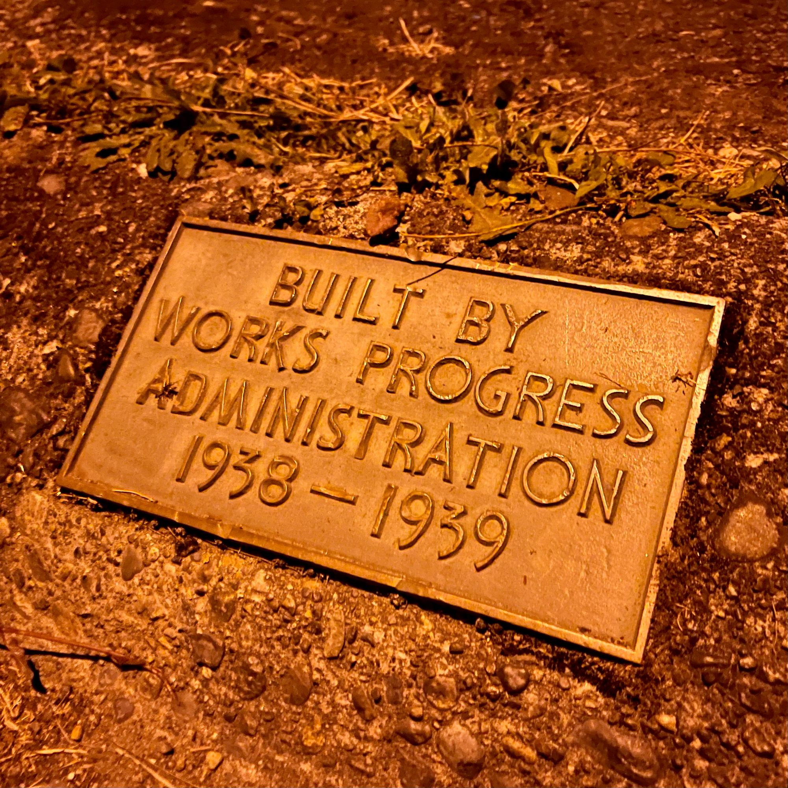
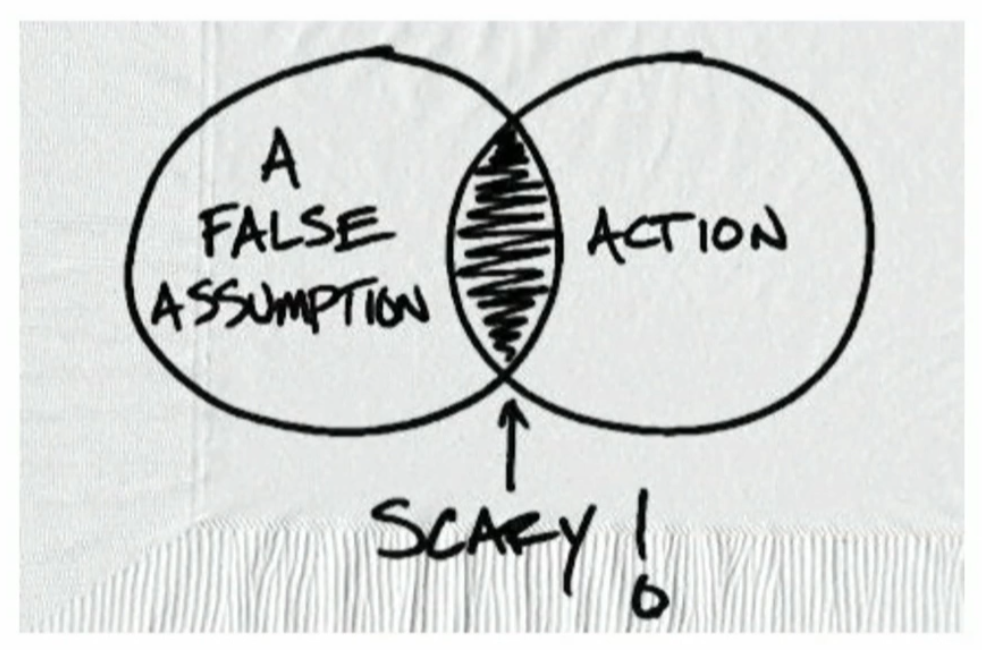
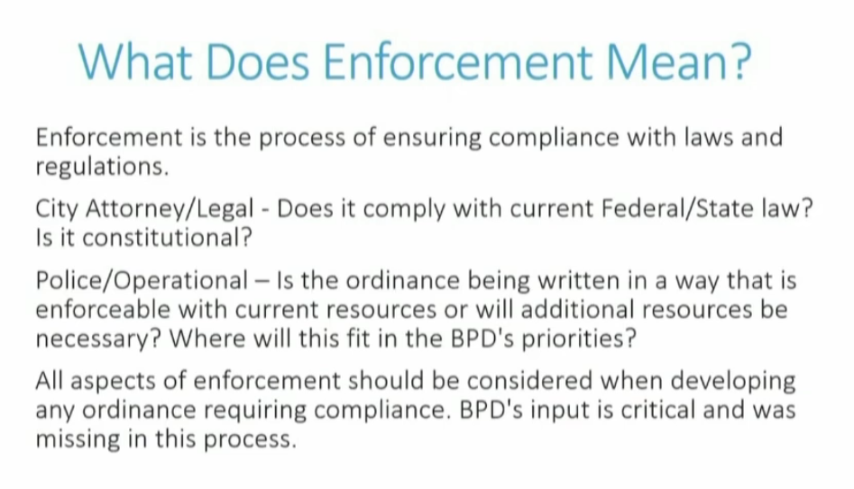

It has been another week and here I am typing on my keyboard in an attempt to maintain my commitment to myself to post every Saturday. I made this commitment to myself in the hopes that it would help build a good habit around _actually_ posting, among other things. Reflecting today, I think it's possible that it has worked. However, I will say that my drafts folders has continued to grow and grow as I mostly just post these Saturday updates and not much else. It might be time for a new commitment.

## This Week

This has been another busy week for Lou and myself but, as it was a holiday week, it began with a quiet long weekend. Last Saturday Lou declared it second Friday, so Sunday was Saturday and Monday, Labor Day, was Waffle Day!

Our Sunday had us watching the end of Silo and Hijack on Apple TV+ - I don't have a lot to say about these shows except that both were pretty good. I think I like Silo more as a whole though and I'm eager to see where that show goes. Hijack was good but I think it could have been a better feature length film than 'real-time' series.

Monday, as mentioned, was Labor Day and Waffle Day. It was a good day for me where I managed to get some _work_ done on my business's website. I'm still not finished, but I'm still pleased to have made progress.

On Tuesday as I read my journal I see myself reflecting, as I often do, about what my next move will be. I've been feeling a sense of frustration around my current role. I've felt a lot this week that I'm being "called" toward something more. That, of course, is tempered with the feeling that I'm absolutely not qualified to do anything - though of course this is not true, these are just intrusive thoughts.

I'll briefly mention Thursday through today: it was fine enough if relatively uneventful. Lou and I have been working all week. Thursday saw Lou at the Bremerton Farmer's Market again, this time supporting [SCAN](https://savethechildrenactionnetwork.org/). Friday, since I didn't take my usual Thursday hike, I sneaked out for a couple hours at Newberry with Ollie and put in a few miles looping around Strange Days repeatedly. Last night we hosted one of Liz's friends for a sleepover. This morning we took a walk downtown to "stimulate the local economy" stopping into a few local shops like Gastropup and Ballast Books. Tonight Liz will sleep over at her friend's house giving Lou and I a little time to ourselves. :)

## Bremerton's Camping Ordinance

Wednesday I watched the Bremerton City Council meeting live. I've been watching them for some time after the fact, at least partially, but this was the first one in a while that I attended as it happened. It turned out to be longer than usual meeting because a lot of people showed up with interest to updating the city's [camping ordinance](https://www.codepublishing.com/WA/Bremerton/html/Bremerton09/Bremerton0932.html). The issue is that it's unconstitutional as decided in the 9th Circuit with [Johnson v. City of Grants Pass](https://caselaw.findlaw.com/court/us-9th-circuit/1913611.html) as a follow up to the 9th Circuit's decision for [Martin v. City of Boise](https://caselaw.findlaw.com/summary/opinion/us-9th-circuit/2018/09/04/284140.html) ruling, essentially, that making all camping illegal violates the [Eighth Amendment](https://constitution.congress.gov/constitution/amendment-8/) of the Constitution of the United States when there is no available shelter. The decisions are, essentially, that it amounts to cruel unusual punishment to punish people for outdoor camping when there is no where else for them to go.

This meeting was where the council, after multiple study sessions, would show the city parcels that where enforcement of the camping ban would be suspended when there isn't available shelter space. Someone was kind enough to make an [accessible map](https://www.google.com/maps/d/u/0/viewer?mid=1xv1SAaEjhxjEJWqkb5y39RBSz7pqChI&ll=47.574954819918176%2C-122.6659319&z=13) for everyone to be able to see what's being considered from the large PDF of the minutes that can be found [here](https://meetings.municode.com/PublishPage/index?cid=BREM&ppid=d33416d7-25d1-44e6-9d32-55b97fa53824&p=-1).

My thoughts on this meeting could be spun off into its own post.  
I found it shocking just how many selfish "what about me" comments were made. I was inspired by the folks who talked about their direct actions on the street at MLK Way and Broadway. I was made curious by folks who asked about funding and resources and where they're being directed.

For now I will focus on how I was able to updated my understanding: prior to this meeting I was under the impression that this change would result in the city pushing people into some kind of tent city. After listening more closely to what the council and mayor had to say it's clear that city is currently unable to enforce this camping ban and after making changes to the ordinance the city will remain unable to enforce the camping ban.

Ultimately, as I'm not understanding it, this change is essentially perfunctory and only meant to make the current ordinance constitutional.

The largest parcel is 40 acres up at the border of Tracyton that resulted has a lot of folks really upset that they're about to see a tent city filled with a bunch of junkies and criminals. That's a perfectly reasonable response from folks in District 1. I don't want the folks currently camping on the street near my home either.

The fact is that the camping ordinance is not operationally enforceable, as pointed out at the end of the meeting by the honorable representative from District 2 Denise Frey who first talked about the "scary place":

Venn Diagram: Left circle: A false assumption - Right circle: Action - crossover "Scary!"

She then talked about the facts as they relate to enforcement:

It's clear that there is a lot of fear, uncertainty, and doubt around this issue.

Homelessness is a huge issue. The answer is housing. The pathway is challenging, and connecting people with resources is hard. Resources are scarce and a lot of people are unwilling or unable to give anything to anyone else willingly.

I am hopeful that we can find a way forward to help the people who are currently living in tents on the streets of Bremerton.

I have a lot of questions I'd like answered about this complex and ugly issue. What's the county's role here? What's the impact of the KRM moving? What's the impact of the municipal court sending their cases up the Kitsap County? What's the impact of Mayor Wheeler's request that infractions of the new camping ordinance being immediately considered a misdemeanor and doing away with the '3 strikes rule'?

I have so many other thoughts about this topic but for now I'll close with:

I firmly believe that our societal success is directly tied to how we treat the most vulnerable and needy within, and we cannot see success in our community without compassion.
