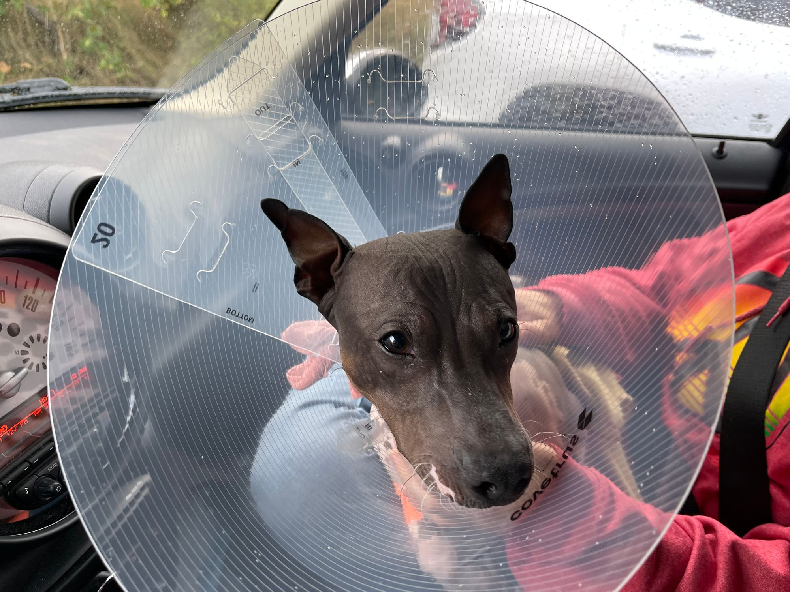

I have struggled over the preceding weeks with deciding just how transparent I should be about our lives. I've decided, however, that there's simply no reason not to be open at this point in my life.

I'm an open book. I just don't feel like I have the bandwidth to deal with hiding anything.

I also talk too much.

I'm sure that will never come back to haunt me /s 😅

With that said, let me relay the details of another week for our family!

This is has been yet another week among weeks in 2023 - they just keep on keepin' on with constant news of doom and gloom, politics, celebrities, and other dystopian nonsense. It's absolutely terrifying to witness the ongoing climate disasters, the struggling of our global ecosystem is hard to witness as someone who loves nature and appreciates living. I struggle to observe human misery without feeling the pain of knowing there _could_ be a better way. I have a hard time seeing people trapped on the streets, trapped in a cycle of hopelessness and pain, simply lost, or worse.

It's certainly easy to get lost in all the terrible news.

It's important to stay informed, but not to get lost in it.

Since it does no good to dwell on these awful things that outside of my control and instead I try to focus on the positives and the things that are within my control.

> You can do anything, but you can't do everything

To that end I'm trying to engage more in my community, give back where I can, and generally do good.

Lou has continued on her do-gooder trajectory this week. Her volunteering has been inspiring. I've found myself wanting to do more as well, and maybe tag along with her on her journey of do-gooding. After hearing about all the need they have as Lou recruits and screens folks, I've decided to also volunteer with the American Red Cross myself. I'm looking at helping with [Code4Good](https://code4good.io/) in the hopes of, you know, doing good.

Let me recap the week in sequence, as I generally do:

## Sunday

Sunday was huge day in multiple ways.

As I believe I had mentioned [last week](/posts/2023-week-38) that Lou was chaperoning a birthday party for one of Liz's friends. They stayed at a hotel on Saturday evening after doing some bowling, and then enjoying some time in the pool. On Sunday they continued the party by attending the [Poulsbo Pride](https://www.facebook.com/groups/977171096651274/) event at Frank Raab Park in Poulsbo. I'm told it was an absolutely wonderful time for the kids.

While this was happening, however, I hiked 7.69 miles at Newberry Hill Heritage Park with Ollie. It was a fantastic hike and one I'd really needed. I had a lovely time and I got to fill in more of the my map "official" map in Gaia GPS by hiking up to the northern part of the park filling in a few of the trails up near Klahowya (as an aside, I've hiked every trail at Newberry but decided to "100% it" using GPS). I'm extremely grateful to have had the change to get out there and do a some hiking meditation and enjoy some mindfulness praactice.

Ollie is becoming quite the hiking buddy and I absolutely love taking him out on the trails. He's getting better and better at meeting other people on the trails.

He still seems to hate German Shepherds. He just does not seem capable to giving them a pass whether they are black and tan or tan and black or whatever. Most dark colored dogs bother him. Also Rottweilers, and other _mean_ looking dogs.

Golden Retrievers, on the other hand, seem to be his most favorite breed. It's likely related to having had such a good time with one during his time in puppy classes, if I were to guess. He got a chance to re-meet a Golden Retriever he's met before name Mabel Syrup. We'd met Mabel and her human, Ashley, previously. I was told that she learned that she had a relative, an aunt perhaps, named Mabel, but that the dog wasn't named for her or the character in Gravity Falls, about whom I'd inquired. I've since recalled, and wondered, if she's named after the [fictional author](https://calvinandhobbes.fandom.com/wiki/Mabel_Syrup) from my beloved Calvin & Hobbes. I knew the name sounded familiar, and it hit me after our first meting. I suspect it's exceedingly unlikely this the name's source, but I kind of hope that it is. Perhaps I'll meet Ashley again that I might ask her. 🤔

Ollie also met another little _terrorier_ that seemed hell-bent on barking at my little Ollie leaving him acting rather confused about why he wasn't able to sniff his new friend's butt. 🤣

In the evening Lou and I attended the Kitsap Community Food Coop's [annual meeting](https://kitsapfood.coop/news/annual-meeting-recap/) at Crane's Castle Brewing in East Bremerton. It was a wonderful time getting got to meet some great people involved in the coop. I've long been interested in the coop's mission but have put off becoming members due to a variety of reasons. Now that we've done and Lou is on the board, I have an even more acute interest in it the business, because it's now my business. I own it, at least in part. (That's how a [coop works](https://kitsapfood.coop/terms-of-membership/))

It was, overall, an excellent evening even if social events tend to be rather draining foor me and my well might have been running a bit low already following my hike earlier that day. I think I did pretty well, however, and I enjoyed meeting some of the other folks involved in making the coop run right now. I will credit Jeff, the president of the board, with doing a decent job of inspiring me to further give-a-shit about the [little coop that could](https://www.kuow.org/stories/the-little-kitsap-co-op-that-could).

I'll have more to say about the coop for sure. For now, however, on to:

## Monday

Monday was not a super eventful day outside of Tris' coming across the Sound to visit with us. She regaled us with tales of her adventures in Korea with her visits to Seoul and Busan. It sounds like it was a trip filled with adventure, as you might imagine from spending weeks in another country.

Moira also visited and it was nice to have the girls home for the evening. 😊

We had a delicious meal of dal, a recipe that Lou continues to improve. It's so incredibly delicious, so intricately seasoned with wonderful layers of flavors... I could go on, but instead I'll simply recommend giving it a try if you've not yet had the pleasure. Lentils are delicious and versatile.

With little else to report about the day and the clock ticking closer to Sunday (and thus risking missing my commitment to myself), I'll move on to:

## Tuesday

Tuesday did not have much adventure for me except a little trip in the afternoon to the Lion's Park with Ollie during a short break in the rain (that ended mid-walk).

Lou's day was a bit busier as she had a volunteer luncheon for the Red Cross that she attended where she got the chance to network and connect with folks as she continues to learn more about ARC and its workings.

It's been fun to watch her passion grow around these organizations as she volunteers. It genuinely warms my heart to watch her, and, as I mentioned, it's inspired my own volunteering as a result.

Now on to:

## Wednesday

The most notable thing about Wednesday was that I took decided to tag along with Lou while she attended her first board meeting for the Kitsap Community Food Coop (I told you'd I'd get back to the coop). Board meetings are open to any Member-Owner, as is the way with coops, and as I'd mentioned, I have an interest in the coop and its success. I believe the coop will likely be the subject of its own post, or perhaps multiple posts, in the future.

The meeting itself was interesting, most notably because it sounds like the coop is in need of immediate help to survive.

I feel like it's important to try to help, so I think I will also attend the next upcoming meeting to try to help come with ideas on how to save our little coop. 😓

One of the reasons that I was excited to attend was that it finally gave me an excuse to check out [Ashley's Pub](https://www.ashleys.pub/). This is a place about which I've heard a great many wonderful things since arriving in Bremerton and that I've passed by for literally years, but have never actually entered.

It did not disappoint and I'm excited for the opportunity to return in the future😊

Meanwhile, as I mentioned, there is work to be done to _save_ the coop, and I'm going to try to help.

I really want them to survive. I'd love to get a return on my investment, if nothing else, but I would really like to see the vision of a community coop realized.

I'll definitely collate some additional thoughts on this topic, I'm sure, but in the interim I'll move on to:

## Thursday

Another big day, Thursday began with having to drug our dog before ultimately taking him up to the vet to be "fixed", as it's called. I'm not completely thrilled, really, but besides being contractually obligated to do so, I think it's still for the best for a variety of reasons, not the least which being that I don't want this little guy procreating all willy-nilly 😂

The surgery was successful, Ollie did well, and now we have a dog recovering from castration wearing a cone and being drugged up on trazodone. Which is super sad 😞

Ollie's resignation to his new cone is so sad, it's like he just has a cone now and that's just how things are and he is just resigned to it. I'm not sure how to articulate what's sad about that, but it's definitely sad.

Lou was not feeling great in the morning, but still made an attempt to help the coop with their table at the Bremerton Farmer's Market. I stayed home with Ollie who was just ever so pitiful. I would have liked to get a hike in for the day, as I try to do on Thursdays, but alas the rain, the dog, and other factors all resulted in my taking a pass for the day. I may yet make it up even if it's a little time out tomorrow (Sunday).

Liz arrived home from school telling us that she'd lost her phone. Apparently it had disappeared early in the day but for some reason she was unable to call us due to not knowing our phone numbers (though she's been taught) and the school's contact system was down. I immediately popped open Find My and saw the phone at an address in East Bremerton just north of the library on Sylvan Way. Sp we hoped in the care drove up. It was a little bit ambiguous on the map and the door of the first house I tried was answered by an extremely eldery man who was clueless to my queries but very pleasantly assured me that I'd have a good day all the same.

I tried the house next door which and the door was answered by a middle-school aged kid who immediately asked who I was. I gave my name and asked for a parent. I confirmed that he went to Mountain View. I explained that my child's phone's GPS was reporting that it was there and suggested that perhaps the phone had been "found" and just not turned in. I was asked if I could have the phone make noise since this kid claimed ignorance. We heard it in the house, the kid went and brought it from his room with an extreme act of ignorance and confusion. The phone was fine though missing its case (which wouldn't be so annoying had we not just replaced the case recently). I thanked them and was on my may glad that it hadn't turned into some kind of altercation.

While at the Farmer's Market Lou found another produce vendor selling [ground cherries](https://en.wikipedia.org/wiki/Physalis) and, as I'd been talking about missing and wanting them for the nearly the entirety of our nearly 15 years together, she bought a couple of containers worth of them! As it has been more than 30 years since I'd first (and last) enjoyed the delicious flavor with font memories of shucking the delicious fruits from the delicate Chinese-lantern like paper wrappers and eating them right in the garden when I lived on 36th and Fremont in Minneapolis with my mother. I may have cried a little bit eating some of them they were so delicious as I'd remembered, and extremely unique in their flavor profile.

In the evening we found ourselves at Helm's Deep Tavern in the basement of Game Wizard and Blue Sky Hobbies across from Ashley's Pub for a meeting of the local chapter of the [DSA](https://www.facebook.com/westsoundDSA/). Helm's Deep is an interesting experience. I _had_ checked out the tavern once before, but only as a brief pass through, this was the first time attending one of their bookable rooms.

To be honest, the service was kind of terrible. As Lou and I desecended the stairs the bar tender saw us and immediately put up a sign indicating that he as on break and he walked away. When he finally returned he managed to pull the wrong taps twice. On the plus side we wound up with a free drink out of the deal, but it was still not the greatest first experience there.

The Democratic Socialists of America meeting was pretty loosely structured. We didn't recite any Marxist texts but instead mostly chatted about the state of affairs in which we all find ourselves.

Lou and I might have mentioned the needs of the local coop and the American Red Cross in the hopes of getting more people interested in helping out. 😅

It was, I think, a positive experience. I think this is a group that might be able to do some good, but I'll reserve judgement for the time being about how I feel about joining the DSA. I'm hopeful for at least decent conversations with some folks that at least generally agree with my own beliefs.

Now on to:

## Friday

Friday began with Lou's discomfort for the second day in a row, though this time a little different. This pain has continued to today, as it has done for some time. Lou has long struggled with some symptoms like that of IBS: sharp pinching pains in her abdomen, among other pain signals. This often happens whens she's stressed, or anxious. It's also related to what she consumes. She thankfully has taken some time to rest but, unfortunately, that has meant that she hasn't been as productive as she's wanted which has here bummed out. We remain uncertain of the ultimate trigger this time, but she does seem to be recovering.

She did spend some time at the coop in the afternoon trying to train at the store. Her goal is to volunteer her time to cover a vacation for the store manager, Nathan, who has not had a break since last year due to staffing and budget issues.

Meanwhile, I spoke with another person from American Red Cross who screened me for the role to which I've applied. I'm excited and hopeful that I am able to do some good.

Since we're almost to Sunday, I'll just to leap to:

## Saturday

Lou was still not feeling well this morning. I made us some French toast and we spent most of the day "chilling".

In the afternoon I did a little yard cleanup in the pack.

In anticipation of Spoopy Movie Month I bought a few scary movies for which I am excited to watch. Including Boogeyman, Talk to Me, and X.

For dinner we got the consistently delicious 4 Sisters and watched the not-really-a-horror movie [The Wrath of Becky](https://www.imdb.com/title/tt20916568/) which was silly, a bit heavy handed, unnecessarily obvious, but ultimately a fun time.

---

With that I'm exhausted and need to get some sleep - until next time y'all
