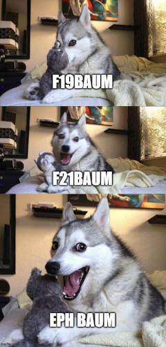

> This content originally appeared with a great deal of misspellings on my GitHub profile's [README.md](https://github.com/ephbaum/ephbaum/edit/main/README.md)

As you may guess, I was not born Eph Baum though legally it is now my name.

🎵

> I am Eph
> There are ~many~ probably other Ephs, but I'm the only Eph that is me (I'm definitely not [Steve](https://youtu.be/5vtZcojS9KA) despite my former middle name)
> 🎵

Here is the journey of taking my given name and condensing it down into something that actually represents me:

As I mentioned, I was not born Eph Baum.

Instead, I was given a first name I was told not to use: Freeman. I was directed, instead, to use my first initial and middle name.

My mother was so insistent on this point that she even somehow pushed the Social Security Administration into issuing my first card to F. Stephen.

My middle name's unusual spelling resulted in many people calling me "Steffen" or even occasionally "Steffon". Some folks, correctly recognizing my name would instead call me "Steve".

Even though I generally didn't use my first name, if discovered, jokes relating to the words "free" and "man" would often follow.

Finally there's my last name, which I don't actually hate, it's just one of those long German names that, at 10 characters in length, very few people seem able to pronounce properly

So, at least for my formative years, my name did little more than annoy me and it never felt like mine.

#### Dear F.,

This is how emails and other automated messages usually arrive to me, the output of scripts that just don't know how to handle my name:

> Hello F!

> F your experience really impressed me!

> F., I hope this message finds you well!

Now I can simply say: It's Eph, actually

I've always tried to use my first initial for most accounts and frequently found that it's pretty rare that systems aren't built specifically for the traditional `first_name + " " + last_name` expectation, and very few take the first initial and middle name combination into consideration thiugh i have discoferd ove the yeara thst irs actually a lot lore common than I'd realized when i waa younger.

I have thousands of emails addressed to some variation of the letter F.

#### `F19baum`, `F21baum` with spaces

Between the first letter of my first name: F, and the end of my last name: baum, there are 19 letters; there are twenty-one if you include non-printing characters.

These two string slices, however, have become commonly use for a "nickname":

#### `F-baum`, the co-worker, the friend

Co-workers, and friends, have called me `F-baum` for most of my life, seizing upon the first initial and end of my last name; as well as my propensity for vulgarity. `K-Baum` was somewhat common too.

I actually kind of like this guy: `F-baum` the co-worker

#### So, Eph is a phonetic spelling of the letter "F"?

Yep! It's F spelled with letters that aren't F.

As a bonus: the middle three letters in the middle of my given middle name are "eph"!

#### Why Baum?

Well, of course, there's the connection to "bomb" that makes is amusing. However, there's more to it.

Baum is the German word for "tree" and, as you may be aware, I'm deeply connected to nature and have a deep love for trees, so it's another multilayered bit of cleverness.

### Seriously, what's the deal?

The deal is that I've been through a great many transformations over the years. As I continue to move through life I've learned a lot about myself and what got me to where I am. I've learned to face my past but continue to move forward. I've come to think of my given name as my dead name and Eph Baum as my new self, so much so that I've decided that I would like to legally change my name and did so in April of 2023.

It's important to me to live my authentic self and this is one way of doing exactly that.

Also, to be clear: I think it's all just clever as hell.
