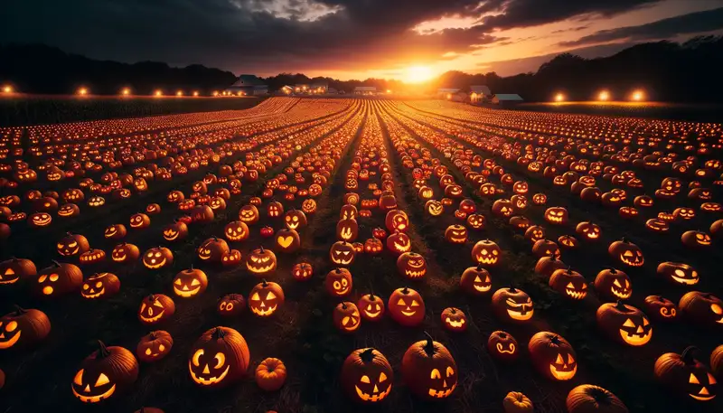
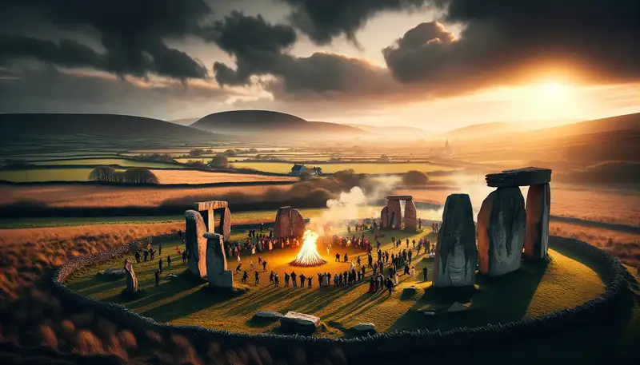
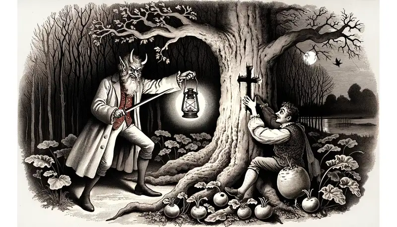
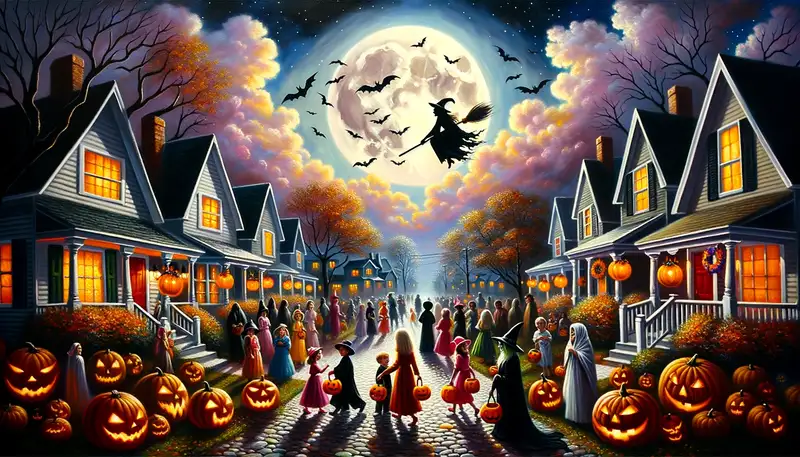

Do you know the history of Halowe'en? Are you aware of this holiday's rich history dating back thousands of years? Let me lay it out for you.

## Saimhain - Where It Begins

The roots of Halloween trace back over 2,000 years to the ancient Celtic festival of Samhain. Celebrated November 1st, the Celts' days began at sundown, so festivities began October 31t, Samhain marked the end of Summer and the beginning of Winter - a time associated with death for the Celts. It was, essentially, the opposing celebration of Bealtaine (basically May Day), and one of the four annual festivals that marked the cycle of seasons around the calendar.

In the Gaels it was believed that during Samhain (a Gaelic word pronounced SAH-win or SOW-in), the veil between the living and the dead. Samhain, celebrated on this night, was a crucial event as it symbolized the intertwining of these two realms. The Celts believed that during this time, the spirits of the deceased would return to the mortal world. was at its thinnest, allowing spirits to roam the earth.

To ward off the spirits of the deceased, the Celts lit bonfires and wore costumes made of animal skins. This is where Halloween costumes originate.

It's worth noting that many peoples have marked the death of seasons in a similar way and using similar concepts and ideas:

### Norse Álfablót:

The Norse people of Scandinavia held a festival called Álfablót, which means "Elf Sacrifice." It took place around the same time as Samhain and was dedicated to the elves and the spirits of the dead. During this time, the Norse believed that the veil between the world of the living and the world of the dead was thinner.

### Roman Lemuria:

Lemuria was an ancient Roman festival where the male head of the household would perform rituals at midnight to banish the malevolent and fearful ghosts of the dead from his house.

### Dia de los Muertos:

This Mexican "Day of the Dead" festival has pre-Hispanic roots from the Aztec civilization. It's a multi-day holiday where family and friends gather to pray for and remember those who have died. The event is colorful and festive despite its somber theme, and it takes place from October 31st to November 2nd.

### The Egyptian Feast of Wagy:

Ancient Egyptians had a festival known as the "Feast of Wagy" (often called the "Feast of the Valley"), during which they would honor the dead. Families would visit the tombs of their deceased relatives, offering food and drink, and celebrating with music and dance.

### The Slavic Dziady:

This is an ancient Slavic feast day that commemorates the dead. Dziady involved preparing ritual foods and offering them to the spirits of the deceased. The rites were intended to ensure the deceased ancestors' continued well-being and prevent their malevolent aspects from harming the living.

### But wait, there's more!

There are _many_ other historical examples. People have marked the changing the seasons similarly for time immemorial. It's actually a super common thread that connects us as people.

## Then the Romans

Over time, as the Roman Empire expanded its influence, Samhain was blended with two Roman festivals: Feralia, a day to commemorate the deceased, and a day to honor Pomona, the goddess of fruit and trees.

### Feralia

Feralia was one of the Roman festivals that commemorated the dead. It marked the final day of the Parentalia, a nine-day festival dedicated to family ancestors. During Feralia, Romans would bring offerings to the graves of their deceased loved ones, such as flower wreaths, bread soaked in wine, and other food items. It was a solemn occasion, a day of remembrance and reflection. Rituals were performed to ensure that the spirits of the dead rested in peace and didn't return to haunt the living.

### Pomona

Pomona, on the other hand, was quite different in nature. This festival was dedicated to the Roman goddess of fruit and trees, whose name is derived from the Latin word "pomum," meaning "fruit." Pomona was often depicted holding a cornucopia, a symbol of abundance. The festival in her honor celebrated the bounty of the harvest, particularly focusing on fruits. It's believed that many modern Halloween traditions, like bobbing for apples, have their roots in the Pomona festival due to the association with fruit, especially apples, which were sacred to the goddess.

You can see the natural blending of these festivals over time. People may not have fully shared their cultures, but the cycle of seasons was fairly universal and the similar way that these changes were marked made it relatively easy for integration, or co-opting, depending on your point of view.

## Eventually: Christians

By the 9th century, Christianity had spread into Celtic territories. November 1st was designated as All Saints' Day by the Roman Catholic Church, a day to honor saints and martyrs. The evening before became known as All Hallows' Eve, which eventually evolved into Halloween.

## All Saints' Day

All Saints' Day, also known as All Hallows' Day, is a Christian festival that honors all the saints, known and unknown. Its origins can be traced back to the early Christian practice of commemorating martyrs annually on the anniversaries of their deaths. By the 4th century, there were so many martyrs (due in part to the persecution of Christians) that it became impossible to give each one a separate feast day. As a solution, churches began to designate a common day to honor them collectively.

The choice of November 1st as the date for All Saints' Day is attributed to Pope Gregory III in the 8th century. He consecrated a chapel in St. Peter's Basilica to all the saints, and November 1st was chosen as the day of its dedication. This date was later made official by Pope Gregory IV in 837 AD, extending the celebration to the entire Church.

## All Hallows' Even

The evening before All Saints' Day, October 31st, became known as All Hallows' Eve. Given its proximity to the ancient festival of Samhain, many of the Celtic practices, like lighting bonfires and wearing costumes, became intertwined with this Christian observance. Over time, All Hallows' Eve was shortened to "Halloween."

It wasn't uncommon to see the church co-opting pagan traditions with their own celebrations. You may be familiar with the Saturnalia, the Roman festival honoring the god Saturn which was eventually "replaced" with Christmas. While both Christmas and Halloween have roots in pagan festivals, the ways they were integrated into Christian observance differ. Christmas, as the celebration of Jesus' birth, took on a deeply religious significance, whereas Halloween retained more of its original character related to spirits and the supernatural. The Church's objective in both cases was to provide a Christian alternative to existing pagan festivals, making it easier for converts to transition from their traditional celebrations.

It's worth noting that following All Saints' Day, the Church observes All Souls' Day on November 2nd. This day is dedicated to praying for the souls of the departed who are believed to be in purgatory, undergoing purification before entering heaven. The three-day observance, from October 31st to November 2nd, is sometimes referred to as the "Hallowtide" or "Days of the Dead."

## From All Hallows' Eve to Hallowe'en

The term "Halloween" comes from "All Hallows' Eve." To break it down:

- "Hallow" is an older word for "saint" or "holy person." In Old English, the term "hālga" meant "saint" or "holy," and over time it evolved into "hallow."
- "Eve" refers to the evening or the night before an event or occasion.

So, "All Hallows' Eve" essentially means "the evening before All Saints' Day."

The contraction of "All Hallows' Eve" to "Hallowe'en" is a result of linguistic evolution. In older English, words and phrases were often contracted for ease of pronunciation, and apostrophes were used to indicate omitted letters. Over time, "All Hallows' Even" (with "even" being an archaic word for "evening") was shortened to "Hallowe'en." The apostrophe in "Hallowe'en" represents the omitted "v" from "even." As the language continued to evolve, the apostrophe was often dropped, leading to the modern spelling "Halloween."

## From Europe to America

The migration of Europeans to America brought varied Halloween traditions. Initially, it was more about community gatherings and ghost stories. However, in the late 19th century, with a surge of Irish immigrants due to the potato famine, the holiday took a more recognizable form in America. The practice of trick-or-treating became widespread, evolving from an English and Irish practice where people would knock on doors asking for food or money in exchange for songs and prayers.

### Overview Halloween's History in the "Americas"

- Colonial America: In the early days of Colonial America, the observance of Halloween was not widespread due to the rigid Protestant beliefs in regions like New England. However, in the southern colonies, some Halloween-related traditions, such as "play parties" to celebrate the harvest, began to take hold. These gatherings involved singing, dancing, and storytelling.

- Irish Influence: The Great Irish Potato Famine in the mid-1800s led to a significant influx of Irish immigrants into the US. They played a pivotal role in popularizing Halloween traditions, especially trick-or-treating. This custom evolved from the Irish and English practice of "souling" or "guising," where children and poor people would go door-to-door on All Hallows' Eve, offering prayers for the dead in exchange for food or money.

- American Adaptation: Over time, Halloween in the US transitioned from a patchwork of regional festivities into a unified national celebration. By the early 20th century, the focus shifted from ghostly superstitions and witchcraft to community-centered events and parties. The commercial potential of the holiday was also recognized, leading to the mass production of costumes, decorations, and, of course, candy.

### The Irish Origin of the Jack-o-Lantern

In addition to Trick-or-Treating and guising, there's another prominent All-Hallows' Even traditional for which we can thank (or blame) the Irish.

Let me tell you about the legend of a man named "Stingy Jack":

#### The Tale of Stingy Jack O'Lantern:

According to folklore, Stingy Jack was a mischievous man who repeatedly tricked the Devil. On one occasion, he convinced the Devil to climb a tree and then carved a cross into its trunk, trapping the Devil above. Jack made a deal to release the Devil only if he promised not to take Jack's soul when he died. The Devil agreed.

When Jack eventually passed away, he was denied entrance to Heaven because of his deceitful ways. However, the Devil kept his promise and refused to let Jack into Hell. Instead, the Devil gave Jack a burning coal to light his way in the cold, dark void between Heaven and Hell. Jack carved out a turnip and placed the coal inside, using it as a lantern to guide his lost soul. He became known as "Jack of the Lantern," which was later shortened to "Jack-o-Lantern."

#### Migration to America:

When Irish immigrants came to America during the 19th century, they brought this legend and the tradition of carving lanterns with them. In Ireland and Scotland, people had carved faces into turnips, potatoes, or beets and placed them in windows or doorways to ward off evil spirits, especially during Samhain.

In the United States, they discovered that pumpkins, native to the Americas, were larger and easier to carve than turnips. This adaptation led to the now-iconic Halloween jack-o'-lantern made from pumpkins.

## Contemporary Halloween in the US and Worldwide

- United States: Halloween has become one of the most celebrated holidays, marked by costume parties, haunted house attractions, pumpkin carving, and trick-or-treating. It's also a significant commercial event, with spending on costumes, candies, and decorations reaching billions of dollars annually.

- Mexico & Latin America: The Day of the Dead (Día de los Muertos) is a multi-day celebration to honor deceased loved ones. It's a fusion of indigenous traditions and Catholic influences. Families create altars, decorate graves, and prepare special foods.

- Europe: Many European countries have adopted or revived Halloween customs. In Ireland, where Halloween originated, it's celebrated with bonfires, games, and traditional foods. In parts of Spain, people enjoy "La Castanyada," where they eat chestnuts and celebrate with family.

- Asia: While Halloween is not traditionally celebrated in many Asian countries, its commercial aspect, especially the costume element, has made it increasingly popular in cities. In Japan, for instance, Halloween-themed events and parades have grown in popularity, especially in areas like Shibuya in Tokyo.

- Australia & New Zealand: Halloween is becoming more widely celebrated, although it's still not as deeply rooted as in the US or Europe. Trick-or-treating and Halloween parties are becoming more common.

## Conclusion

Today, Halloween is celebrated in numerous ways, from trick-or-treating to costume parties. Its ancient roots are often overlooked, but the spirit of festivity, community, and a _touch_ of the supernatural remain at its core.

The evolution from Samhain, the Celtic end-of-harvest festival, to a global event is a testament to cultural exchange and adaptation. Its themes of remembrance, community, and the supernatural resonate with people from all walks of life.

It's a good time had by ~all~ most!
