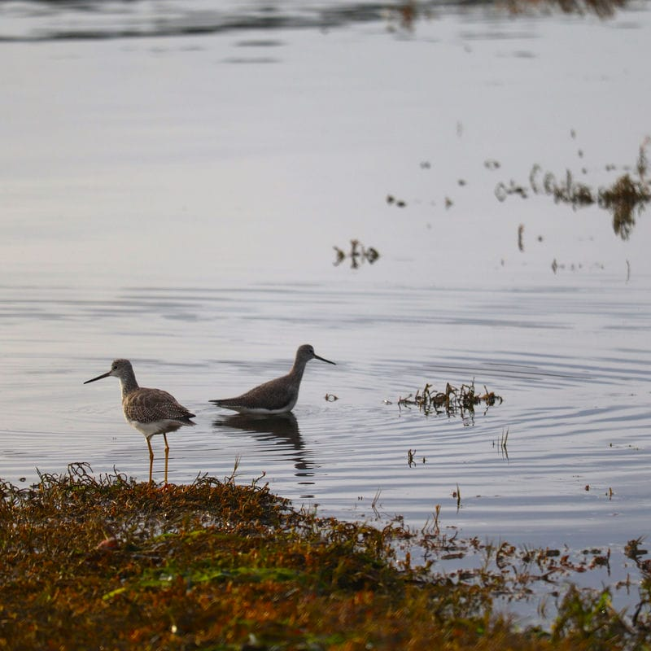

> Update 2023-11-12 - I've touched up this post a little bit and filled in a few details. You can see the file's history [here](https://github.com/ephbaum/EphWordsBlog/blob/main/src/content/blog/2023/11/2023-11-11-2023-week-45-ever-onward.md), if you're curious.

I've been staring at his blinking cursor for a while trying to figure out how to move get it moving across the screen in a way that doesn't just leave nonsense characters in its wake.

That first sentence seems to have worked out, so I'm taking a crack at another one and so far it's also going pretty well.

Given all the success of the previous two sentences and the continued movement of the caret ever forward in this text buffer has me believing in myself. I think it's possible to move on to writing something more substantive as opposed to blathering on and on about this text's creation and perhaps more about this week of my life, which I consider as the purpose of these posts.

Though it was a week of the same length as they're all known to have, it was a "big" week all the same. It had the same number of minutes and seconds but somehow it felt "larger" for a variety of reasons.

I think I talk a lot about weeks from a size perspective and they often seem "large" to me. Of course, ultimately, they're just weeks filled with events like every other. But all the same they often feel bigger, not exactly progressively, but when compared to weeks that don't "feel big", so to speak.

This week, however, marked the 13th anniversary of the day that people Lou and I were at the time were married.

It's kind of a big deal to have been married this long.

To have done so with the frequency and volume of big weeks that Lou and I have experienced seems like a heck of the milestone as well.

We chose to mark the occasion together on Tuesday, exactly one week to the day from Halloween due to the venue having offered us basically 50% off of the event to do so in their "off season". As a couple of poor kids paying for our own wedding we jumped at the chance.

In those 13 years, as mentioned, Lou and I have experienced a lot. We've had a lot of big weeks. We've grown, changed, matured, and learned- often as a result of fucking up, or observing others' fuck-ups.

We chose to celebrate that day together this year as we have done for all those that came before.

Lou and I had a lovely afternoon which, in turn, led to a wonderful evening.

It, quite honestly, didn't end well.

Conversations before, and since, have been better, and more productive, however.

Today we shared really nice little "road-trip date" to the ever lovely Port Townsend that was absolutely lovely.

Lou is my human. I am Lou's human.

We're working on us. It's very nice.

Meanwhile, it's getting late after having had such a big day, so I'm going to quickly recapitulate and, perhaps I'll touch things up in a future update.

## Sunday

Sunday was a relatively quiet day. I ran a couple errands in Silverdale, did some chores, and tried to fit in some of that self-care that we all need oh so much.

I watched the first episodes of [Scavenger's Reign](https://www.imdb.com/title/tt21056886/) (S1E1-9) and it's pretty interesting. Lot's of unique and novel ideas on display. I'm looking forward to seeing the next 3 episodes that have since dropped.

I spent some time feeling nostalgic and traipsing down Memory Lane. Or, as I should rather call it: reflecting.

## Monday

More nostalgia, perhaps.

Watched, somewhat randomly, [Fantastic Mr. Fox](https://www.imdb.com/title/tt0432283/).

I spent a little time playing OG Fortnite and also played a bit more of Alan Wake 2, a game in which I'm progressing very slowly as I want to look at everything, soak it all up. Ahti's performance of [YÖTÔN YÕ](https://www.youtube.com/watch?v=UY-QAd-WR8I) in Watery is captivating.

## Tuesday

Tuesday was, as mentioned above, the celebration of 13 years of marriage with the love of my life.

The short version is that we had a nice little date in downtown Bremerton. It was a lovely time, although it didn't end on the highest note, it was overall a very good way to mark 13 years with my best friend.

The longer version is that Lou and I spent the afternoon together.

In the evening we went down to downtown. We started at Another Castle and grabbed a couple drinks and played some Pac-Man and Mario Kart- that wasn't enough, however, so we headed over to Quarters Arcade and played some skee-ball and such- Lou's a sucker for skee-ball.

After that we went to Axe & Arrow and got a whiskey flight and shared their delicious honey brown cake.

As I said, the night didn't end on the highest of notes. But it was, otherwise, a lovely night and it felt nice to spend time with Lou all the same and, ultimately, I think we've managed to make good progress on establishing a way forward in each others' lives.

## Wednesday

I don't really have a lot to say about Wednesday this week. I was able to, among other things, spend some "quality" time with the kiddos playing a few games of Fortnite.

Wednesday was, ultimately, a good day

## Thursday

Liz performed with her orchestra class at Bremerton High School and we were able to see 3 different string orchestra classes perform. She did so well. It makes me happy to see her focus and apply herself to learning to play and perform on her violin. I'm super proud of her!

Afterward we got the requisite ice cream as a family.

## Friday

There's not much interesting to talk about for Friday. I watched the S1E1-4 of Better Call Saul, a show I've been meaning to watch for quite some time. It turns out that Lou "watched" the first 3 seasons already and I figured I could start catching up to be able to talk about it with her.

It was a lovely rainy PNW day :)

## Saturday -- Today

Today was a pretty fantastic day.

It began with coffee and quiche from Saboteur. (I'm reminded of the relationship book Lou and I talked about developing that would be titled Quiche and Cuddles IIRC)

We drove up to Port Townsend and spent some time exploring together.

I'd love to fill this day's details in more later, but for now I'm going to cut this post and say that it was a wonderful time, we saw many fantastic things, and I had missed spending time with my friend Lou. :)

> Update

We drove to Port Townsend and explored a bit by car. We ended up stopping at Aldrich's Grocery and then exploring the market. We got a delicious Wild Rice Stew, focaccia, and some tasty kombucha.

After the farmer's market and a little more exploration we spent some time exploring the shops on Water Street ending our Port Townsend excursion with some delicious blueberry bread pudding and rice pudding from the extraordinarily quaint Lighthouse Cafe.

On our way home we took the long way around through Irondale, across Indian Island, and stops at Mystery Bay State Park and Fort Flagler State park. We saw a beautiful great blue heron at Mystery Bay State Park and both would like to come back up to do more exploration for sure. Fort Flagler seems like a great place to explore in the future.

We continued our journey south through Port Ludlow before ultimately making our way home.

---

In conclusion: it was a _big_ week for me. It was, I think, a good week. I'm happy that Lou and I are trying to move forward together.

It's not going to be easy. It will be hard work. Things will not be as they've been- not entirely.

Wish us luck.

TTFN!
