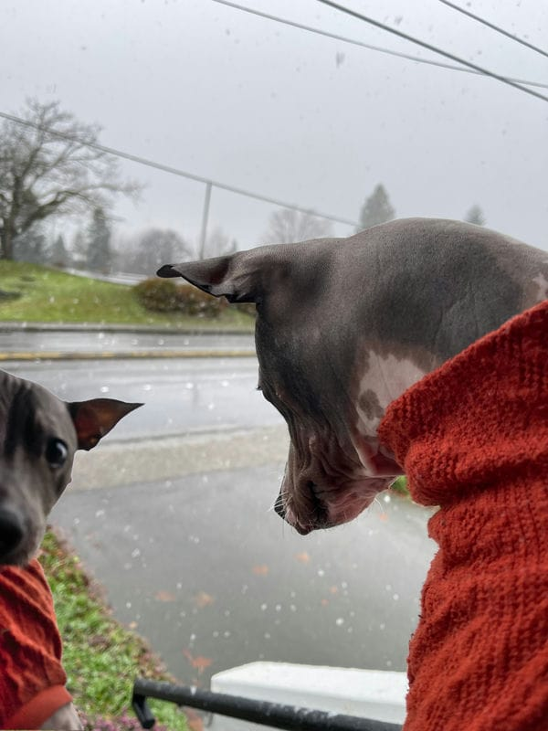

Not to sound like a broken record, but this has been a difficult week. As mentioned [last week](/posts/2023-week-48), my father passed away. I began this week by taking a bit of time away from work to grieve and work on putting my father's final affairs in order.

I'm shocked by how much sorry I feel. As I've talked about previously, I feel like I've already long grieved the loss of my father, but somehow I find myself still deeply saddened by his death, particularly at a young age despite dementia having robbed him of any real quality of life going forward.

I have arranged for his cremation, written his obituary, and I'm planning to create an online memorial for him should anyone be interested in his memory. After doing some research this week, I think I'll go with [Keeper](https://www.mykeeper.com/).

I'll take a little more time when his cremains arrive as I suspect that will be difficult.

I won't recount my week by day this time but instead will just talk about about the experiences.

I will mention that Sunday this week was not Waffle Day - instead we had Pancake Day and it was delicious.

### The Whale

Lou and I watched the movie [The Whale](https://www.imdb.com/title/tt13833688/) early this week.

Given that my father just passed and I've been extra introspective about my own relationship with my kids and this movie is, at its core, a poignant story about a man attempting to reconnect with his child as he faces his own mortality following years of suffering in his own grief which has resulted in an addiction to food and chronic overheating and obesity. It likely doesn’t help that my own struggles with chronic pain and depression led me to a weight of nearly 400lbs in my own past, either, causing me to maybe identify more closely with this character.

I recognize there are things about this movie that are definitely worth criticizing - it’s so narrowly staged, much like the stage play from which it is adapted, there are some almost vaudevillian performances, and it feels somewhat exploitative, for examples

I experienced it like a gut punch. The ending had me in tears.

Brendan Fraser’s performance is excellent- I’ve long loved the man’s work but this performance was sublime

I’ve been a fan of Aronofksy since I rented Pi in high school watched it with my fellow "cinemephile" buddy and it was one of the movies that drove us to write our first (terrible) screenplay together. My love for his work was cemented shortly thereafter with Requiem for a Dream.

Again, there are things about this movie that I absolutely see critically, but, for me, are “forgivable” given the power of the underlying story and its execution.

### Going Through the Christmas Motions

Liz insisted that we get the tree up this week. We have it partially decorated.

I don't love Christmas as a season for a variety of reasons that I'll probably need to write a post about- though I've shared my feelings before. Between my atheism, feelings about capitalism & consumerism, and, just, a long history of shitty holiday experiences, I'm not exactly a Scrooge or Grinch, but I don't have a lot of holiday spirit.

Still, I try to make sure the holiday is as magical as possible for my kiddos.

Here's this year's ornament:

### Fornite Season 5

The new Fortnite season is bonkers!

The the new Battle Royale map is **huge**, the locales are richly detailed, and there's a lot to do. Everything feels super new, perhaps more so after the last "OG" season we just experienced, but this map is huge, the buildings are super detailed. It's all pretty fantastic.

In addition there's [new modes](https://www.epicgames.com/site/en-US/news/introducing-lego-fortnite-rocket-racing-and-fortnite-festival-new-epic-games-launching-this-week-in-fortnite). Rocket Racing is Rocket League meets Mario Kart within Fortnite. LEGO Fortnite is Minecraft meets LEGO Worlds within Fortnite.

It's a lot of new playable content.

I've said it before but I'll say it again that I really don't want to love Fortnite but I really do

### Advent of Code 2023

I've been working on this year's [Advent of Code](https://adventofcode.com/) challenges.

I wrote [a post](https://ephbaum.dev/dont-trust-ai-an-advent-of-code-tale/) on my dev blog about the pitfalls of AI as I experienced an annoying bug due to an AI seemingly changing a line of code as I pasted it while doing some refactoring.

It's been some fun challenges this year, but it has felt like the difficulty has been all over the place.

Speaking of, I need to work on Day 9's challenge so I don't fall behind (like I do every year).

### What else?

I had an eye appointment this week and ordered new glasses.

Lou and I finished watching Beef, which was as good as everyone says.

Another [atmospheric river](https://www.npr.org/2023/12/06/1217505148/an-atmospheric-river-is-soaking-the-pacific-northwest-with-record-breaking-rain) this week resulted in water in our basement again, like most winters. Some folks had much worse experiences and we're actually getting pretty good at clean up and mitigation. One of these days I think we'll be able to stop it entirely.

Meanwile, Ollie saw snow for the first time today:

And that's about it, I guess.

Another week over in 2023 with only 3 full weeks left in this year to go, one of which containing many people's favorite holiday, they should fly by quite quickly.
