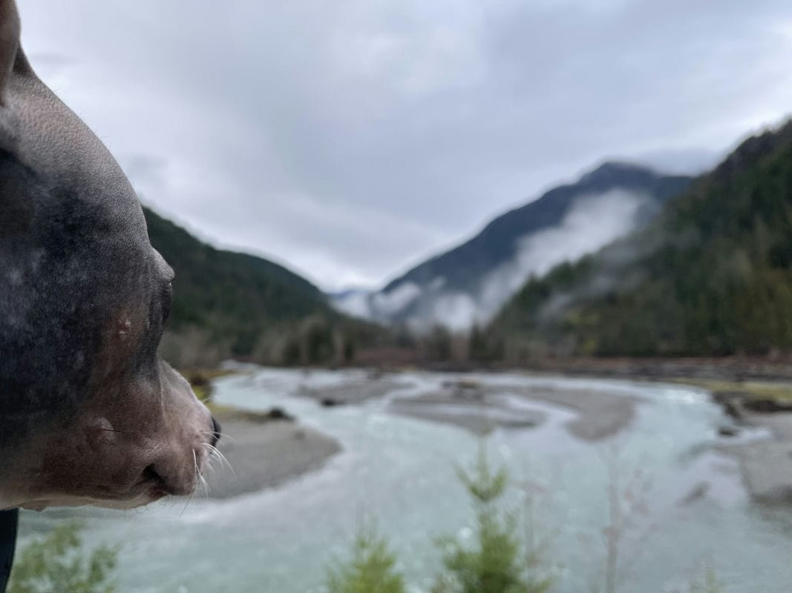
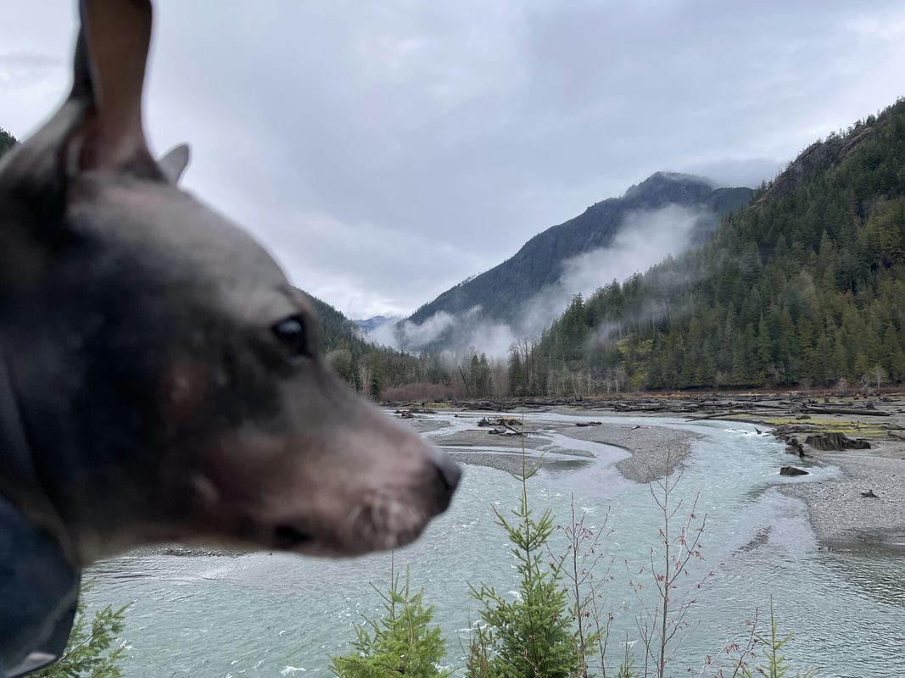

Update 2023-12-31 - I tried to make some updates to this post, but I don't think I did much to improve things. I added a few links. This has been another big year in a series of big years and I'm having a hard time fully reflecting on it. Feel free to check out the history of this post [here](https://github.com/ephbaum/EphWordsBlog/blob/main/src/content/blog/2023/12/2023-12-30-2023-week-52-after-52-weeks-a-smackles-form.md).

Yesterday I misheard Lou say she was making a Smackles Form. Turns out that she was was creating a [S.M.A.R.T. Goals](https://en.wikipedia.org/wiki/SMART_criteria) Form for her clients. I rather like my idea of a _smackles_ form however, which, in my mind, would be colorful and has sparkles. SMART Goals, however, are good and, probably I should consider their use as I go into 2024 to help me get some things done as there are plenty of outstanding TODOs on my never-ending list.

Yesterday, as we talked about our 3 day weekend Lou remarked: "We have 3 days to feel fine and dandy." I'm not sure why but it took me a little while to parse that.

I think that working on my self-review at work and the impending New Year's holiday have had me reflecting a great deal of late- reflecting my personal life, my professional life, and the world around me over the last year and beyond.

Today my daughter told me that she wishes there was a show of my life after she missed the target in guessing I was 6 years old in 1993 due to the confusion (and miscalculation) of her mother's birth year as compared to my birth year. I was more like twice as old in 1993 and that year was, as I've mentioned, one of my favorite years. It was the year the Nirvana's In Utero released, and Smashing Pumpkin's Siamese Dream and both were enormously important works to me- Enter the Wu-Tang as well. Beavis and Butthead began its run. Super Mario All-Stars, Star Fox, Street Fighter II and Mortal Kombat were a big deal. One of my favorite novels became the highest grossing film of all time: Jurassic Park (surpassing Spielberg's E.T. until Cameron's The Titanic in 1997). There were, of course, a great many other things about 1993 that were very big and important and so, of course, it has long held an important held quite the place in my memory.

It's interesting to think about that year 3 decades later, however.

The idea of a show about my life is interesting to me because I think my life has been rather interesting but, yet, somehow it's also been very mundane all things considered. She talked about it terms of Dwayne "The Rock" Johnson's [Young Rock](https://www.imdb.com/title/tt11639952/) but, c'mon, that guy's life was actally interesting. What is this life of mine? I'm not descended from wrestling, nor actual, royalty.

It would be hard, however, for me to simply "create a show" about my life. Just nike-ing things is a barrier I struggle with crossing all the times.

"Just do it"- You got it... except I kind of struggle sometimes- or I freeze up. I just don't feel like I always have the bandwidth.

But I have done, of course. (Just done things, that is)

I flung myself across the United States to the Pacific Northwest during a global pandemic. We totally just did that.

I've had some incredible adventures over the last several years- my life can hardly be called boring.

Yet it is exactly that.

And yesterday I was damning myself for my love and passion of practically everything. Like a wide eyed child I am, in awe of all things the world over and about me.

I live my life like I'm watching an interesting show- so a show about my life would be interesting only if I were to show people the show I was watching. Like how there is an active effort to bar Donald J. Trump from running as President of the United States for 2024 in the United States. Though if Trump were to believe his own lies, he could not run in 2024 due entirely to having _been_ the President of the United States, suggesting a convenient series of concessions to resolve paradoxical reason/logic.

I think, my self-review has gotten all up in my head

I'm self-reflecting.

It's been a hell of year, and one not at all what I expected. Re-reading my [first of these posts](/posts/2023-week-1) and I talk about how I thought this would be "our year". In that post I reflect a lot on 2022 and its challenges, its unexpected difficulties, and discuss the numbers related to this year that gave me _hope_. Given my love of the number [23](<https://en.wikipedia.org/wiki/23_(number)>) and this being the year I turned [42](<https://en.wikipedia.org/wiki/42_(number)>), which is [the answer to life the universe and everything](https://en.wikipedia.org/wiki/Phrases_from_The_Hitchhiker's_Guide_to_the_Galaxy#The_Answer_to_the_Ultimate_Question_of_Life,_the_Universe,_and_Everything_is_42). Things have not, of course, gone at all the way that I expected.

Yet it's been an entirely mundane year- it's been a year of self-care, of healing, of growth.

It's also been a year of stress, of injury and pain.

It's been year filled with the unexpected- like every other year before it.

It's also been a year of Fortnite

- and [Alan Wake](/posts/2023-week-43) (and so many other video games)
- and skill sharpening
- and reading
- and consumption of media (movies, music, comics, books, Internet)
- and history
- and travel
- and history
- and this list could go on... (and be filled with lots of links that might link back to referential posts that I don't feel like I linking to today)

It's been a big year filled with bringing a [brand new dog](/posts/2023-week-8) into our lives- a wonderful 30 lbs. dog we were assured was not a lap dog who spends a significant amount of his life in our laps

It's been a year of #ThursdayHikes

- and audio recordings
- and personal achievements
- and loss and FMLA
- and [bereavement & grieving](/posts/2023-week-48)
- and an emptying nest
- and [separation](/posts/2023-week-40)
- and the ever changing boundaries of friends and family

... and again, these could be linked to relevant posts if I felt like it. Perhaps in a future update I'll do exactly that.

I read an [article in the Atlantic](https://www.theatlantic.com/technology/archive/2023/12/tesla-chatgpt-most-important-technology/676980/) yesterday about the way that EV's have already changed the U.S. - it got me thinking about my own role in automotive industry, of the software engineering industry, and my relationship my company and the people in it. And, of course, that relates to the aforementioned self-review I was writing, as I've been very reflective.

I've been working for more than six years at my company now, and 5 of those I've been moving steadily closer to the core of the CARS technical engineering organization following our acquisition. It's been an incredible journey as I've moved around my organization triaging, building, re-building, and/or maintaining various projects built out of their start-up days.

Mostly I've spent a lot of my time doing my best to help folks get their work done while trying to also get my own work done as well.

I think this would be a great place in this post to talk more about my professional growth and development, but I think that might require a later update or post.

And now here we are in the last week of 2023 on the verge of 2024.

I'm thinking about my year personally, my year professionally, and my year in general and, I think, I have a lot of thoughts I'm not capable of distilling in a simple post here at the end of the week and, of course, part of that may have something to do with the fact that I'm writing this post so late in the day having chosen to drive around to the other side of the Hood Canal fjord in search of adventure today instead of focusing on writing a blockbuster year end post.

Speaking of reflection and recapping, here's a quick run down of my last full week of 2023:

## Sunday

Waffle Day!

Also it was Christmas Eve this year.

We ate corn meal pancakes (read: waffles without the waffle iron) and had a mostly snacky food day, as Christmas Eve tends to be around this household.

I ran to the store again because, of course, we still needed stuff. In this case we needed berries and whipped cream for our traditional Christmas morning crepes.

It was a rather cold and unpleasant day- a traditional PNW X-Mas eve, from what I can gather.

We watched some "non-traditional" Christmas movies like Die Hard and Kiss Kiss Bang Bang (as is "tradition" around here)

I did [Advent of Code 2023 Day 24](https://adventofcode.com/2015/day/24). Or rather, my eyes glossed over a bit when reading day 24's problems. It was one of the days I talk about in my [tech blog post](https://ephbaum.dev/50-stars-over-25-days/) but that was [Tuesday](#tuesday) post where I wound up looking at others' solutions because I just didn't have the mental bandwidth to solve for collisions on a 3D field. I learned a lot and I'm sure I'll be bettered prepare in the future for solving just such a problem.

It was a Christmas Eve and, at a remarkably early hour on Christmas day, Lou (and our kiddo) drove family friends to the airport for a a flight- it meant that, ultimately, none of got much sleep before Christmas... and I'd bet that's probably true of a great many people the world over...

It was an ultimately good Christmas Eve despite certain unpleasant circumstances like the absense of our children (empty nest above mentioned and the decision of our son to remain in Iwoa for this holiday break due to a variety of circumstances). It was the first year we've not had Michael around for the holidays and his absence was felt pretty hard by all.

## Monday

Monday was Christmas day! Despite our multi-belief based holiday celebration, x-mas remains an important holiday around here where we show each other how much we love each other through the warm and transactional power of capitalism.

This day saw all of our children (save our son in Iowa) in the house and it was cozy AF, if you'll allow.

As mentioned it was a day where few of us seemed to have gotten good sleep. Lou and I spent much of our day performing important tasks to facilitate our various children's expectations of tradition and love. We prepared a variety of dishes, plates, and foods- it was a lot of fun but also rather hectic and, I'd say that this year much more of the burden lay upon Lou, as happens every year, though I sure tried to help wherever possible.

Momo came in the afternoon and then eventually our eldest and her boyfriend drove around from Seattle to visit us as we'd done on [thanksgiving](/posts/2023-week-47) to visit them. It was, as again it was more traditional PNW weather, despite this year's El Niño having otherwise largely seemed to keep things dry and warm this year, so it sounds like their drive was less pleasant than ours at been _to_ their place (our drive home was pretty unpleasant that day).

Anyway, the throughout the day we dutifully exchanged gifts with each other to indicate our love and appreciation, as ascribed in the holy words (imagine I linked to one of _n_ of articles and posts about shopping, or the spirit, of this, or any previous years', holiday seasons)

And the food, most of what Lou and I worked on throughout the day, was _fantastic_ and met _most_ of the nostalgic requirements, and expectations, of traditional x-mas for us our kids. Her deviled eggs this year were practically perfection, her crepes this year were almost certainly responsible for at least a couple pounds of weight gain, and ultimately I think we all ate _very_ well. 🤤😋😮‍💨

It was a lovely day and I think we all felt the love. 🥰

## Tuesday</a>

Tuesday, known elsewhere as Boxing Day, was an interesting day.

TIL (Tuesday I Learned) that Death Certificates look a hell of lot like Birth Certificates and, honestly, I should have realized that because I'm a smart and learned human who has seen multiple death certificates in his lifetime- but somehow the level at which the paper on which the death certificate is printed is the same vibrancy as that of birth certificates is surprising- at least for the state of Minnesota. I think I expected something more subdued, I think, like a vehicle title, perhaps, but of course in retrospect it seems obvious.

We ate a lot of Christmas leftovers.

Liz and I tried to play [Root](https://ledergames.com/collections/root) and discovered that it takes up a bit more space than we really have in our home (got me thinking about perhaps bringing it down to the local gaming venue to set up and play 🤔)- we got it mostly set up and played the [2-turn walkthrough](https://cdn.shopify.com/s/files/1/0106/0162/7706/files/Root_Base_Walking_Through_Root_web_Oct_15_2020.pdf?v=1603137225), mostly (she kind of lost focus near the end of the first turn)

Other stuff happened.

It was a day.

## Wednesday

Wednesday was another drizzly day in Bremerton.

I did work, as I do.

I lost some focus to illness.

I lost some focus to [tom7](https://www.youtube.com/@tom7) on YouTube watching (having previously read about) his Harder Drives video and then getting lost in Elo World and his reverse emulating the NES.

Also finally got around to watching the film adaptation of [Uncharted](https://www.imdb.com/title/tt1464335/) and it was just as hard as I expected- Mark Wahlberg is no Sully, Tom Holland is no ~Nathan Fillion~ Nathan Drake but the movie, overall, works pretty well all the same.

I spent more time researching [luke S. May](https://www.historylink.org/File/4241) and his illustrious career in the newspapers. I've been casually looking into his exploits for years, since I read his name in connection to the [Erland's Point murders](https://www.historylink.org/File/5558) and recalling hearing his name here and there over the years- so I've been doing some searching through the newspapers and reading of his exploits in the region in the 20's and 30's. There are a lot of interesting characters in the region around that time to be sure...

Anyway, there were a variety of things that happened on Wednesday

## Thursday

Thursday I was feeling rather under the weather and had a lot of trouble with focus and just felt tired so I ended up working in the morning but taking the afternoon off to rest my brain.

We had Chipotle for dinner- it was yummy.

I played, among other things, the new [Super Mario RPG](https://www.nintendo.com/us/store/products/super-mario-rpg-118738/) that Lou got me for Christmas- what a sense of nostalgia. It's definitely a remaster of the OG. I never finished the original, though I'd played it some, so this was been a fun trip down memory lane. The humor is exactly as silly as I remember it and, luckily, it didn't require much focus and let me veg out a bit before going back to bed

I'm planning to play Tears of the Kingdom at some point in my future as well. 😅

## Friday

Another morning of work but, due to still not feeling well, I took the afternoon off to rest. I did manage to do some rubber ducking with my boss and got a start on my self-review. It did result in a lot of self-reflection, as mentioned earlier.

I did take Liz to the mall to pick up some things for which she'd been asking. It was busier than I would have preferred but a nice little outing with the kiddo.

I did manage to play a few games of Fortnite with a kiddo, it was good bonding time even if I wasn't the most effective I've ever been 😅

I also managed to futz with my Neovim setup trying to get lazy.nvim working so I could get gen.nvim working and I wound up having a little trouble with coc.nvim... but that's a post for the other blog 😆

My copy of Super Mario Wonder was delivered and I ended up playing a few worlds in the evening before bed and it is as good as it's described. The little details are stunning, the gameplay tight and crisp, all of it is top-notch.

I also got a copy of the great Bill Watterson's first new work in 3 decades which I am simultaneously excited and terrified to read (blah blah fear and excitement are the same thing)

## Saturday - Today

Today, per Liz's request, we took a little road trip. I still wasn't feeling great, but well enough to do a little road-trip with the family.

She had wanted to go see snow as we've told her pretty consistently that, despite her missing of Minnesota snow, that we can generally drive to snow around here, especially in the Winter. Of course, this has been an exceptional El Niño, as mentioned earlier, year and the warmth / dry weather has resulted in a fairly minimal amount of snow, even in the high elevations of the Olympic and Cascades.

So, instead of chasing snow we drove around to Lake Cushman and took a little drive into OLYM to check out the beauty of nature.

It was an absolutely lovely day despite the occasional light rain and mostly gray skies. The low hanging clouds / mist were beautiful and the beauty of the Olympic mountains could not be dampened by the lack of sun and low hanging cloud cover.

It was wonderful seeing [Cushman Dam No. 1](https://en.wikipedia.org/wiki/Cushman_Dam_No._1) in person, Liz found it super fascinating. We'd driven past the more visually interesting [Lake Cushman Dam No. 2](https://en.wikipedia.org/wiki/Cushman_Dam_No._2) quite a few times in our years here during our various adventures but today was the first time seeing the big dam.

We drove along the pothole covered N. Lake Cushman Road (119) making several stops at various turn-offs and vistas. We ate sushi in the rain overlooking the lake at the gorgeous Lake Cushman Lookout. We followed 119 all the way into OLYM to see Staircase, stopping at the closed point of NF-24 and checking out the bridge across the North Fork Skokomish River, which was raging. I'm excited to come back when NF-24 is open. For gits and shiggles we also went across to NF-2451 and drove up until we found it was closed.

It was a beautiful drive.

Ollie liked it too:

We didn't find snow but we did have a lovely time and, perhaps during a future weekend trip we'll find ourselves some of that snow this kid misses oh so much.

I'm excited to explore more of NF-24 as well as NFD-24.

It did finally read Watterson's The Mysteries and I loved it but have a lot of thoughts I need to compile

---

In conclusion: I still didn't create the "year-in-review" I've been promising and instead just mused a bit about my last year. That will have to be, however, good enough.

This has been a huge year

- week
- day

I almost certainly need to circle back on this post before I can truly make my conclusion and have so many more things I _could_ share about my week, I'm sure- I am a busy fella. It's almost 11p.m. now...

kthxbye... see you in 2024 (even if I update this post sooner)
