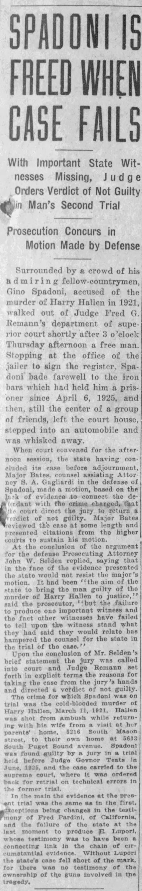

# History Fascinates, Appalls, and Resonates

I have, in my life, spent a fair portion of my energy, focus, and attention to history.

History has myriad contexts:

- World history
- American history
- Personal history
- Regional history
- Professional history
- Educational history
- Geological history
- Galactic history
- Universal history

There's a lot of history that we all share in varying Venn diagrams of peoples' contexts

It's impossible to keep it all straight, but there are all these varying stories intertwining and dancing around each other as we together hurtle through space on this little life covered rock in the midst of the galactic explosion we never asked to hitch a ride upon but find ourselves _together_ all the same...

Lately I've been traipsing about through a lot of historical perspectives related to broadly seeking to learn about the place where I brought myself in my 40's, I've been looking at my own history through various lenses and coming to terms with the recent passing of my father from his meat suit and as dealing with the process of grieving and tying together the general grief that I have held and shed throughout said timeline.

Personal history.

Regional history.

Discovering Bremerton's history has added an intriguing layer to my own family's narrative as it's skipped along the timeline. My family's history covers several regions over the years about which I'm aware. Thinking about things that were happening in Hinkley, for example, and here in Kitsap County or the Olympic Penninsula, is fascinating. Thinking about the stories from each that reach each other's doorsteps in the form of local newspapers.

As I place key moments from our past along the timeline and explore our connections to various locations, places, and times, I am continually amazed by the wealth of stories this place holds.

Discovering Bremerton's history is interesting as I put my own family's history skipping along the timeline and my own connection in various locations, places & times, etc. 🤯 It is a place rich with stories.

Reading about this history of this place, and learning of it's past filled with fascinating and amazing humans who all living in community in varying ways.

My own place here as a timid member. Shopping here, socializing here, learning here, growing here, helping here.

It's a lot to get to know a place, am I right?

And the larger world, the Olympic and West Sound worlds.

Their histories

Reading stories about the Pacific Northwest region and the various historical territories, the native peoples' and their experience with manifest destiny

I've been excitedly exploring this place and every place I look there are stories

This place is rich with stories

There's the crime fighting of Luke S. May, local criminologist, who was quite the character, had a lot of wild True Crime stories, was known to apply science to prove his points and it led to the growth and proliferation of the law enforcement crime labs.

Looking into cases throughout this place's past is wild. Reading the stories of local journalist/historian's like [Murray Morgan](https://en.wikipedia.org/wiki/Murray_Morgan), or even [Josh Farley](https://www.josh-farley.com/reporting), and the local journals of record of their periods.

There's the exploits of former Bremerton Mayor Jesse Knabb who, in the 30's wound up on the national stage for such stories as his having jumped off the end of Bremerton dock (in front of 10x the number of folks who had voted for him, as he made good on a campaign promise to do so if he lost, a crowd he drummed up with a loudspeaker on a truck **AND** having been _caught_ with a woman at a hotel (though he claimed to have been pursuing a good deal on prowlers for Bermerton's police dept.

There's the murder of James Smith at Hi-Low Bowl in Port Orchard who [might have been killed](https://archive.seattletimes.com/archive/?date=20020725&slug=murder25m) _by_ the Port Orchard Chief of Police: Gale Dow!

It's been a lot of fun doing the research on area. It's a little strange to feel like a tourist here.

Learning about the history of the region has been rife with colorful characters like the tailor who Bremerton Mayor / Police Chief / County Commissioner Jesse Knabb eventually, he would have you believe, framed by a "gang" in the 30's and Port Orchard Patrolmen turned Chief of Police and, possibly, a murderer!

There's the tragic Harry Hallen murder, and the drama surrounding The Griffin Wheel company in Tacoma. The story is told from a rather interesting perspective [here](http://groupssa.com/ssa/griffinwheelmurder/griffinwheelmurder.html). The entire results in the originally convicted murdereing, Spadoni, is released and ordered not guilty.

There are fascinating stories such as learning about the "mystic invalid" in the mid-20's in Coos County, OR, who, in addition to murdering his sister-in-law, was said to have done so through the application of "mesmerism" of his "simple" nephew to perform the crime and, apparently, was also the mastermind / architect of dozens of murder plots of prominent people in the area. It's a wild story.

There are "[kidnapings](https://www.wordnik.com/words/kidnaping)" aplenty, including the first time J. Edger Hoover's G-Men had failed to save a stolen child after [Charlie Mattson](https://www.historylink.org/File/8028) in Tacoma at the end of 1936, a story which spanned the region and ended up on the national stage! That story is tragic, and so is [Anna Nosko](https://www.columbian.com/news/2022/apr/03/clark-county-history-anna-nosko-murder-of-1923/)'s story, a young lady of 11 who was snatched from a path on her way home from school in picturesque Clark County, WA, assaulted, and murdered.

Tragic stories have the dubious honor of being interesting.

It's amazing to read about former posses that were being formed here in the 1920's and 30's.

True Crime isn't generally filled with positive stories. I appreciate that the Bremerton Sun managed to follow the story of Jimmie Moore who, as a child of 9, survived a fire bombing in the apartment he'd been staying in East Bremerton with his mother and Barbara Wilson, who tragically did not survive. While the story of a Molotov cocktails isn't inspiring, Jimmie Moore's recovery from his burns and return to a "normal life" (as the survivor of an unsolved fire bombing) absolutely was.

There are the stories of local historians, folks descended from the regions "pioneers". Locals who tell stories like that of the [Bremelorian](https://bremelore.wtf) who recently told [this story](https://kitsapsmokestack.org/2024/02/02/this-month-in-history-w-the-bremelorian-feb-24-1939-things-are-getting-fishy-down-at-the-shipyard/) in the Kitsap Smokestack about a plethora of fish at PSNS that resulted in excellent eating for the all of Bremerton in 1939!

All that calls to mind the thoughts of life of people in a time of meat grinding wars and their adjacency to events

The life of people during the last U.S. civil war, and those that emerged. Those that came to this country during various wars, different populations moving around for different reasons.

Local historians and stories passed down from pioneers continue to add to the rich tapestry of Bremerton's history, recently the Kitsap History Museum held an [uncorked](https://kitsapmuseum.org/category/events/history-uncorked/) event that featured local historian Ruth Reese talked about the history of beautiful Manette, WA, site of the original Port Orchard at Enetai Beach.

We recently visited the [High Steel Bridge](https://en.wikipedia.org/wiki/High_Steel_Bridge) near Shelton, WA, and in so doing I learned a bit about its history and the [Simpson Lumber Co.](https://en.wikipedia.org/wiki/Simpson_Investment_Company) out of McCleary, WA. McCleary is, itself, the site of an unsolved mystery. [Lindsey Baum](https://www.theolympian.com/news/local/article210857294.html)'s body was eventually found, and a person finally arrested in her case. Driving through that town and seeing the remembrances of her at the local playground, it moves you all the same. Good to learn there's some actual closure.

There are modern tales of folks doing incredible good throughout the region. There are people that are working tirelessly day after day to help the local housing insecure population. There are people that offer low cost services to people who could not otherwise afford them. There are people who are trying to make things better. They outnumber the folks mentioned above that are causing strife, even if their stories may not drive as much engagement, they are important stories indeed.

Anyway, what's my point in all this?

As I said: There are a ton of stories here. I would very much like to tell some of those stories.
