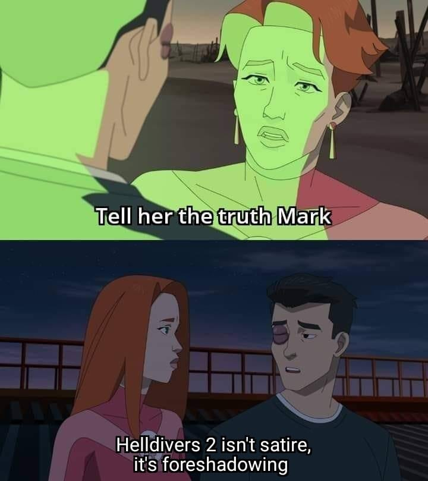

For the Record: I have been really busy, which is why I didn't even post anything in March, despite wanting to at least post once a month this year.

In the time since my last post, besides putting in 21.6 hours in Helldivers 2 (and perhaps quite a few more hours of Fortnite, which I just can't quit), I've also travelled across multiple states and brought home a new dog Andy (about whom a [future post](#) must be dedicated, as well as a recounting of the [journey](#)! We've taken a few other trips, we've picked up a camper trailer and a vehicle to pull it, and done myriad other things - if you've read any of the previous weekly "[saturday posts](/tags/saturday-post)", you'll know that we stay pretty busy.

If you look at [my most recent post](/posts/2024-02-05-history-fascinates-appalls-and-resonates) you'll see that it's still marked as a work-in-progress (as of this writing anyway, maybe I'll _actually_ finish it 😅).

## Helldivers 2

Instead of posting, or doing other important things, I've been playing a fair bit of Helldivers 2 and found it to be just an excellent game. The theme, however, is actually really tricky given that it's just so dark:

Still, the gameplay is spectacular. The gun play is nuanced and fun, the enemies are challenging, the missions are reasonably interesting and varied and the loop is fun.

There are definitely things about the game that I don't love about the game: the multiple in-game currencies and many upgrade trees are a little frustrating the juggle, the progression feels just a little slow for me.

Also, there are bugs and of course I'm not referring the the [Starship Troppers-esque](https://www.imdb.com/title/tt0120201/) "Terminids", and they can be pretty frustrating.

But overall it's a ton of fun, especially with a group of friends but your general PUG experience ranges from not to terible to stellar.

I wish I had more time to play (and write) but I'm excited to keep this one on rotation and I hope they manage to maintain good momentum with this one. I definitely enjoyed the original Helldivers and see a lot of potential for this version.

## Everything Else

It's actually pretty late and I'm really just going to have to put a pin in it.

Perhaps I'll make some time to put down a few more words sooner rather than later, but for now please accept my deepest apologies as I just don't have time to over-share right now.

Catch you later.
