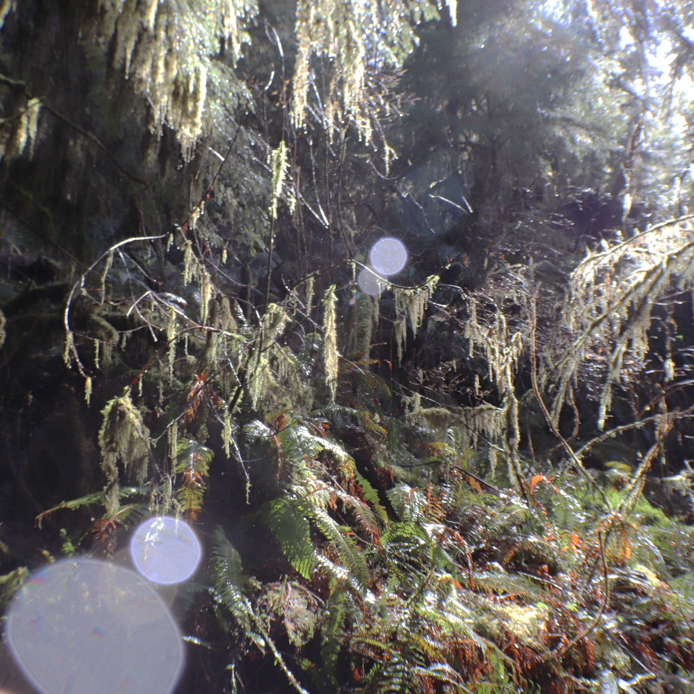

> Author's Note - This work is in progress. I wanted to get this posted because it has been in progress for me for too long, but it is not complete - please excuse me while I work through some stuff

# A Trip to a Rainforest

This weekend was fantastic for a variety of reasons.

For example: We saw a huge waterfall, freshly fallen snow, a rainforest, and drove on the beach on the Pacific Ocean in the same day.

One of the many reasons that we moved to Kitsap County was to ease our access to the many amazing locations on the Olympic Peninsula.

#### Here For Adventure

When we first stayed on the Kitsap Peninsula years ago I was absolutely shocked by just how much beauty we could enjoy from the house we where we were staying in Kingston. A significant portion of the northwestern corner of the state of Washington is wilderness, wilds, and hiking trails. It's incredible just how much beautiful wilderness can be reached within an hour or two of our front door. As we continued to research and evaluate our options on where we would ultimately move it became more and more clear that we would be able to reach all the adventure and natural beauty of the PNW from Kitsap County while simultaneously reasonably close to Seattle, Tacoma, even Olympia, and you can even reach Portland on I-5 in under 3 hours. Plus the cost of living is much much lower across Puget Sound from the rest of the Greater Seattle area.

I digress, however, because I feel like I've been this drum enough for this post.

Now that we're here and with our son visiting on Spring Break, we decided to try another test: What can we see within a 2 1/2 hour trip.

### What about a rainforest?

One option that seemed appealing turned out to be the Quinault Rainforest, Lake Quinault, and the Quinault River.

The criteria for what we would go see was that it needed to have mountains, waterfalls, and hiking trails.

Quinault definitely has that!

### Rain Rain…

The Quinault area is about two and a half hours from our home. The drive is beautiful taking us through the quaint town of Belfair, the lovely old mill town of Shelton, and tiny city of McCleary before connecting with SR8, which gives way to SR12 that leads toward Aberdeen.

McCleary is a small town where a tragic [true crime](https://www.fbi.gov/wanted/seeking-info/lindsey-baum) remains unforgotten with signs and shrines  all along the highway like on this fence surrounding the playground at Beerbower Park:

McCleary also has an old Subway that's since closed and replaced with [Scout Subs](https://www.facebook.com/ScoutSubs1) which we stopped at on a previous trip to the Pacific Coast and enjoyed.

We continued west toward the ocean on 12 until we reached Montesano we cut north along Wynooche Valley Road, passing through a beautiful valley, cutting west along a road only identified with a 5 digit number. As we followed the winding numbered highway a gentle rain began to fall, which might be something you'd expect on the last day of Winter in the PNW. As we drove up 101 through [Neilton](https://en.m.wikipedia.org/wiki/Neilton,_Washington) it was when we reached the Olympic National Park sign that we experienced a sudden torrential downpour (which played itself out after only a few  minutes).

### Hiking? Yes, but first: lunch.

Highway 101 runs into the little village of [Amanda Park](https://en.m.wikipedia.org/wiki/Amanda_Park,_Washington) before continuing north back to the coast from whence it came.

Being around lunch time when we arrived we decided to give the Quinault Internet Cafe a try. It's a relatively unremarkable diner as you pull up, but it's nestled in with a few other businesses where 101 crosses the Quinault River. The area looks  a like a small town that exists mostly because of a highway.

Leigh and I ordered a veggie burger and it was fine enough topped with thousand island dressing and pepper jack cheese. The fries were the perfect shade of well done and were delicious. The kids got tacos and enchiladas and both claimed they were delicious.

Veggie Burger and Fries

The service was fine and sitting in a booth at the window allowed a lovely view of the Quinault Rainforest, Colonel Bob wilderness, the rain and clouds and beautiful nature surrounding us.

### The Trails

With a meal within us and having a few hours until we could check into our lodging we drove a few minutes to the Quinault Rain Forest Trailhead along South Shore Drive, just past the fishery. There a reasonable amount of parking, but I imagine that this place fills up fast during the summer when I assume a lot of people come to the area. As it stands we certainly weren't alone on this day.

We started our hike by walking around the [Quinault Rain Forest Nature Loop](https://www.wta.org/go-hiking/hikes/quinault-rainforest-nature-loop), which was an absolutely spectacular half mile trip with interpretive signs telling us all about the rainforest in which we found ourselves.

We were extraordinarily lucky on this final day of Winter to find ourselves enjoying a whole lot of sun.

If you hike this trail and you encounter a sign that suggests looking up, do so. Photos of the old growth and the tall trees cannot possibly do justice to the incredible breathtaking and awe inspiring beauty of the trees above you. It's almost therapeutic to feel so small among these giants, and we had the joy of sun passing through the mist hanging and entwining itself around and through the trees.

The trees above are not the only things worth seeing, however. If you take the loop to the left as we did and begin with the platform and giant tree near the head of the trail you'll soon find yourself overlooking Willaby Creek as it splashes and winds its way to Lake Quinault just a short distance away.

Trees and water, however, are still not the whole story. There was so much beauty in the life everywhere on either side of the trail in the understory. Moss, fungi, ferns, and flowers are everywhere in varying shades of green and brown. Downed trees being reclaimed by the rainforest can be found everywhere and it's easy to get lost thinking about the way in which this ecosystem recycles itself.

### Quinault Lake to Quinault Lake Lodge

From the Nature Loop we followed the trail through Willaby Campgrond, closed this time of year, to stand on the shore of Lake Quinault on a little beach near the RV overflow parking. This afforded us a breathtaking view across the blue green waters to the Olympics all around. Our luck continued to hold as we watched the clouds gather and travel around the hills and mountains around us while staying mostly in the sun.

From the beach we hiked through the campground to where the Lake Quinault trail loop picked up. This trail is pretty astounding as it passes just under a variety of lake front cabins with gentle rises and falls leading all the way up to the Lake Quinault Lodge.

During our hike we found ourselves struggling a bit with a lot of trees across the trail as well as a lot of mud and places where debris and water clearly washed out the trail since it was last maintained.

There were, however, beautiful sights to behold during our time hiking along the lake for sure. Little waterfalls & streams, bridges, private docks as well as, of course, the ferns and other vegetation made the hike well worth the extra effort.

This was made even clearer when we arrived at the Lake Quinault Lodge and were greeted with a lovely view of the stately old building and its beach on the shore of Lake Quinault. The main building is absolutely beautiful and while I don't regret not staying during this trip, I am hopeful we'll have the opportunity to stay here on a subsequent trip.

This was, however, as far as our hike took on this trip, which was meant to be more exploratory than anything.

All tolled we hiked a bit shy of 4 miles.

From the lodge we hiked back to the car and drove over to check out our accommodations.

### Quinault River Inn

We spend the night in room #2 "Double Eagle" at the Quinault River Inn.

We arrived late in the afternoon and found the owners of the property, Josh and Tiffany, playing with their children in front of the properties office.

The property itself is absolutely beautiful with a small motel with 8 units facing the river on which a small gazebo and a fire pit are situated. Behind the main motel building is space for a several RVs and a fitness center (which we didn't check out on this visit).

Just up the hill from the Inn toward the highway is the aforementioned Quinault Internet Cafe and just down from there is a Mercantile and a pizza place that, when I stopped in later for disposable utensils I saw was hiring a server and had posted that their pizza oven was out of service leaving only grill/fried food options. Additionally there's a gas station across 101 (selling seafood and more), a fireworks store, a small visitor center that appeared closed outside of the summer season (and not listed on Google at all), and a couple dozen residential properties on the loop of Lake Dr. N and Amanda Park Rd. This seems to be the entirety of the census designated place of Amanda Park.

We had gotten a double queen room meaning that the room itself was a little cramped, but absolutely not uncomfortably so. The room itself was well appointed, the obligatory info binders were filled with useful information, and the Coastal Salish artwork was impressive.

The best part of the room, however, was the beautifully framed view of the Quinault River right out the large picture window.

### Dinner

All the hiking and adventuring had us hungry and we decided that The Salmon House, which had caught my eye when I first started looking at this area.

I had done some research with a couple guidebooks, websites, and what have you and discovered that there really isn't a lot of options right in the area. There's a mercantile and a grocery around the lake. For eateries, in addition to the Internet Cafe and the previously mentioned Dino's Pizza and Grill,  The Roosevelt Room at the [Lake Quinault Lodge](https://www.olympicnationalparks.com/lodging/lake-quinault-lodge/) and Salmon House Restaurant, seemingly a part of the Rain Forest Resort Village.

It's worth noting that the Lake Quinault Lodge, like many of the accommodations within the Olympic National Park and Forest, is run by Aramark whose hospitality has never exactly wowed me (compared to their premium pricing I've yet to feel my experience was commensurate) and I certainly worry that the experience might be as middling as their [Indeed](https://www.indeed.com/cmp/Aramark/reviews) or [Glassdoor](https://www.glassdoor.com/Reviews/Aramark-Reviews-E2716.htm) employment reviews. 🤐😅

My mental algorithm for choosing to try The Salmon House place on our first trip should be obvious.

#### Visiting the The Rain Forest Resort Village

It certainly seemed to be the same consensus a variety of other people reached who were also visiting the area. Like the previously mentioned owners of the Quinault River Inn who we saw again getting food, who then confirmed their recommendation.

Due to staffing The Salmon House was takeout only at the time and did not offer dine-in, though it was obvious what a lovely experience that would have been with a beautiful view of the water from practically everywhere in the restaurant.

The menu was almost exclusively salmon, although our daughter managed to find a chicken based pasta, as she does. Our son and I, however, picked the blackened salmon with pepper jelly while my better half chose a broiled salmon option.

As I mentioned earlier, it seems Salmon House Restaurant and Lounge is part of the [Rain Forest Resort Village](https://www.rainforestresort.com/index.htm) and across the South Shore Road was the rental office which also serves as a gift shop and convenience store. After placing our order we chose to walk around this shop to see what it offered.

We were immediately introduced, by the friendly man behind the counter, to a pair of dogs. One was a little Pekingese and the other a 16 week old Great Dane puppy. Both of these animals were wonderful, adorable, and our youngest was so excited to see and play with the critters. It was a lucky thing that this store also sold Benadryl because our child, no matter how many times we caution her to leave dogs alone, remains allergic to canines and ended up in a pretty miserable state before they even got to enjoy their dinner.

The gift shop and grocery selection was fine enough, though nothing to write home about (except perhaps on the post cards, if that's your thing, because you can literally write home with them). There was a reasonable selection of gift shop items. The whole place exuded a sort of rustic charm inside & out and the entire property had a calming relaxing country resort vibe that was very pleasant.

#### Blackened Salmon w/ Pepper Jelly 😋

The Blackened Salmon w/ Pepper Jelly was, as I recall, one of the most expensive items on the menu at around $25 a plate. It was also one of the most delicious things I have eaten in some time. The seasoning and pepper jelly work perfectly together with the perfectly flaky and moist salmon. Accompanied by the salmon was, in my case, rice pilaf with wild rice as a steamed vegetable medley. The veggies were a little sweeter than I would have like but otherwise they were fine enough accompaniments.

The Blackened Salmon with Pepper Jelly, however, had absolutely no business being as delicious as it was.

### Walking Around Town

... or rather the Census Designated Place

After dinner we, with the exception of our daughter who was drained and tired from a dose of anti-histamines, engaged in what we like to call: The After Dinner Walk.

Walking around Amanda Park at dusk is an interesting experience. While we might feel like intruders in most neighborhoods in which we do not live, this feeling was on another level. We certainly felt out of place as we walked up Lake Shore Drive and then back on Amanda Park Road passing a variety of different residences and properties.

At one point as I walked I found myself reading a sizable message scrawled across the front of an out building that, as it turned out, was a warning away from the private property. Unfortunately it was at that moment someone I assume was the author was crossing the yard and challenged me for looking at her property. I simply apologized and explained that I was simply reading the eye catching warning and we continued on.

Unfortunately there's not much to see. While it was nice to take an after dinner walk, you can't really see the river or the lake so you're just walking through a small neighborhood and upsetting a bunch of dogs.

### Sleeping

I found that the beds were comfortable and the room with it's mini-duct split heating / cooling units kept the temperature comfortable without a lot of noise. This night was dark and quiet.

I found that, despite my typical sleep struggles when staying in a new place, it was a restful night's sleep and we woke to a rainy morning with a lovely frost in the hills around us.

### Breakfast

After we cleared out from our room we opted to get breakfast again at the Internet Cafe. Their breakfast offerings were, again, typical diner options like pancakes, eggs, toast, and the like as well as more 'exotic' dishes like huevos rancheros.

The hashbrowns were tasty with a little onion and green peeper.

The service was friendly, we worked with the same server as the afternoon before who was still friendly and efficient.

Their breakfast turned out to be a wonderfully unremarkable array of options and we left plenty satisfied by both the food and the the service. I'd recommend checking them out if you're in the area (not that you have that many options).

### Chasing Waterfalls

As a final adventure in the area we loaded up into the car and again drove along South Shore Road until we had passed Lake Quinault and continued along, encountering a field of Roosevelt Elk, several trailheads and homes, finally arriving at Merriman Falls.

Merriman Falls is a 40 foot horse tail waterfall just a few steps off the road.

<blockquote class="instagram-media" data-instgrm-permalink="https://www.instagram.com/tv/CbeFx4CAGA4/?utm_source=ig_embed&amp;utm_campaign=loading" data-instgrm-version="14" style=" background:#FFF; border:0; border-radius:3px; box-shadow:0 0 1px 0 rgba(0,0,0,0.5),0 1px 10px 0 rgba(0,0,0,0.15); margin: 1px; max-width:540px; min-width:326px; padding:0; width:99.375%; width:-webkit-calc(100% - 2px); width:calc(100% - 2px);">
 <a href="https://www.instagram.com/tv/CbeFx4CAGA4/?utm_source=ig_embed&amp;utm_campaign=loading" style=" background:#FFFFFF; line-height:0; padding:0 0; text-align:center; text-decoration:none; width:100%;" target="_blank"> 
 

 
 

 

 
<svg width="50px" height="50px" viewBox="0 0 60 60" version="1.1" xmlns="https://www.w3.org/2000/svg" xmlns:xlink="https://www.w3.org/1999/xlink"><g stroke="none" stroke-width="1" fill="none" fill-rule="evenodd"><g transform="translate(-511.000000, -20.000000)" fill="#000000"><g><path d="M556.869,30.41 C554.814,30.41 553.148,32.076 553.148,34.131 C553.148,36.186 554.814,37.852 556.869,37.852 C558.924,37.852 560.59,36.186 560.59,34.131 C560.59,32.076 558.924,30.41 556.869,30.41 M541,60.657 C535.114,60.657 530.342,55.887 530.342,50 C530.342,44.114 535.114,39.342 541,39.342 C546.887,39.342 551.658,44.114 551.658,50 C551.658,55.887 546.887,60.657 541,60.657 M541,33.886 C532.1,33.886 524.886,41.1 524.886,50 C524.886,58.899 532.1,66.113 541,66.113 C549.9,66.113 557.115,58.899 557.115,50 C557.115,41.1 549.9,33.886 541,33.886 M565.378,62.101 C565.244,65.022 564.756,66.606 564.346,67.663 C563.803,69.06 563.154,70.057 562.106,71.106 C561.058,72.155 560.06,72.803 558.662,73.347 C557.607,73.757 556.021,74.244 553.102,74.378 C549.944,74.521 548.997,74.552 541,74.552 C533.003,74.552 532.056,74.521 528.898,74.378 C525.979,74.244 524.393,73.757 523.338,73.347 C521.94,72.803 520.942,72.155 519.894,71.106 C518.846,70.057 518.197,69.06 517.654,67.663 C517.244,66.606 516.755,65.022 516.623,62.101 C516.479,58.943 516.448,57.996 516.448,50 C516.448,42.003 516.479,41.056 516.623,37.899 C516.755,34.978 517.244,33.391 517.654,32.338 C518.197,30.938 518.846,29.942 519.894,28.894 C520.942,27.846 521.94,27.196 523.338,26.654 C524.393,26.244 525.979,25.756 528.898,25.623 C532.057,25.479 533.004,25.448 541,25.448 C548.997,25.448 549.943,25.479 553.102,25.623 C556.021,25.756 557.607,26.244 558.662,26.654 C560.06,27.196 561.058,27.846 562.106,28.894 C563.154,29.942 563.803,30.938 564.346,32.338 C564.756,33.391 565.244,34.978 565.378,37.899 C565.522,41.056 565.552,42.003 565.552,50 C565.552,57.996 565.522,58.943 565.378,62.101 M570.82,37.631 C570.674,34.438 570.167,32.258 569.425,30.349 C568.659,28.377 567.633,26.702 565.965,25.035 C564.297,23.368 562.623,22.342 560.652,21.575 C558.743,20.834 556.562,20.326 553.369,20.18 C550.169,20.033 549.148,20 541,20 C532.853,20 531.831,20.033 528.631,20.18 C525.438,20.326 523.257,20.834 521.349,21.575 C519.376,22.342 517.703,23.368 516.035,25.035 C514.368,26.702 513.342,28.377 512.574,30.349 C511.834,32.258 511.326,34.438 511.181,37.631 C511.035,40.831 511,41.851 511,50 C511,58.147 511.035,59.17 511.181,62.369 C511.326,65.562 511.834,67.743 512.574,69.651 C513.342,71.625 514.368,73.296 516.035,74.965 C517.703,76.634 519.376,77.658 521.349,78.425 C523.257,79.167 525.438,79.673 528.631,79.82 C531.831,79.965 532.853,80.001 541,80.001 C549.148,80.001 550.169,79.965 553.369,79.82 C556.562,79.673 558.743,79.167 560.652,78.425 C562.623,77.658 564.297,76.634 565.965,74.965 C567.633,73.296 568.659,71.625 569.425,69.651 C570.167,67.743 570.674,65.562 570.82,62.369 C570.966,59.17 571,58.147 571,50 C571,41.851 570.966,40.831 570.82,37.631"></path></g></g></g></svg>

 
View this post on Instagram

 

 

 

 

 

 

 

 

 

 
 

 

</a>
<a href="https://www.instagram.com/tv/CbeFx4CAGA4/?utm_source=ig_embed&amp;utm_campaign=loading" style=" color:#c9c8cd; font-family:Arial,sans-serif; font-size:14px; font-style:normal; font-weight:normal; line-height:17px; text-decoration:none;" target="_blank">A post shared by Eph Baum (@eph_baum)</a>

</blockquote>

It's an absolutely beautiful natural water feature that passes under a small bridge and continues until it meets with the other length of Quinault River coming from the mountains beyond.

There's not much to do here besides admire the beauty of the waterfall and enjoy the relaxing roar of the falls, but it's still worth the stop.

From here you can continue up S. Shore Rd until either cross the river and come back on N. Shore Rd or you can continue along Graves Creek or even north away from Lake Quinault on N. Shore Rd and find additional adventure.

My understanding is either of these may be a bit more taxing on your vehicle, however, as they are not well maintained roads.

Also, looking at the map, it appears you could possibly make it from this point to Lake Cushman and ultimately Hoodsport, though I suspect the journey would take a long time through the mountains and the roads are likely hardly maintained. I hope to find out in the future as there appears to be a lot more adventure that this initial scouting trip as revealed.

Next trip to this area will likely focus on N. Shore Road and perhaps more complex hiking trails in the region. Maybe another Waterfall as well.

### Rainforest to Beach

My better half _loves_ the ocean and the beach and given our proximity to the ocean it seemed foolish _not_ to take a trip over to the water.

To do this we traveled the lovely Moclips Highway (S-26) which cuts west off 101 just south of Neilton.

#### Interesting Accusations

As we entered Neilton we also apparently re-entered cell services and I was suddenly made aware of both a voice message and a test message from a local number. Fearing that we'd left perhaps left something behind, I pulled over to check.

Instead I discovered that Josh, one of the owners of the The Quinault River Inn, was telling us that if we didn't return a pair of black insulated tumblers he would be charging us $10 each for them.

This was remarkably confusing as we had not seen any such tumblers and were entirely unaware of their existence, and certainly hadn't taken them.

Later I heard from Josh that a previous lodger had apparently made off with them and mailed them back.

#### Wending Along S26

It's a gently winding highway from the edge of a rainforest to the Pacific Coast. It's beautiful and a pleasure to drive.

### Pacific Beach, WA

We stopped first at the Surf House Cafe in the little beach front town of Pacific Beach. Like many of the towns along Washington's coast its name is a little on the nose. (Seriously, Ocean Shores, Ocean City, Seabrook?!?)

Attached to a little shop with interesting gifts and the like, we got a few drinks and a I tried a scone that was fine enough.

From here we drove down to the beach. As it was the first day of Spring it wasn't at all surprising that it was raining, but it was still a nice enough morning to hear the roar of the waves. We spend a little time on the beach, checked out the town, and then made our way south along the coast.

### An Awful Lunch Experience

A lovely drive down the coast and we found ourselves hungry so we decided to try the well rated Brunch 101 of Hoquiam.

This turned out to be a mistake.

We arrived a little bit after noon and were given a 20-25 minute way, so we waiting in the car until 12:55 when were called to come back.

We were seated at a large table in the front of the restaurant. Behind us was a group of people that were so boisterously loud that we found ourselves wincing at the constant laughing and shouting.

We weren't alone, looking around the room you could see other people that were also wincing and struggling to enjoy their meals and hold conversations while these folks who only cared about their own good time.

We ordered food and drinks and then we waited.

It was almost 45 minutes while watched smaller groups who'd arrived after us being served before us. During that wait our server didn't come back to us once and even seemed to be actively ignoring us as I'd tried to make eye contact several times.

I got a soyrizo based burrito that was utterly unremarkable beyond the store bought chorizo. I'm told the other three meals were good enough.
