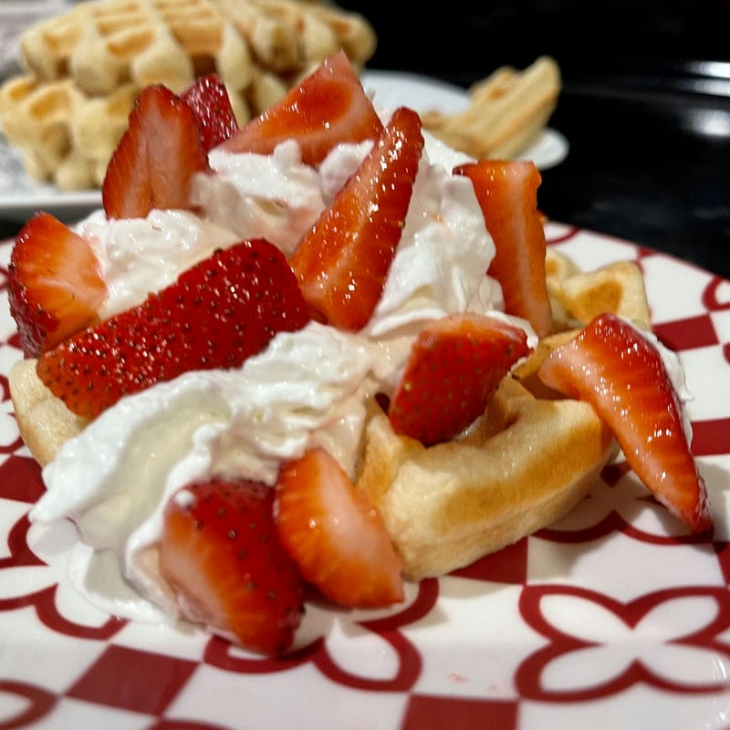
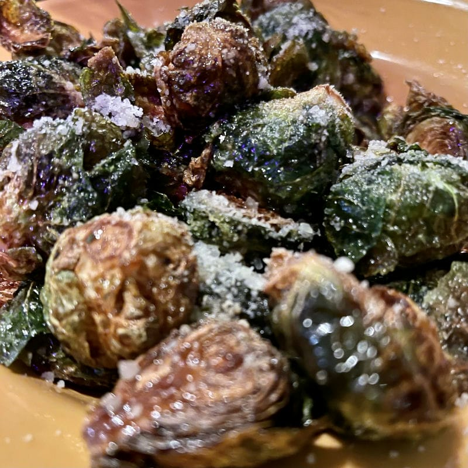

Here we are again: another Saturday. They keep happening like clockwork.

And like clockwork I'm recounting another _big_ week despite it not actually being particularly eventful.

I have a lot of thoughts that I want to share but I just don't think I have the time today to be able to put them together in a cohesive way today. Perhaps I'll circle back on this post in the future, as I sometimes do.

Since I'm struggling to assemble those thoughts I'll just carry on with the traditional accounting of the week:

## Sunday

Waffle Day!

If you've been following along, you'll know my love for waffles and Waffle Day.

On Sunday morning Lou and I, mostly Lou, made delicious waffles with strawberries and "whooped cream".

I had really missed waffle day.

Then Lou and I ran some errands together.

We stopped at the Bremerton [US Chef'store](https://www.chefstore.com/). It was my first time in and absolutely loved it. It's the sort of place that makes me wish I had a restaurant, or enough space to store things a bit more bulk.

For lunch Lou and I made some delicious fancy grilled cheese from the loaf of sourdough we'd gotten from our trip Port Townsend the day prior. It was absolutely delicious.

It was a nice little Sunday. I was able to do a little relaxing. Played some games, goes some stuff done, it was a fine day all-in-all.

## Monday

Monday was a fine enough day overall.

Momo came over and we had a yummy lasagna dinner. We watched the latest episode of Bob's Burgers.

It was a nice little night.

## Tuesday

A quiet day for me.

I managed to get some things done.

## Wednesday

Another relatively quiet day for me.

## Thursday

Thursday was a much more eventful day.

Lou and I went on a little date. We bribed our child and her friend to hang out with our dog for the evening. It mostly cost us some junk food, which these kids gladly accepted.

For dinner we went to [Remedy Speakeasy](https://www.remedyspeakeasy.com/) mostly drawn to their delectably delicious Brussels Sprouts. Lou got the Salmon Cakes while I got the Brown Butter Sage Gnocchi (and picked out _most_ of the prosciutto since I don't much trust my body to process pork any more). It was delicious as always. The server managed to twist our arms, convincing us to try out their caramel apple bread pudding which was additionally delicious.

Afterward we went across to Manette to checkout the popular Quiz Night at the [Manette Saloon](https://themanette.com/) hosted by the venerable [Josh Farley](https://www.josh-farley.com/). We've heard about this event's popularity over the years so it seemed high time that we check it out. I was lucky enough to meet Deena Taylor of [Bremelore](https://www.bremelore.wtf/) fame. I have enjoyed listening to her podcast and had reached out to chat with her more about Bremerton's history. She was there to be interviewed by Mr. Farley in association to her wonderful podcast.

The Quiz Night was definitely a good time. We arrived a little later than expected and didn't join a team or start our own, so we just observed as though it were a class we were auditing. It was a lot of fun and from my recollection, between the two of us, we would have had a pretty formidable score right up there with teams that tied for first.

It was a nice evening, good to get out and spend time with Lou, and it was nice to see some folks we know from the community. It was a bit of a bummer when Josh Farley [referenced the story](https://www.npr.org/2023/10/25/1208478868/bobi-worlds-oldest-dog-dies-portuguese) of Bobi the 31-year-old Portuguese purebred Rafeiro do Alentejo and Guinness World Record holder had passed, but of course not all the new can be good and it seems he lived a good life as a very good boy.

## Friday

Friday was a difficult day as the kiddo's school was on modified lockdown due a [standoff with a homicide suspect](https://www.kitsapsun.com/story/news/2023/11/18/2-dead-following-standoff-in-east-bremerton-in-which-shots-were-fired/71633208007/) near her school. In my mind, given the proximity to the school, the recommendation by police for folks in the area to shelter-in-place, as well as the situation starting hours before the school day began, they should have delayed or even cancelled classes for the day as they did at the elementary school. The fact that classes were held suggest that there was a failure somewhere.

Liz expressed her fears and one of her text messages absolutely gutted me:

Living in a world where our children are forced to endure lockdowns, that they have to practice for the potential of school shooters given because they happen with such frequency, it's just sad. It's heartbreaking.

I think about the old [Duck & Cover drills](https://www.history.com/news/duck-cover-drills-cold-war-arms-race) and the anxieties those must have fueled.

I remember how scary I found the idea of tornadoes and fire when performing those drills as a kid in school. Duck & Cover was a thing of the past by then but I was still well aware of [M.A.D.](https://en.wikipedia.org/wiki/Mutual_assured_destruction) and the fact that at any moment one of America's enemies could drop a bomb and millions people would be suddenly dead. It was reported in the news, depicted on TV and in movies. During the cold war we were frequently reminded of living on the brink.

That, however, is so much different than the anxiety kids deal with today when literally anyone could walk into their school and start mowing kids down with a gun. They've heard stories of children dying in their schools.

It's one thing for kids to worry about an abstract sudden death from above by an evil faceless country of filthy commies, but it's definitely very much another to worry about literally any one suddenly entering your school and shooting you, your friends, and your teachers.

Obviously this wasn't an active shooter situation, but the idea of a lockdown, that schools have such protocols, is enough to remind me of the ugly truth of potential school shootings.

[This story](https://www.seattletimes.com/seattle-news/law-justice/police-fatally-shoot-homicide-suspect-during-bremerton-standoff/) has a few more details than the local paper.

Thankfully the lockdown was lifted and the school was otherwise unaffected by the events.

In the evening Liz decided to have a sleepover with her cousin.

Lou and I ordered too much delicious food from The Curry - their bhartha is delicious and their mushroom tikka masala is delectable. It was delicious. It was meant as a bit of a celebration in honor of Lou having started a new job; a job for which she's extremely excited and seems to be a really good opportunity for her.

## Saturday (Today)

I began today by making breakfast for Lou and I - just a simple "skillet" with American fries and onions, eggs, and sprinkled cheese.

After breakfast Lou and I headed up to [Ueland Tree Farm](http://www.uelandtreefarm.com/public-access.html) and hiked a few miles. It's not my favorite hiking in the area, but its close proximity makes a great option for a quick hike west town.

There were little mushrooms everywhere!

After hiking Lou and I grabbed some sushi for a late lunch (or early dinner?) from [Tom's Teriyaki and Sushi](https://ordertomsteriyakinsushi.com/), which we'd somehow not tried out. Seems we've been sleeping on Tom's. We got a couple of tempura rolls as well as some vegetable fried. It was quite tasty.

I spent a little time playing Fortnite, got to play a couple matches with Mikey. Lou and I watched the last few episodes of Season 3 of Better Call Saul and are just now starting on Season 4. Earlier Liz and I watched the first episode of [Scott Pilgrim Takes Off](https://www.imdb.com/title/tt16969708/) and I'm not entirely sure how I feel about it yet, but I'll definitely watch more.

---

And that's it, really -- I mean, there's plenty more I could talk about. I worked on a few personal projects, brushed up on dome DBT skills like DEAR MAN, GIVE, and FAST, and started Yale's [The Science of Well-Being](https://www.coursera.org/learn/the-science-of-well-being/) course on Coursera, for example.

It wasn't a particularly eventful week, all things considered, but a good week for sure. It's been nice to have Lou back in my life and I have hope for us. I'm feeling positive.

As I mentioned above, perhaps I'll circle back to this post soon with a little more detail or thoughts about some things but, for now, I'm going to get to bed.

Until next time 👋
