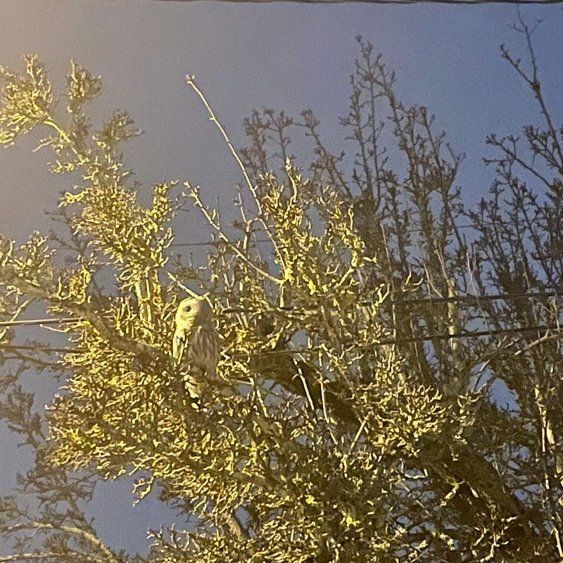

Update 2023-12-24: I filled in the rest of Saturday, fleshed out a couple things, and added a couple images. Feel free to check out the history of this post [here](https://github.com/ephbaum/EphWordsBlog/blob/main/src/content/blog/2023/12/2023-12-23-2023-week-51-almost-a-whole-set.md).

Here we are at the final stretch. This is the last day of the end of the last full week of this year. Soon it will be 2024 and I'll have completed my commitment to myself to post every Saturday.

I'm rather proud of myself for actually sticking to my commitment to post every Saturday. I have a whole pile of drafts for both of my blogs that I'd still like to post even a few from. I'll admit that when I set my Saturday post goal for myself it wasn't really to simply post a summary of each week, that's just sort of what the exercise morphed into, but I'm still happy to have done it. I've been thinking a bit about refining my commitment for 2024 to focus on creating and posting content from my drafts folder about topics that I have in mind.

I feel the exercise of spending the year posting every week has been valuable and giving me additional discipline.

I'd also like to get back into writing prose and feel like this might be the right forum to do so (that was part of the idea behind registering "ephwords.com").

We'll see how that shakes out, but I think 2024 may look a bit different around here. What might you like to see, dear reader?

The holidays are always surprisingly busy with the extra planning and shopping trying to get everything done.

I mentioned [last week](/posts/2023-week-50) that it's the season of recap posts, and that one would be forthcoming, but this has been a busy week and I've simply not bothered to work on such a post for this year for me. I still plan to do so but perhaps that's how the last post of this year will go, or maybe I'll get around to it early next year.

I believe I also mentioned last week that I would be receiving my father's cremains this week and I did exactly that on Monday. It has had impacted me quite a bit more profoundly than I had expected. It's just hard to believe that he's gone even though he's been gone for so long already. I'm much more sad than I expected, I find myself still grieving quite a bit both for his passing and having not really had a father.

I spent some time working on my dad's online memorial this week and wrote a letter to the only family on his side I know how to reach, if my information is good, in the hopes of letting his living siblings know that he has passed. This is a cousin to whom I have not spoke in more than 30 years so I'm unsure how my letter will be received but a part of me hopes for at least some communication with my estranged family.

There's not a lot else to share. Busy holiday week. Emotionally draining. It was a good week to have taken off from work for sure.

As I have done, here's a recap of my week:

## Sunday

Waffle Day!

Lou and I spent the day helping someone move. It wasn't exactly how I'd planned to spend my day, but Lou asked me to help in the morning. What was I going to do, say no? It was a long day. Moving is the worst, especially if it's someone else.

## Monday

Monday was a challenging day.

I went to the post office to pick up my father's cremains. It was, of course, packed due to the proximity to the holiday. I spent 40 minutes in line only to be told that the post office on the slip stuck to my door, where I was standing, was not actually the post office at which my father was waiting for me.

I managed to avoid losing my shit and went to the other post office to pick up my father.

I spent much of the day processing my emotions, knowing my father's remains, still boxed, were now resting on a shelf in our living room.

## Tuesday

Tuesday was a quiet day.

I knocked off a few TODOs.

I spent some time playing with [Ollama](https://ollama.ai/)- which should be a future post for my tech blog. It's a pretty useful tool for working with multiple LLMs

## Wednesday

Took Ollie to get his nails did in the morning.

In the evening I tagged along again with Lou to the [Kitsap Community Food Coop board meeting](https://kitsapfood.coop/about-us/board-of-directors/) at [Ashley's Pub](https://ashleys.pub), which is always a fun place to patronize. I enjoy trying their various ciders on tap.

## Thursday

On Thursday I drove to the Target in Gig Harbor to pick up my eye glasses and remembered why I really need to change my annual ordering cadence so that I don't have to visit Target in December.

In the evening Lou and I went out on a little date. We started with dinner at [Khao Soi](https://thaikhaosoi.com/), which is always delicious. It was actually the first time we'd dined there instead of getting take-out and it was a lovely little experience sitting on their patio near the Manette Bridge. We had originally planned to attend the [Quiz Night](https://themanette.com/events/kitsap-quiz-night/) at the Manette Saloon but, ultimately we decided we weren't really feeling it. Instead we went downtown and got a couple drinks at Remedy and Horse and Cow. It was a lovely little night out.

## Friday

Not much to report for Friday. Checked off a few more TODOs, ran a couple errands, etc.

## Saturday - Today

Today has been a fine enough day.

Ran out to pick up the final touches<a href="#asterisk">\*</a> of our Christmas dinner.

Did a little cleaning in anticipation of our forthcoming holiday guests.

Lou made cookies (I helped a little).

For the evening we took a drive up to [Candy Cane Lane](https://www.kitsapsun.com/story/news/2017/12/09/how-candy-cane-lane-came-bremerton/936874001/) ([Viewcrest Drive NE](https://maps.app.goo.gl/gWg5Rz6YQDycEBHt9)) to checkout the holiday light displays. This is a semi-annual Christimas-Eve-Eve tradition. It was a gorgeously foggy night and the displays were impressive as always.

In other news we saw an owl in Manette and it was pretty cool:

Later in the evening I spent some time grieving and processing. I have still have quite a bit to work through, it seems. There are a lot of complex emotions involved when your father dies; in my case there may be more to unpack than might be typical. I have a lot of thought that would likely make reasonably good content for another post.

## Conclusion

As this year's final week winds down, I find myself reflecting on the journey it has been. Fulfilling my commitment to post every Saturday has been a rewarding challenge, providing a structure to my weeks and a platform for my thoughts. The process evolved into something more than just weekly updates; it became a space for personal growth and unexpected emotional explorations.

This week, especially, has been a poignant reminder of life's complexities – from the mundane errands to the profound grief of handling my father's cremains. It's these contrasts that make our experiences rich and deeply human.

Looking ahead, I'm excited to dive into the untapped potential of my drafts and explore new creative avenues in my writing. Your engagement and feedback have been invaluable, and I welcome your thoughts on what you'd like to see in 2024.

As I navigate the busy holiday season and the introspective moments it brings, I am reminded of the constant balance we all strike between daily routines and life's larger tapestries. Thank you for joining me on this journey. Here's to embracing the full spectrum of experiences the new year has in store.yu

\* hahahaha nope, I've had to go to the store like 5 more times.
