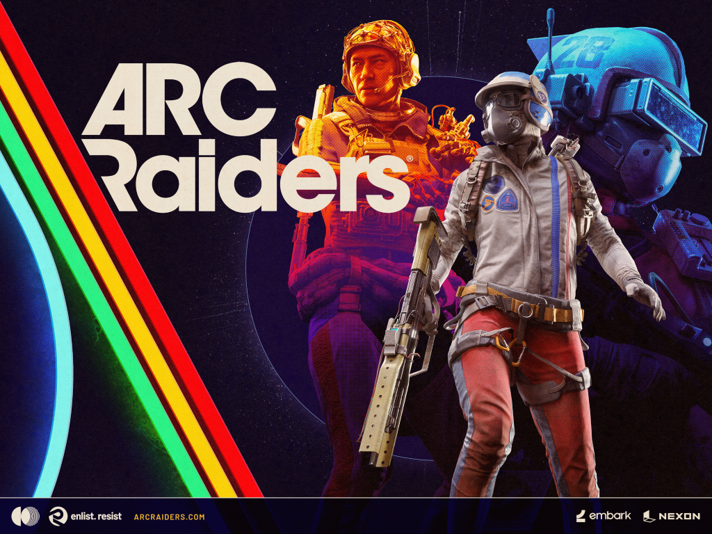
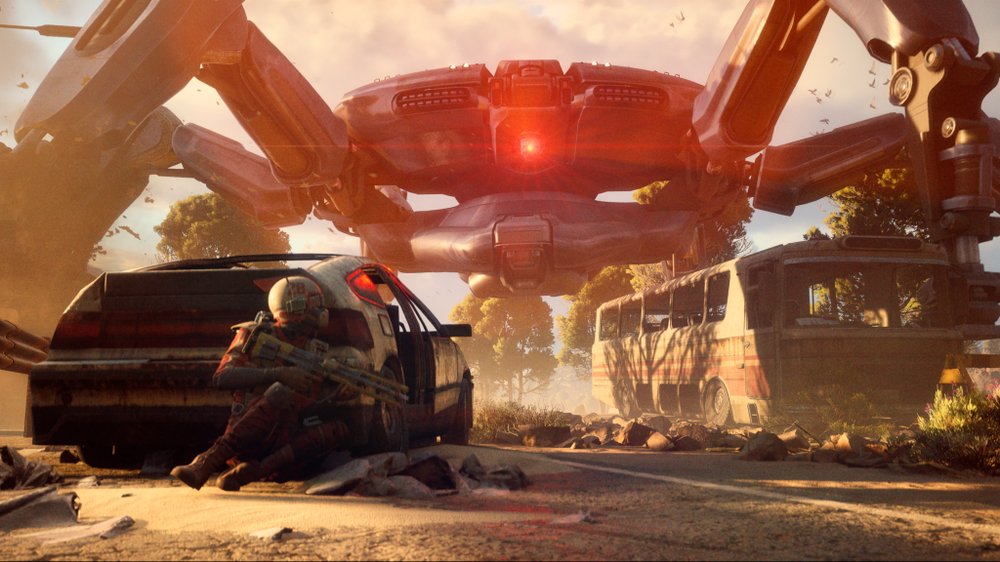
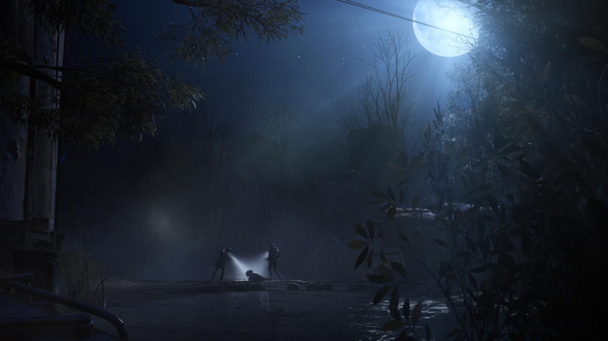

Remember: you will die.

These words are true, of course, in our daily lives. Memento Mori is a Latin phrase meaning that you should be aware that you will die. It's meant to remind you that life is fleeting, and that you should be present, now.

One of the ways I spend my time, knowing that someday—sooner than I hope-as someone who finds beauty in nearly the entirety of existence's fabric and kinda wants to live forever just to see how it all turns out—is by playing ARC Raiders.

And, it's perhaps corny to transition from talking about the beauty of our planar reality, of the richness of the experience of being alive (even when times are tough), and maintaining the awareness of one's mortality, to a video game.

I’ll own that.

But honestly, ARC Raiders is part of that beauty.

It's a very well crafted gaming experience.

Has it got its bugs and quirks?

It absolutely does—and having played two iterations, the "Server Slam" and then the subsequent launch, with more than a few hours into each, I feel qualified to be this enthusiastic about it.

  

    In case it's not clear:   
    I love this game!   
    11/10.
  

Much has been said of ARC Raiders virtues. It's a PvPvE Extraction Shooter. The basic loop is enter a map, loot, and leave. You face both robotic enemies in the form of ARC and, potentially, rival Raiders.

ARC Raiders, right? You get it.

The lore, the world building, has been pretty solid. If you’re looking to RP a dangerous post apocalyptic world, it’s got you covered.

The graphics are solid, the engine is fantastic, the movement is spectacular and provides for incredible gameplay. The gunplay is satisfying, as well.

The ARC are downright fun to fight and provide just enough challenge to keep things engaging. The game allows for near limitless opportunities to FAFO—you can grapple onto these robots, and they each have their own "personalities", so to speak. Learning how to play with them, particularly in different scenarios and groupings, is a lot of fun.

There are plenty of meta gameplay opportunities from looting specific items for specific quests to completing challenges in Trials- Trials providing for a ranking system and, of course, more loot.

The loot economy is just deep enough to be approachable without being overwhelming.

And the sound—did I mention the sound? The beautifully rendered environments that stretch out before you each raid are made more real by the spatial audio. As you run, you can hear each footfall below you. Nearby, you might make out ARC patrolling, their thrusters whirring steadily. In the distance, gunfire from other Raiders fighting each other or the ARC. If you stop moving, you can listen and try to figure it out. Maybe you'll hear a Raider flare in the distance as one of your compatriots succumbs to hostility, or an unfortunate misstep off a tall structure.

Somewhat novel for this game is the PvPvE mechanic. You can fight other Raiders—and some folks seem to really love the PvP, some like to kill just to kill. They go after the goop (loot 'got off other players'), seeing other players as rivals or impediments to getting the best loot that run, or perhaps as a shortcut for what they already have on them. Some don't want to fight other raiders; they enjoy a battle against a worthy opponent on the field of battle.

And I get it, I really do. I've enjoyed many a PvP experience. I have thousands of hours in Fortnite and other games, and throughout my many, many, many years of gaming (over 40 of them), I've spent countless hours killing other players day and night.

In some cases, though, these murderous Raiders are just complete gaming psychopaths- killing for the sake of killing, not for the loot, operating in no way in service of the game's larger economy.

Which is absurd.

Some of these terrible players are just downright ridiculous. They’ll pretend to be your friend only to turn on you when your back's turned, or they’ll camp near an extract point to pick off unsuspecting Raiders trying to go home. They’ll skulk around in the shadows and ambush you, shooting you in the back while you breach and loot- which is very ungentlemanly behavior, as you should well know.

Thankfully, Embark, the excellent studio behind ARC Raiders, has implemented a form of aggression based matchmaking. It _semi_-effectively separates the Raiders looking to fight other Raiders from the Raiders more focused on looting, questing, and fighting ARC.

It’s not perfect, and is, of course, somewhat exploitable (more on that soon), but it does work pretty well.

Anyway, thus, in ARC Raiders: Memento Mori.

You can never fully trust other Raiders. They can come at you, ambush you, or turn on you at any moment.

I have only downed 20 Raiders, and knocked out 12. I’m not a pacifist, if you shoot at me I’m going to defend myself.

I will also try to defuse the situation- and I might even defib someone after they’re knocked if we can talk it out.

The proximity chat and emote wheel in this game is pretty fantastic and, the simple psychological disruption of human communication works.

If you can talk to another player, they're (often) less likely to commit violence against you. Unless they're one of those bloodthirsty players, but as you may have noticed from what I've been alluding to, I do generally end up in friendly lobbies. My recent streaks of successful extracts have been pretty good—most recently getting out alive 32 times in a row. The streak before that was also mighty, at least 18 successful extractions when I'd lost count.

But I cannot overstate the overwhelming number of positive interactions I’ve had with other players. Of course there are some weirdos out there, though I’ve encountered them more on my own team in the rare fill lobby. But I’ve chatted with folks from all over, worked with players to accomplish goals, rescued a few, been rescued by a few as well.

It's part of what makes this game so good. There are so many adventures that I could relay, incredible tales of bravery, of trials and tribulations, of daring adventures battling ARC, taking down powerful enemies, solving challenging puzzles, and gathering valuable loot!

Today, however, a friend and I died in ARC Raiders, and this one hurt a little bit.

As I'd mentioned, I'd had a pretty steady streak of successful extracts.

Given that I'm at the level cap and have completed almost everything the game has to offer, I mostly focus on completing the Trials each week. These are a series of challenges where your goal is to complete certain objectives, such as dealing damage to specific enemies and harvesting as many plants as possible, all in one match. If you successfully extract, you earn points that place you among a ranking cohort of other players. Based on your total score across the five various challenges each week, you're stacked against your cohort, and your position determines your movement from rank to rank. The top of the cohort will advance two ranks, the next highest batch just one, the remainder will maintain their rank except for the bottom group, which will actually drop in rank.

This week, one of the challenges is to throw snowballs at a Bastion. Bastions are large and difficult to kill and fight against ground ARC enemies. They're intimidating and loud.

We had spent a long time in a previous Cold Snap match harvesting snowballs, a throwable item that does no real damage whatsoever. They can be collected from snow piles in a few places on Cold Snap maps, a game mode that offers higher XP in exchange for slightly more challenging stakes. The main stake is that the outdoor temperature is very low, and prolonged exposure will cause increasing cold that eventually damages and even kills you until you "reset" the cold effect by getting indoors.

We had gone to Blue Gate to take on the Bastion with our snowballs. By the time we arrived at the Assembly area on the map, we found other Raiders already fighting it. We announced our friendly intentions and goal of throwing snowballs, and the team already there seemed to respond in a passive and non-threatening way, continuing to focus on fighting the big ARC. This gave us plenty of time to throw snowballs and accumulate points toward our Trials. We also helped provide cover against the other ARC in the area and, of course, kept the Bastion switching focus.

I had seen, of course, that there was a Raider above us on the catwalk, all of us in this fairly large underground tunnel area. Everyone seemed to be working together.

Eventually, the Bastion died with a deafening boom. I began healing up, hanging back with no intention of looting the Bastion that we didn't kill.

Suddenly, shots rang out.

From above, on the catwalk. They fired down at Austin and me before turning their weapons on the other two who had largely taken on the Bastion.

These two would ultimately run away from the aggressive Raiders, leaving my teammate and me to die right there on the ground.

We had accumulated nearly 10,000 points throwing snowballs at the Bastion, and they were now gone. All that work was just thrown away.

And why? We weren't a threat to any other player, and apart from the fair amount of healing items, Mk. 3 augment, and my favorite guns (Anvil IV with Silencer III and Burletta IV with Extended Light Mag. II and Silencer 3), the only loot they could have gotten off me was a couple remaining stacks of snowballs.

That's it.

That's all I had.

It's a waste.

They did it to be awful. That's it, that's all there is to it.

This was almost certainly a friendly lobby. Everyone we'd encountered to that point had been friendly, and the dozens of matches I'd played previously had had no hostile encounters with Raiders.

My assumption is that these were little rat players. They had waited on the catwalks for the chance to ambush us. They fired at me as I was leaving the building—afraid, I'm betting, that they might miss their chance at a cheap kill.

I'm theorizing a lot, of course, but I'm betting these terrible players can't actually fight in any sort of fair way. They probably get pwned in normal hostile lobbies, finding it difficult to track down easy kills when folks are actually trying to kill each other. So my guess is they went through the somewhat tedious process of 'resetting' their aggression-based matchmaking.

The process, as I understand it, takes less than 10 minutes. You simply load in without weapons a few times, immediately 'surrendering' after you spawn, and then soon you find yourself among players who aren't there to fight other Raiders.

It makes sense when you consider that these pathetic losers hid out on the catwalk, watching other players enjoy the game, fighting the Bastion, doing the work—just camping out and waiting for the chance to ambush unsuspecting players so they can feel bigger than they really are. Pathetic excuses for humanity.

I'm sure some out there would decry this assessment as the whining of a 'crybaby'. If I posted this story in the ARC Raider's Discord I would almost certainly see the toxic 'reactions' tick up, a clown emoji and a pregnant man emoji.

The toxic loser element of the gaming community loves that sort of thing.

They might even be the sort to go around throwing slurs at everyone they meet.

It's really too bad that more people can't see the beauty that exists, that they resort to such ugliness. It's pathetic, and I truly pity them.

I won't lie, I stared at that death screen for a moment. I imagined what it would be like to post the video somewhere captioned: I'm uninstalling this game.

But: Memento mori.

Oh well, it's just a game, and I didn't really lose anything, besides some time.

And I didn't really lose that considering that I still had fun (right up until the end, of course).

I might not go back for another Bastion snowball fight—I definitely needed to step away from my computer for a bit and center myself after that death. It was a hard one.

But I'll be back in ARC Raiders.

Even if I'm beginning to suspect it's really just some sort of twisted social experiment and Embark is using this data for evil intentions. 

It's just too good. It's clear that the game is a real labor of love for Embark Studios.

I don't know if the game will survive long term. It's definitely got the potential to keep players hooked for a long time, myself included.

Just like in real life, there are terrible people in this game, and they can make it really frustrating. People you just don't want to interact with, folks you wish would get what they deserve, people you hope karma catches up with eventually.

But I'm not going to let terrible people get me down.

Mean people suck.

But they won't win, not when you can still find the beauty in the world around you and not let those miserable fucks drag you down with them.
