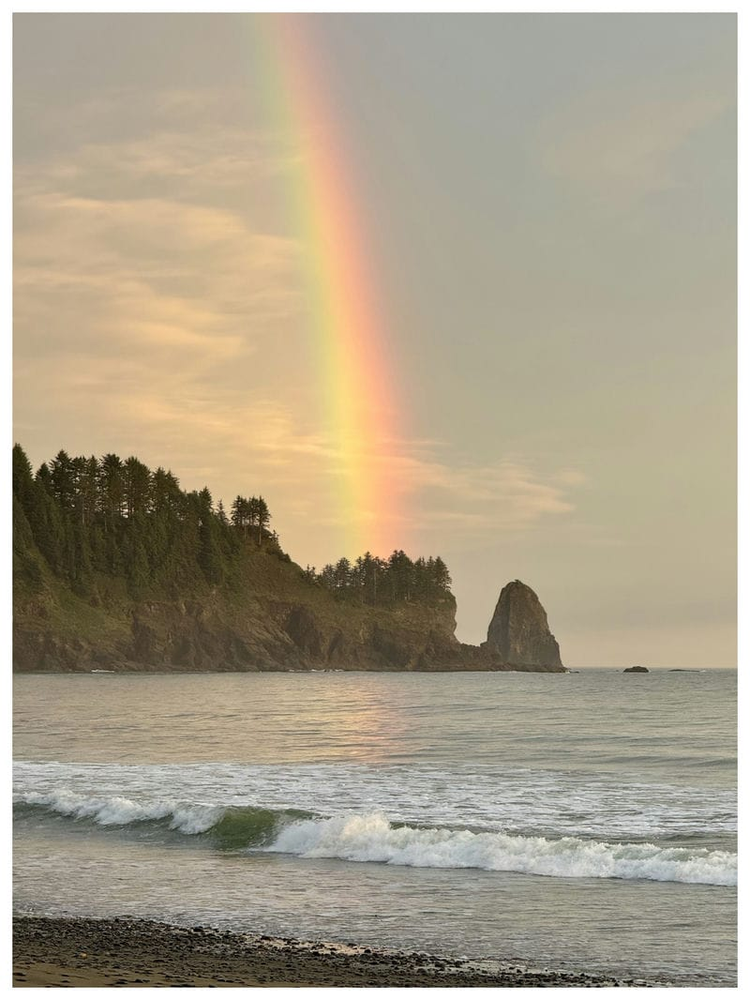
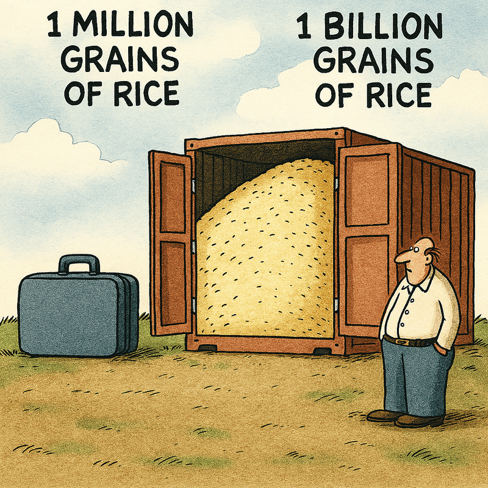
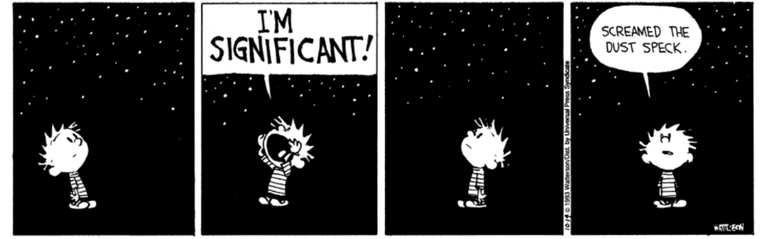

<figure class="w-full md:w-1/2 mx-auto my-6">

  <figcaption>
    Rainbow over the Pacific Ocean at First Beach in La Push, Quileute Reservation on 28 June 2024. This post mostly turned into an excuse to share this awesome photo.
  </figcaption>

</figure>

We live in a time when the average person — of which there are more than at any other point in history — has more options for entertainment and information than ever before. There are now twice as many of us on this rock hurtling through space as there were in the 1970s.

On top of the more than 8 billion of my fellow humans, many of whom may shout into the void through some means, the void now shouts back. LLMs and algorithmic slurry churn out content at industrial scale, faster than any mind can absorb. The barrier to creation has dropped so low that nearly anything — or anyone — can spill into the stream.

When Gutenberg’s printing press came into being in the 15th century, there were maybe 400 million people on Earth — many of whom had yet to encounter each other. That population would double as the Industrial Revolution took off, and by the early 19th century, we’d reach our first billion humans alive at once.

More than 100 billion people have lived and died through humanity’s existence, but there have never been more humans alive than there are right now.

And there have never been more ways to connect us — more ways to communicate, tell stories, entertain, or inform.

That means it’s never been easier to share yourself with the world. But it also means there have never been more people sharing themselves as well.

The signal is out there. But the noise has never been louder.

Competition has never been higher. While there have never been more people to hear your message, there have also never been more people shouting into the void at once.

It’s hard to imagine how you can stand out with so many others competing for the same hearts and minds. And scrolling through social media, news, television — the fact is, many don’t stand out. Or they stand out for reasons they may not desire.

So, here, now, is my own tiny droplet in the ocean of content all fighting for your attention. In this brief missive‑essay‑blogpost‑article-whatever, I’m simply reflecting on the noise — and the noise makers — as I’ve done repeatedly throughout my life.

It’s honestly a bit overwhelming. I don’t know about you, but I struggle to conceive of even 1 billion as a number. Even a million can be challenging to conceptualize.

A billion grains of rice would fill a shipping container. A million grains would fill a suitcase. It’s hard to feel significant when you’re just one grain among billions — especially when the void now shouts back with algorithmic slurry.

<figure class="w-full md:w-1/2 mx-auto my-6">

  <figcaption>
    You don't remember this Far Side comic? No, had GPT5.2 create to illustrate the absurdity of comparing a suit case to a storage container. Don't ask me to show my work on that math, by the way.
  </figcaption>

</figure>

It can be disheartening to feel like one among so many — especially if you want people to see your work (or your own LLM slop). You’re competing against more possible producers of content than ever before, it's being generated algorithmically, burning the oceans and plagiarizing the work of people before. And the loudest siren's call comes from massive companies like Disney and their army of content creation professionals.

I’m just one person trying my best.

But I still feel the need to express myself. To share. To tell stories. And to hope that it connects with anyone interested. Even though I don’t have a bench as deep as Disney — or anywhere near the talent — I’m still here.

A glass‑half‑full take might be: while there are more people to compete with, there are also more consumers than ever before.

Creation and consumption — never in equilibrium.

And in the midst of all this, I often think of my favorite Calvin & Hobbes strip. Calvin stares up at the starry night sky and yells, “I’m significant!”

Then quietly adds: “Screamed the dust speck.”

It’s a strip I’ve thought about a lot over the years. It feels like Bill Watterson’s own reflection on this concept — cranked up to include the vastness of the cosmos.

So yes, I’m a droplet in the ocean. But I’m a droplet that insists on rippling.
