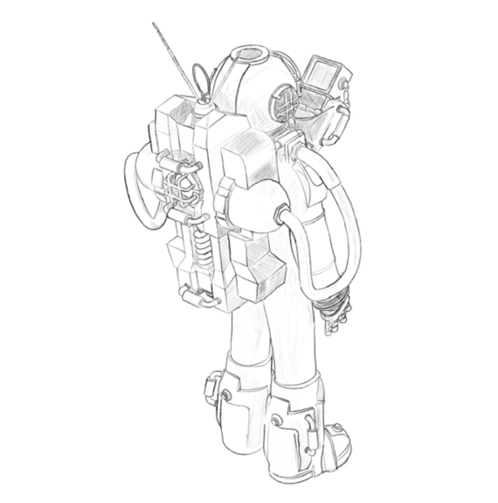

Recently I've reconnected with a good friend with whom I've been largely out of touch since 2018.

That's a long time (depending on your perception, understanding, and acceptance of time).

Since then there's obviously been a lot that's happened.

For all of us.

You might have seen some of it in the news. That pandemic thing was a pretty big deal, for example.

Anyway, Michael has been my best friend for a very long time. We met in the 5th grade, which is going on thirty-five years (according to calendars as well as math). There's definitely been a lot happened in that time as well. We bonded initially over our shared interest in comic books, and eventually: movies, video games, books, toys, and any number of other things pre-pubescent nerds enjoyed in the early-90s.

But also: being weird.

We were weird kids- and we bonded over that (is what I'm getting at).

The first time I went over to his house I ended up hanging out in his bedroom alone for while he belted out an unending rendition of 🎶"I am so great!"🎵 from the bathroom next door. Decades later I recall it going on for over an hour, but it probably wasn't not that long.

Like I said, we're weird kids. He's weird, I'm weird.

He showed me his cool drawings and I was jealous of his artistry.

He had a Sega Genesis. I had a Super Nintendo.

His house smelled like potpourri and was just up the street from me, a quick trip on my bike.

We connected as weird kids with a lot of weird ideas. We realized early on that we had a shared love for story telling, and for art. We shared our writing with each other. Telling stories, and riffing on (and critiquing) each other's ideas.

One time he kicked me out of his house because we disagreed, if I recall correctly, over Wolverine's costume on the unpainted figurines for an X-Men board game. I think it was related, for some reason, to the version of his costume, the original brown and yellow or the later yellow with blue and black. I'm pretty sure I was right.

Over the years we became creative partners in a variety of endeavors. We wrote comic books. We created characters. We built worlds. We collaborated on movies ideas. In high school we even started a punk band. As adults we even worked together to design and develop websites for clients.

Pretty much all of it came to nothing.

With the exception of client work (and this could be arguable), we never really finished anything. For one reason or another -- neurodiversity and lack of confidence, for example -- we really didn't complete anything despite making some pretty excellent stuff over the years.

I legitimately think back fondly on a lot of it and wonder what might have been.

And I've always been a huge fan of his work and long encouraged him to share his art with the world. I still bear his artwork tattooed on my neck from the time he was going to be a tattoo artist when he grew up.

It has taken a long time, but I'm thrilled that he's finally doing it, he's sharing his art!

On Groundhog Day 2026, Michael dropped teaser trailers for an animated series he's been working on for a little while in his new company: [Little Weird Kid Stories, LLC](https://www.littleweirdkid.com) called Collector 626:

<iframe width="560" height="315" src="https://www.youtube.com/embed/9XRwYI9QHhk?si=k11Jm1GisdwfPk_x" title="YouTube video player" frameborder="0" allow="accelerometer; autoplay; clipboard-write; encrypted-media; gyroscope; picture-in-picture; web-share" referrerpolicy="strict-origin-when-cross-origin" allowfullscreen></iframe>

It's just a little taste of what's to come — I've read the script for the first episode and, frankly, I'm annoyed that the actual episodes aren't done yet. I have to wait like everyone else, and I haven't gotten to see subsequent scripts.

Though I really want to.

The premise hooked me immediately: a prisoner dying and 'respawning', alone on a planet 62 trillion miles from Earth, serving out life sentences he can't even remember. It's bleak and weird in exactly the right way. It has snappy, clever, dialog.

62,000,000,000,000 miles is really really really far away.

<figure class="w-full md:w-1/2 mx-auto my-6">

  <figcaption>
    Probably the first Collector 626 fan art on the Internet — traced in Procreate on an iPad Pro with an Apple Pencil
  </figcaption>

</figure>

And Collector 626 is just the beginning — I've gotten to see a lot material from some of the other stories he's working on, and I absolutely cannot wait to see it all come to life.

I've mentioned before that I love stories. I've certainly shared a few stories of my own, and honestly, I'm really hoping to share more, too.

Stories are critically important- they create human connection. Stories can teach, they can heal, they can warn and guide. Stories are the fabric, the tapestry that connect us.

And stories can be entertaining, they can provide a temporary distraction from your own story.

And my friend's stories are pretty darn good. (I mentioned before, I'm a fan, and I think you'll be as well)

The teaser is all his own work. The 3D modeling and rendering, the art, the writing, the direction, the lighting, the texturing. The music is all his as well, he played the guitar, the drums, he wrote the melody. Then he put it all together, mastering the audio.

I know how hard he's worked on this. I've watched something like 62,000,000,000,000 test teasers over the last month or so.

In a world where everything is made with AI, it's actually refreshing to see something real, something created by a person, with intention as a result of human sentience. Synapses fired.

No giant plagiarism machine dumped out derivative works here (unless you consider his brain a giant plagiarism machine, and I would concede you might have a point if you did)!

This is genuine human created content, anyway, not generative AI, and I would encourage anyone and everyone to check it out.
